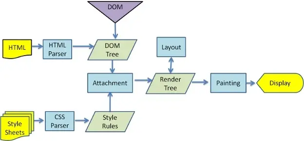

# 常用 hooks 的使用场景和用法

## useState

### 作用

useState 的作用是保证函数式组件在重复渲染时保留这个 state。函数式组件重新渲染都是独立的闭包，函数式组件里的函数都是独立的，取到的值不会受后面操作的影响。

```tsx
function Counter2() {
  let [number, setNumber] = useState(0);

  function alertNumber() {
    setTimeout(() => {
      // alert 只能获取到点击按钮时的那个状态
      alert(number);
    }, 3000);
  }

  return (
    <>
      <p>{number}</p>
      <button onClick={() => setNumber(number + 1)}>+</button>
      <button onClick={alertNumber}>alertNumber</button>
    </>
  );
}
```

### 基本用法

```ts
const [state, dispatch] = useState(initData);
```

- state，目的提供给 UI ，作为渲染视图的数据源。
- dispatch 改变 state 的函数，可以理解为推动函数组件渲染的渲染函数
- initData 有两种情况，第一种情况是非函数，将作为 state 初始化的值。 第二种情况是函数，函数的返回值作为 useState 初始化的值。

对于 dispatch 的参数，有两种情况：

- 第一种非函数情况，此时将作为新的值，赋予给 state，作为下一次渲染使用;

- 第二种是函数的情况，如果 dispatch 的参数为一个函数，这里可以称它为 reducer，reducer 参数，是上一次返回最新的 state，返回值作为新的 state。

### 注意事项

1. 在使用 useState 的 dispatchAction 更新 state 的时候，记得不要传入相同的 state，这样会使视图不更新。useState 的 dispatchAction 方法会默认比较两次 state 是否相同，然后决定是否更新组件。

```tsx
export default function Index() {
  const [state, dispatchState] = useState({ name: 'xiaoming' });
  const handleClick = () => {
    // 点击按钮，视图没有更新
    state.name = 'xiaohong';
    dispatchState(state);
  };
  return (
    <div>
      <span> {state.name}</span>
      <button onClick={handleClick}>changeName++</button>
    </div>
  );
}
```

2. useState 的初始值，只有第一次有效。如下面的 Child 组件收到的 data 只有在第一次渲染时生效，后续父组件修改传入的 data 都不会影响子组件的 name 的 state 变量。

```tsx
const Child = memo(({ data }) => {
  console.log('child render...', data);
  const [name, setName] = useState(data);
  return (
    <div>
      <div>child</div>
      <div>
        {name} --- {data}
      </div>
    </div>
  );
});

const Hook = () => {
  console.log('Hook render...');
  const [count, setCount] = useState(0);
  const [name, setName] = useState('rose');

  return (
    <div>
      <div>{count}</div>
      <button onClick={() => setCount(count + 1)}>update count </button>
      <button onClick={() => setName('jack')}>update name </button>
      <Child data={name} />
    </div>
  );
};
```

3. 函数式组件一次执行上下文中，state 的值是固定不变的。

```tsx
function Index() {
  const [number, setNumber] = React.useState(0);
  const handleClick = () =>
    setInterval(() => {
      // 此时 number 一直都是 0
      setNumber(number + 1);
    }, 1000);
  return <button onClick={handleClick}> 点击 {number}</button>;
}
```

### 如何监听 state 的变化

在函数式组件中只能通过 useEffect 来执行 state 变化引起的副作用。

## useEffect

### 基本用法

```ts
useEffect(() => {
  return destory;
}, dep);
```

- 第一个参数 callback，返回的 destory 函数， destory 作为下一次 callback 执行之前调用，用于清除上一次 callback 产生的副作用。如清除定时器
- 第二个参数作为依赖项，是一个数组，可以有多个依赖项，依赖项改变，**执行上一次 callback 返回的 destory**，和执行新的 effect 第一个参数 callback

useEffect 是采用**异步调用** ，对于每一个 effect 的 callback， React 会向 setTimeout 回调函数一样，放入任务队列，等到主线程任务完成，DOM 更新、js 执行完成、视图绘制完毕才执行。所以 effect 回调函数不会阻塞浏览器绘制视图。

### 常用用法

```ts
// 依赖项是一个空数组，只执行一次
// 告诉 React 你的 effect 不依赖于 props 或 state 中的任何值，所以它永远都不需要重复执行
useEffect(() => {
  const users = new User();
}, []);

// 没有任何依赖值就代表每次都执行
useEffect(() => {
  const users = new User();
});

// dep1 或者 dep2 任意一个发生变化都会执行
useEffect(() => {
  const users = new User();
}, [dep1, dep2]);
```

## useLayoutEffect

useLayoutEffect 和 useEffect 有着相同的用法。区别是 **useLayoutEffect 采用的是同步执行**，并且执行时时机不同。

useLayoutEffect 是在 DOM 更新之后，浏览器绘制之前执行。也就是在下图的 Painting 之前。因为是同步的原因，useLayoutEffect callback 中代码执行会阻塞浏览器绘制。

useEffect 是在视图绘制成功之后执行，也就是 Display 之后。



### 使用场景

有了 useEffect，React 为什么还要再加一个 useLayoutEffect hook 呢？如果我们需要对 DOM 进行一些读写操作，以进行一些关键性的首次渲染，那么我们就可以使用 useLayoutEffect。这之后的任何 DOM 更改都将在下一帧中呈现，屏幕的更新就不会出现卡顿。

而如果在 useEffect 的副作用里执行 DOM 的修改，都可能会导致浏览器再次回流和重绘。而且由于两次绘制，视图上可能会造成闪现突兀的效果。

## useInsertionEffect

useInsertionEffect 是在 React v18 新添加的 hooks ，它的用法和 useEffect 和 useLayoutEffect 一样。那么这个 hooks 用于什么呢?

在介绍 useInsertionEffect 用途之前，先看一下 useInsertionEffect 的执行时机。

```ts
React.useEffect(() => {
  console.log('useEffect 执行');
}, []);

React.useLayoutEffect(() => {
  console.log('useLayoutEffect 执行');
}, []);

React.useInsertionEffect(() => {
  console.log('useInsertionEffect 执行');
}, []);
```

输出结果为：

- seInsertionEffect 执行
- useLayoutEffect 执行
- useEffect 执行

可以看到 useInsertionEffect 的执行时机要比 useLayoutEffect 提前，useLayoutEffect 执行的时候 DOM 已经更新了，但是在 useInsertionEffect 的执行的时候，DOM 还没有更新。

### 使用场景

本质上 useInsertionEffect 主要是解决 CSS-in-JS 在渲染中注入样式的性能问题。这个 hooks 主要是应用于这个场景，在其他场景下 React 不期望用这个 hooks 。

## useRef

useRef 返回的 ref 对象在组件的整个生命周期内保持不变，也就是说每次重新渲染函数组件时，返回的 ref 对象都是同一个。

### 用法

```ts
const container = useRef(initialValue);
```

### 使用场景

函数式组件每一次 render，函数上下文都会重新执行。上面讲到过，useRef 可以创建出一个 ref 原始对象，只要组件没有销毁，ref 对象就一直存在，那么完全可以把一些不依赖于视图更新的数据储存到 ref 对象中。

- 第一个能够直接修改数据，不会造成函数组件冗余的更新作用。
- 第二个 useRef 保存数据，如果有 useEffect ，useMemo 引用 ref 对象中的数据，无须将 ref 对象添加成 dep 依赖项，因为 useRef 始终指向一个内存空间，所以这样一点好处是可以随时访问到变化后的值。

## useMemo

### 用法

```tsx
const cacheSomething = useMemo(create, deps);
```

- 第一个参数为一个函数，函数的返回值作为缓存值
- 第二个参数为一个数组，存放当前 useMemo 的依赖项，在函数组件下一次执行的时候，会对比 deps 依赖项里面的状态，是否有改变，如果有改变重新执行 create ，得到新的缓存值。
- cacheSomething 是返回值，执行 create 的返回值。如果 deps 中有依赖项改变，返回的重新执行 create 产生的值，否则取上一次缓存值。

### 使用场景

1. 缓存计算结果

```tsx
function Scope() {
  const style = useMemo(() => {
    let computedStyle = {};
    // 经过大量的计算
    return computedStyle;
  }, []);
  return <div style={style}></div>;
}
```

Scope 组件缓存 computedStyle 的计算结果在 style 里，每次都被渲染的时候就无需再计算一次。

2. 缓存组件，减少子组件的 rerender 次数

```tsx
function Scope({ children }) {
  const renderChild = useMemo(() => {
    children();
  }, [children]);
  return <div>{renderChild} </div>;
}
```

### memo 和 useMemo

React.memo 是一个高阶组件。它用于对组件进行性能优化。**当组件接收的 props 没有变化时，避免组件的重新渲染。**基本上，它会记住组件的渲染结果，并且仅当组件的 props 发生变化时才重新渲染组件。

那么我们该如何去保证组件接收的 props 保持不变呢？这里使用 useState ，每次更新都是独立的，`const [number,setNumber] = useState(0)` 也就是说每次都会生成一个新的值（哪怕这个值没有变化），即使使用了 React.memo ，也还是会重新渲染。

```tsx
import React, { useState, memo, useMemo, useCallback } from 'react';

const SubCounter = memo(({ onClick, data }) => {
  console.log('SubCounter render');
  return <button onClick={onClick}>{data.number}</button>;
});

export default function Counter() {
  console.log('Counter render');

  const [name, setName] = useState('计数器');
  const [number, setNumber] = useState(0);
  const data = { number };

  const addClick = () => {
    setNumber(number + 1);
  };

  return (
    <>
      <input
        type='text'
        value={name}
        onChange={(e) => setName(e.target.value)}
      />
      <SubCounter data={data} onClick={addClick} />
    </>
  );
}
```

我们该如何优化上面的代码减少 SubCounter 的渲染次数呢？父组件缓存传入的 onClick 和 data 变量

- useCallback：接收一个内联回调函数参数和一个依赖项数组（子组件依赖父组件的状态，即子组件会使用到父组件的值） ，useCallback 会返回该回调函数的 memoized 版本，该回调函数仅在某个依赖项改变时才会更新
- useMemo：把创建函数和依赖项数组作为参数传入 useMemo，它仅会在某个依赖项改变时才重新计算 memoized 值。这种优化有助于避免在每次渲染时都进行高开销的计算

优化后的代码：

```tsx
import React, { useState, memo, useMemo, useCallback } from 'react';

const SubCounter = memo(({ onClick, data }) => {
  console.log('SubCounter render');
  return <button onClick={onClick}>{data.number}</button>;
});

export default function Counter2() {
  console.log('Counter render');
  const [name, setName] = useState('计数器');
  const [number, setNumber] = useState(0);
  // 父组件更新时，这里的变量和函数每次都会重新创建，那么子组件接受到的属性每次都会认为是新的
  // 所以子组件也会随之更新，这时候可以用到 useMemo
  // 有没有后面的依赖项数组很重要，否则还是会重新渲染
  // 如果后面的依赖项数组没有值的话，即使父组件的 number 值改变了，子组件也不会去更新
  const data = useMemo(() => ({ number }), [number]);

  // 有没有后面的依赖项数组很重要，否则还是会重新渲染
  const addClick = useCallback(() => {
    setNumber(number + 1);
  }, [number]);

  return (
    <>
      <input
        type='text'
        value={name}
        onChange={(e) => setName(e.target.value)}
      />
      <SubCounter data={data} onClick={addClick} />
    </>
  );
}
```
