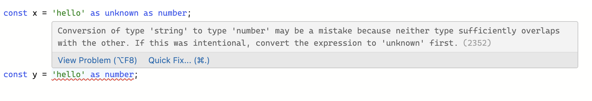

# TypeScript 的类型断言

`TypeScript` 允许你覆盖它的推断，并且能以你任何你想要的方式分析它，这种机制被称为「类型断言」。`TypeScript` 类型断言用来告诉编译器你比它更了解这个类型，并且它不应该再发出错误。

例如：我们使用 `document.getElementById`，`TypeScript` 只知道将返回某种 `HTMLElement`，但我们知道通过 `id` 始终返回 `HTMLCanvasElement`，那么我们就可以通过类型断言来实现收窄类型范围。

```ts
const myCanvas = document.getElementById('main_canvas') as HTMLCanvasElement;
```

类型断言有两种语法，**尖括号语法**和 **`as` 语法**。

```ts
// 语法一：<类型>值
<Type>value;

// 语法二：值 as 类型
value as Type;
```

不过<>尖括号语法与 JSX 语法冲突，一般使用 as 语法。

## 类型断言和类型转换

类型断言之所以不称为类型转换，是因为转换通常意味着某种运行时的支持。但是，**类型断言纯粹是一个编译时语法。**

**类型断言会在编译时被移除，不会在运行时进行类型检查。意味着如果给变量断言了一个不正确的类型并使用，有可能在运行时会报错，所以除非确切的知道变量的数据类型，否则不要使用类型断言。**

那么能在 `TypeScript` 中进行类型断言的条件是什么呢？答案是：类型断言要求实际的类型与断言的类型兼容，实际类型可以断言为一个更加宽泛的类型（父类型），也可以断言为一个更加精确的类型（子类型），但不能断言为一个完全无关的类型。

```ts
const x = 'hello' as number; //报错
```

## 双重断言

有时候，我们真的要断言一个完全无关的类型，也是可以做到的。那就是连续进行两次类型断言。先断言成 `unknow` 类型或 `any` 类型，然后再断言成目标类型。因为 `any` 类型和 `unknown` 类型是所有其他类型的父类型，所以可以作为两种完全无关的类型的中介。

```ts
// 或者写成 <T><unknown>expr
expr as unknown as T;
```

```ts
const x = 'hello' as unknown as number; // success
```



## as const 断言

如果没有声明变量类型，`let` 命令声明的变量，会被类型推断为 `TypeScript` 内置的基本类型之一；

**const 命令声明的变量，则被推断为值类型常量。**

```ts
// 类型推断为基本类型 string
let s1 = 'JavaScript';

// 类型推断为字符串 “JavaScript”
const s2 = 'JavaScript';
```

`TypeScript` 提供了一种特殊的类型断言 `as const`，用于告诉编译器，推断类型时，可以将这个值推断为常量，即把 `let` 变量断言为 `const` 变量，从而把内置的基本类型变更为值类型。

使用 `as const` 断言后，`let` 变量就不能再改变值了。如下例子：

```ts
let s = 'JavaScript' as const;
s = 'Python'; // 报错
```

## 非空断言

对于那些可能为空的变量（即可能等于 `undefined` 和 `null`），`TypeScript` 提供了非空断言，保证这些变量不会为空，写法是在变量后面加上感叹号!。（表示该值不是 `undefined` 和 `null`）

```ts
function liveDangerously(x?: number | null) {
  // No error
  console.log(x!.toFixed());
}
```

非空断言还可以用于赋值断言。

```ts
let name!: string;
```

## 断言函数（asserts 修饰符）

断言函数一种特殊的函数，用于保证函数参数符合某种类型。如果函数达不到要求，就会抛出错误，中断程序执行。如果达到要求，就不进行任何操作，让代码按照正常流程运行。

`asserts` 并不是一个断言函数，它只是一个修饰符（也称为断言签名），以 `asserts value`、`asserts T is xxx` 的形式来确定函数的返回类型，只有 `asserts` 后面的表达式（value 或者 T is xxxx）为 truthy 值，才会返回正常，否则将会抛出异常，终止当前代码的运行。

`asserts value`是一种简写形式，用来断言某个参数为真（即不等于 `false`、`undefined`、`null`）

```ts
// 断言函数
function isString(value: unknown): asserts value is string {
  if (typeof value !== 'string') throw new Error('Not a string');
}
```

`TypeScript` 编译时，会进行[控制流分析](https://github.com/Microsoft/TypeScript/pull/8010)，能够根据上下文推断出每个条件分支值的类型。同样的，TS 编译器能够在控制流分析中，根据当前的 `asserts` 断言分析出后面的类型。

```ts
function yell(str: any) {
  console.log(str); // 此时仍是any
  // 根据asserts断言分析出后面的str为string
  isString(str);
  return str.toUpperCase(); // 这里是string
}

function isString(str: unknown): asserts str is string {
  if (typeof str !== 'string') {
    throw new Error('not a string');
  }
}
```

另外，**断言函数的 `asserts` 语句等同于 `void` 类型**，所以如果返回除了 `undefined` 和 `null` 以外的值，都会报错。

```ts
function isString(value: unknown): asserts value is string {
  if (typeof value !== 'string') throw new Error('Not a string');
  return true; // 报错
}
```

## asserts 修饰符和 is 关键字的区别

`is` 关键字被称为类型谓语，用来判断一个变量是否属于某个接口或类型。一般用于函数的返回类型，并根据结果返回对应的布尔类型。通常用于条件判断。

`is` 关键字经常用来封装“类型判断函数”，通过缩小和函数返回值的比较，从而缩小参数的类型范围，所以烈性谓语 `is` 也是一种类型保护

```ts
function yell(str: any) {
  if (isString(str)) {
    str.toUpperCase(); // 这里是string
  }
}

function isString(str: unknown): str is string {
  return typeof str === 'string';
}
```
