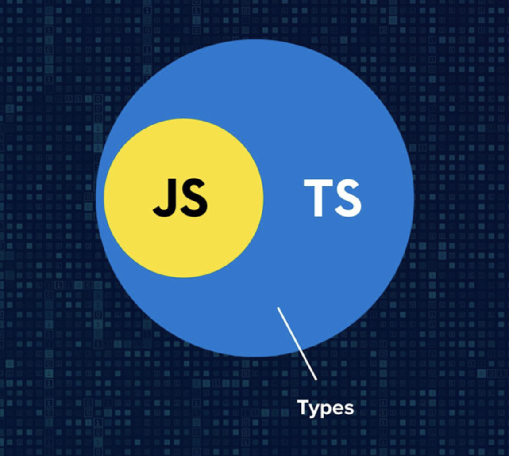

# TypeScript

`TypeScript` 是 `JavaScript` 的超集，意味着它能做 `JavaScript` 所做的一切，但有一些附加功能。

使用 `TypeScript` 的主要原因是**为 JavaScript 添加静态类型**。静态类型意味着变量的类型在程序中的任何时候都不能被改变。它可以防止大量的 bug

为 `JavaScript` 添加静态类的原因至少有三个：

- 可以避免经典的错误 `'undefined' is not a function`.
- 在不严重破坏代码的情况下，重构代码更容易。
- 使大型、复杂的应用程序源码更易阅读。

`TypeScript` 的优势具体表现为：

1. 类型系统是最好的文档，大部分的函数看类型的定义就知道如何使用
2. 可以在编译阶段就发现大部分的错误，而不需要在运行时发现错误
3. 增加了编辑器和 IDEA 的功能，包括代码补全、接口提示、跳转到定义、重构等等

## 类型的概念

**类型是人为添加的一种编程约束和用法提示**
