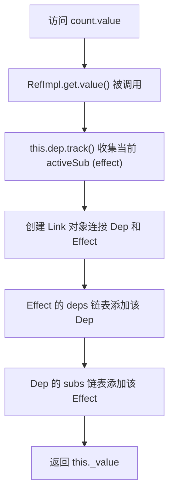

# 核心架构：RefImpl 模式详解

## 一、设计背景与目的

**RefImpl（Reference Implementation）是 Vue 响应式系统的基础模块**，专门用于解决原始值（primitive）无法被 Proxy 代理的问题。

### 核心挑战

```javascript
// 问题：Proxy 无法代理原始值
const count = 0;
const proxy = new Proxy(count, {
  get(target, key) {
    console.log("访问", key);
    return target[key];
  },
});
// TypeError: Cannot create proxy with a non-object as target
```

**RefImpl 的解决方案**：将原始值包装成对象，通过对象的 `.value` 属性访问，从而实现响应式追踪。

---

## 二、RefImpl 类结构详解

### 2.1 类定义与核心属性

```typescript
// packages/reactivity/src/ref.ts#L110-L123
class RefImpl<T = any> {
  _value: T; // 响应式值（可能是 reactive 包装后的对象）
  private _rawValue: T; // 原始值（未包装的值）

  dep: Dep = new Dep(); // 依赖追踪器

  public readonly [ReactiveFlags.IS_REF] = true; // 标识这是 ref 对象
  public readonly [ReactiveFlags.IS_SHALLOW]: boolean = false; // 是否浅层响应式

  constructor(value: T, isShallow: boolean) {
    this._rawValue = isShallow ? value : toRaw(value);
    this._value = isShallow ? value : toReactive(value);
    this[ReactiveFlags.IS_SHALLOW] = isShallow;
  }
}
```

### 属性详解表

| 属性           | 类型      | 作用                                       | 访问级别     |
| -------------- | --------- | ------------------------------------------ | ------------ |
| `_value`       | `T`       | 存储响应式值，对象类型会被 reactive() 包装 | 内部         |
| `_rawValue`    | `T`       | 存储原始值，用于变化检测                   | 私有         |
| `dep`          | `Dep`     | 依赖收集与触发的核心对象                   | 公开（内部） |
| `[IS_REF]`     | `true`    | 标识符，用于 `isRef()` 判断                | 只读         |
| `[IS_SHALLOW]` | `boolean` | 标识是否为浅层 ref                         | 只读         |

---

## 三、构造函数：智能值转换

```typescript
// packages/reactivity/src/ref.ts#L119-L123
constructor(value: T, isShallow: boolean) {
  this._rawValue = isShallow ? value : toRaw(value)
  this._value = isShallow ? value : toReactive(value)
  this[ReactiveFlags.IS_SHALLOW] = isShallow
}
```

### toRaw 和 toReactive 的作用

```typescript
// 假设实现逻辑（简化版）
function toRaw(value: any) {
  // 如果已经是响应式对象，返回其原始值
  return isProxy(value) ? value[ReactiveFlags.RAW] : value;
}

function toReactive(value: any) {
  // 如果是对象，转换为 reactive；否则直接返回
  return isObject(value) ? reactive(value) : value;
}
```

### 构造函数的行为矩阵

| 输入值类型     | isShallow | \_rawValue     | \_value                  |
| -------------- | --------- | -------------- | ------------------------ |
| `0`            | `false`   | `0`            | `0`                      |
| `{ count: 1 }` | `false`   | `{ count: 1 }` | `reactive({ count: 1 })` |
| `{ count: 1 }` | `true`    | `{ count: 1 }` | `{ count: 1 }`           |
| `reactive({})` | `false`   | `{}` (原始)    | `reactive({})` (复用)    |

---

## 四、Getter 机制：依赖追踪

```typescript
// packages/reactivity/src/ref.ts#L125-L136
get value() {
  if (__DEV__) {
    this.dep.track({
      target: this,
      type: TrackOpTypes.GET,
      key: 'value',
    })
  } else {
    this.dep.track()  // 生产环境简化调用
  }
  return this._value
}
```

### 4.1 依赖收集流程

```javascript
// 示例：在 effect 中访问 ref
const count = ref(0);

effect(() => {
  console.log(count.value); // ← 触发 getter
});
```

执行流程：



### 4.2 Dep.track() 核心实现

```typescript
// packages/reactivity/src/dep.ts#L72-L110
track(debugInfo?: DebuggerEventExtraInfo): Link | undefined {
  if (!activeSub || !shouldTrack || activeSub === this.computed) {
    return  // 不在 effect 中，不收集
  }

  let link = this.activeLink
  if (link === undefined || link.sub !== activeSub) {
    // 创建新的依赖链接
    link = this.activeLink = new Link(activeSub, this)

    // 添加到 effect 的 deps 链表（尾部）
    if (!activeSub.deps) {
      activeSub.deps = activeSub.depsTail = link
    } else {
      link.prevDep = activeSub.depsTail
      activeSub.depsTail!.nextDep = link
      activeSub.depsTail = link
    }

    addSub(link)  // 添加到 dep 的 subs 链表
  } else if (link.version === -1) {
    // 复用上次运行的 link，同步版本号
    link.version = this.version
  }

  return link
}
```

### 4.3 双向链表结构

```
Effect 1              Effect 2
   ↓                      ↓
deps ──→ [Link1] ──→ [Link2] ──→ null
   ↑                      ↓
   └──────────────────────┘
         ↓
    [Link1].dep ──→ Dep1
         ↓
    [Link2].dep ──→ Dep2

Dep1
   ↓
subs ──→ [Link1] ──→ null
         ↓
      [Link1].sub ──→ Effect1
```

---

## 五、Setter 机制：触发更新

```typescript
// packages/reactivity/src/ref.ts#L138-L160
set value(newValue) {
  const oldValue = this._rawValue
  const useDirectValue =
    this[ReactiveFlags.IS_SHALLOW] ||
    isShallow(newValue) ||
    isReadonly(newValue)
  newValue = useDirectValue ? newValue : toRaw(newValue)

  if (hasChanged(newValue, oldValue)) {  // ← 值变化才触发
    this._rawValue = newValue
    this._value = useDirectValue ? newValue : toReactive(newValue)

    if (__DEV__) {
      this.dep.trigger({
        target: this,
        type: TriggerOpTypes.SET,
        key: 'value',
        newValue,
        oldValue,
      })
    } else {
      this.dep.trigger()  // ← 触发所有订阅的 effect
    }
  }
}
```

### 5.1 hasChanged 判断

```javascript
// 简化实现
function hasChanged(newValue, oldValue) {
  // 使用 Object.is 避免 NaN !== NaN 的问题
  return !Object.is(newValue, oldValue);
}
```

### 5.2 值更新策略

| 情况                           | useDirectValue | \_rawValue 更新   | \_value 更新           |
| ------------------------------ | -------------- | ----------------- | ---------------------- |
| 深层 ref，新值是普通对象       | `false`        | `toRaw(newValue)` | `toReactive(newValue)` |
| 浅层 ref                       | `true`         | `newValue`        | `newValue`             |
| 深层 ref，新值是 shallow 对象  | `true`         | `newValue`        | `newValue`             |
| 深层 ref，新值是 readonly 对象 | `true`         | `newValue`        | `newValue`             |

### 5.3 Dep.trigger() 实现

```typescript
// packages/reactivity/src/dep.ts#L124-L143
trigger(debugInfo?: DebuggerEventExtraInfo): void {
  this.version++      // ← 版本号递增，用于 computed 优化
  globalVersion++
  this.notify(debugInfo)
}

notify(debugInfo?: DebuggerEventExtraInfo): void {
  startBatch()  // ← 批处理优化
  try {
    if (__DEV__) {
      // 开发环境：按顺序调用 onTrigger 钩子
      for (let head = this.subsHead; head; head = head.nextSub) {
        if (head.sub.onTrigger && !(head.sub.flags & EffectFlags.NOTIFIED)) {
          head.sub.onTrigger(extend({ effect: head.sub }, debugInfo))
        }
      }
    }

    // 逆序通知所有订阅的 effect（栈式执行）
    for (let link = this.subs; link; link = link.prevSub) {
      if (link.sub.notify()) {
        // 如果是 computed，递归触发它的依赖
        ;(link.sub as ComputedRefImpl).dep.notify()
      }
    }
  } finally {
    endBatch()
  }
}
```

---

## 六、浅层 vs 深层响应式

### 6.1 浅层 Ref（ShallowRef）

```javascript
const shallow = shallowRef({ count: 1 });

// ✓ 触发更新（整体替换）
shallow.value = { count: 2 };

// ✗ 不触发更新（深层修改）
shallow.value.count = 2;
```

浅层 ref 的特点：

- `IS_SHALLOW` 标志为 `true`
- `_value` 存储原始对象，不经过 `toReactive()`
- setter 中 `useDirectValue` 为 `true`，直接赋值

### 6.2 深层 Ref（普通 ref）

```javascript
const deep = ref({ count: 1 });

// ✓ 触发更新（整体替换）
deep.value = { count: 2 };

// ✓ 也触发更新（深层修改）
deep.value.count = 2; // 因为 _value 是 reactive 对象
```

### 6.3 深度修改浅层 ref 的解决方案

```typescript
// packages/reactivity/src/ref.ts#L188-L190
export function triggerRef(ref: Ref): void {
  if ((ref as unknown as RefImpl).dep) {
    (ref as unknown as RefImpl).dep.trigger();
  }
}
```

使用示例：

```javascript
const shallow = shallowRef({ count: 1 });

// 深层修改后手动触发
shallow.value.count = 2;
triggerRef(shallow); // ← 强制触发更新
```

---

## 七、与 Reactive 模式的对比

| 特性           | RefImpl                 | Reactive                 |
| -------------- | ----------------------- | ------------------------ |
| **适用场景**   | 原始值、单个值          | 对象、数组               |
| **访问方式**   | `.value`                | 直接访问                 |
| **响应式机制** | getter/setter           | Proxy 拦截               |
| **嵌套处理**   | 不自动解包嵌套          | 深层转换                 |
| **依赖收集**   | Dep 对象                | Dep 链表（每个属性一个） |
| **内存开销**   | 小（每个 ref 一个 Dep） | 大（每个属性一个 Dep）   |

### 7.1 RefImpl 的优势

1. **精确追踪**：每个 ref 有独立的 Dep，无需遍历对象属性
2. **类型安全**：`.value` 显式访问，避免混淆
3. **性能友好**：原始值不需要 Proxy 包装
4. **独立性**：可以单独传递和更新

### 7.2 使用场景决策树

```
需要响应式值？
├─ 是原始值？
│  └─ → 使用 ref()
├─ 是对象/数组？
│  ├─ 需要深层响应？
│  │  ├─ 需要保持对象引用？
│  │  │  └─ → 使用 reactive()
│  │  └─ 只需要包装一层？
│  │     └─ → 使用 ref()
│  └─ 只需要浅层响应？
│     └─ → 使用 shallowRef() 或 shallowReactive()
└─ 否 → 不需要响应式
```

---

## 八、性能优化策略

### 8.1 Version 机制（用于 computed）

```typescript
class Dep {
  version = 0
}

// 在 getter 中
get value() {
  this.dep.track()
  return this._value
}

// 在 setter 中
set value(newValue) {
  // ...
  this.dep.trigger()  // version++
}
```

Computed 利用 version 判断是否需要重新计算：

```javascript
// 伪代码
const cachedValue = computed(() => dep.value);
const lastVersion = dep.version;

function getValue() {
  if (dep.version !== lastVersion) {
    lastVersion = dep.version;
    return compute();
  }
  return cached;
}
```

### 8.2 双向链表优化

- **depsTail**：O(1) 添加新依赖
- **version 复用**：重新运行的 effect 复用 Link，减少 GC 压力
- **逆序通知**：栈式执行，符合调用栈语义

### 8.3 批处理（Batch）

```typescript
// 在 dep.notify() 中
startBatch();
try {
  // 通知所有 effect
} finally {
  endBatch(); // 统一调度
}
```

多个 ref 同时更新时，只会触发一次视图更新。

---

## 九、面试要点总结

1. **设计目的**：解决 Proxy 无法代理原始值的问题
2. **核心机制**：将值包装成对象，通过 getter/setter 实现响应式
3. **依赖收集**：Dep 类 + Link 双向链表，实现精确的订阅发布
4. **浅层 vs 深层**：`IS_SHALLOW` 标志控制是否进行 `toReactive()` 转换
5. **性能优化**：version 机制、双向链表、批处理
6. **与 reactive 的区别**：适用场景、访问方式、依赖管理策略
7. **关键函数**：`track()` 收集依赖，`trigger()` 触发更新
8. **类型安全**：通过 `[IS_REF]` 标志符实现类型判断
