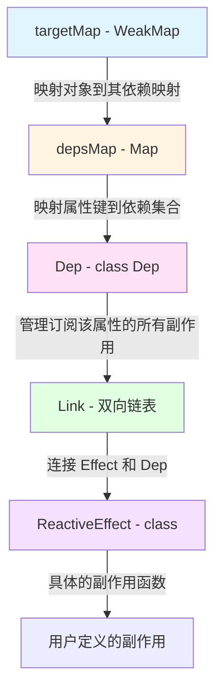
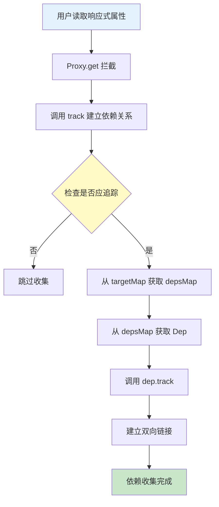
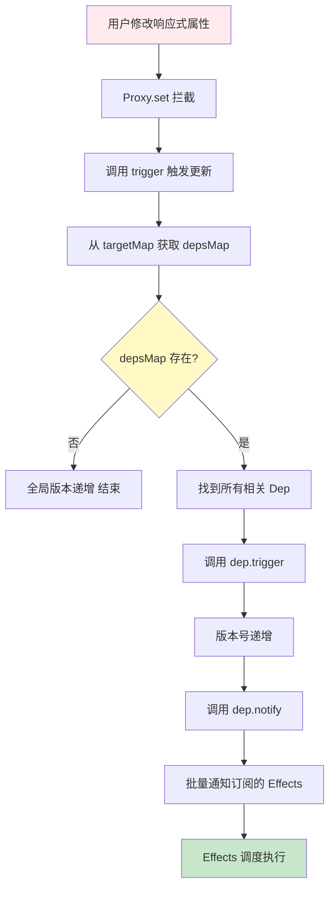
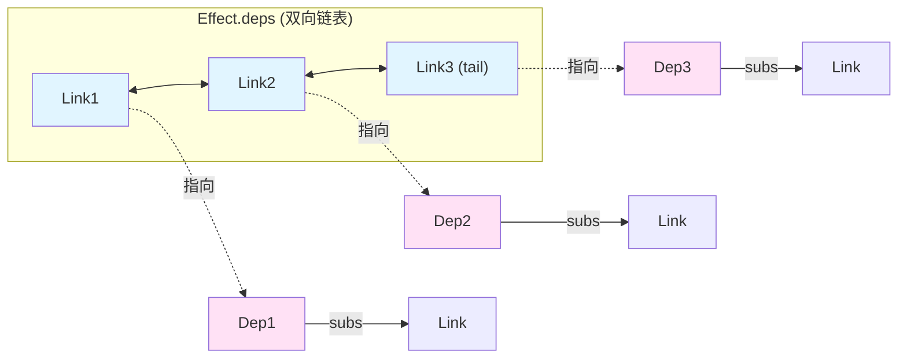
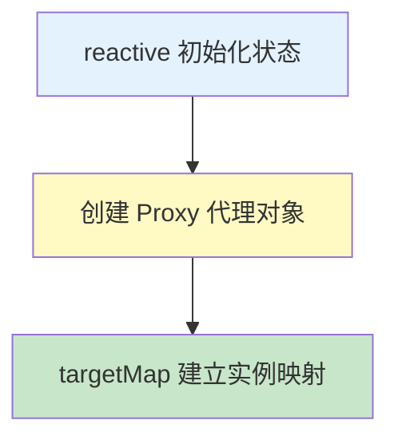
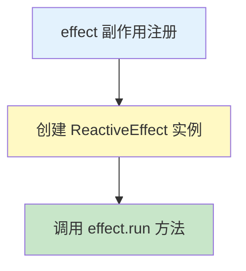
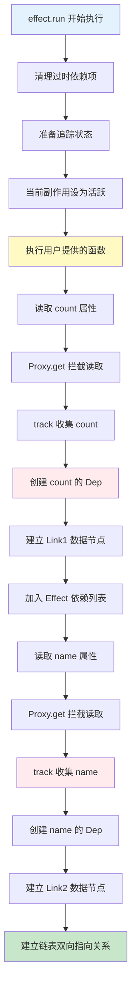
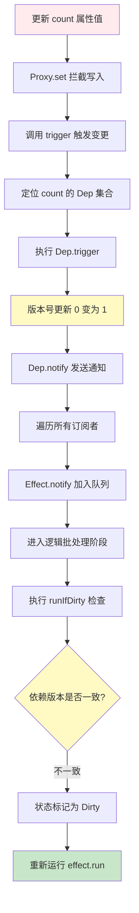
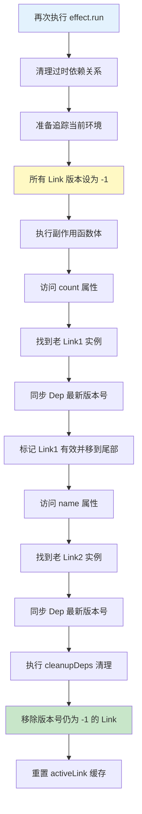

# Vue 依赖追踪的完整实现原理

## 一、核心数据结构

### 1. 三层数据结构

Vue 3 使用三层映射关系来管理依赖追踪：



**源码定义**：

```typescript
// packages/reactivity/src/dep.ts#L238-L240
export const targetMap: WeakMap<object, KeyToDepMap> = new WeakMap();

type KeyToDepMap = Map<any, Dep>;
```

### 2. Link - 双向链表节点

Link 是 Vue 3 的核心优化，用于连接 Effect 和 Dep：

```typescript
// packages/reactivity/src/dep.ts#L32-L62
export class Link {
  /**
   * 版本号：用于追踪依赖是否仍被使用
   * - 每次 effect 运行前重置为 -1
   * - 运行时同步到 Dep 的版本
   * - 运行后仍为 -1 的 Link 会被清理
   */
  version: number;

  // 双向链表指针
  nextDep?: Link; // Effect 的下一个依赖
  prevDep?: Link; // Effect 的上一个依赖
  nextSub?: Link; // Dep 的下一个订阅者
  prevSub?: Link; // Dep 的上一个订阅者

  constructor(
    public sub: Subscriber, // 订阅者（Effect）
    public dep: Dep // 被订阅的依赖
  ) {
    this.version = dep.version;
  }
}
```

### 3. Dep - 依赖集合

```typescript
// packages/reactivity/src/dep.ts#L67-L106
export class Dep {
  version = 0; // 版本号，每次 trigger 会自增

  // 当前正在追踪的 Link（性能优化，避免重复创建）
  activeLink?: Link = undefined;

  // 双向链表：订阅此 dep 的所有 effects
  subs?: Link = undefined; // 链表尾
  subsHead?: Link = undefined; // 链表头（DEV 模式用）

  // 反向引用，用于清理
  map?: KeyToDepMap;
  key?: unknown;

  // 订阅者计数
  sc: number = 0;
}
```

### 4. ReactiveEffect - 副作用

```typescript
// packages/reactivity/src/effect.ts#L87-L117
export class ReactiveEffect<T = any>
  implements Subscriber, ReactiveEffectOptions
{
  // 双向链表：此 effect 依赖的所有 deps
  deps?: Link = undefined; // 链表头
  depsTail?: Link = undefined; // 链表尾

  // 状态标志位
  flags: EffectFlags = EffectFlags.ACTIVE | EffectFlags.TRACKING;

  next?: Subscriber; // 链式调用优化

  constructor(public fn: () => T) {
    if (activeEffectScope && activeEffectScope.active) {
      activeEffectScope.effects.push(this);
    }
  }
}
```

---

## 二、核心全局状态

### 1. 当前活跃的副作用

```typescript
// packages/reactivity/src/effect.ts#L39
export let activeSub: Subscriber | undefined;
```

这个变量记录**当前正在执行的 effect**，用于在依赖收集时建立关系。

### 2. 追踪控制开关

```typescript
// packages/reactivity/src/effect.ts#L508-L530
export let shouldTrack = true;
const trackStack: boolean[] = [];

export function pauseTracking(): void {
  trackStack.push(shouldTrack);
  shouldTrack = false;
}

export function resetTracking(): void {
  const last = trackStack.pop();
  shouldTrack = last === undefined ? true : last;
}
```

---

## 三、依赖收集流程

### 完整流程图



### 1. Proxy 拦截读取操作

```typescript
// packages/reactivity/src/baseHandlers.ts#L55-L134
get(target: Target, key: string | symbol, receiver: object): any {
  // ... 处理特殊 flag

  const res = Reflect.get(target, key, receiver)

  // ... ref 解包逻辑

  if (!isReadonly) {
    track(target, TrackOpTypes.GET, key)  // ← 关键：收集依赖
  }

  // ... 嵌套对象响应式转换

  return res
}
```

### 2. track 函数 - 入口

```typescript
// packages/reactivity/src/dep.ts#L262-L284
export function track(target: object, type: TrackOpTypes, key: unknown): void {
  // 检查是否应该追踪 + 是否有活跃 effect
  if (shouldTrack && activeSub) {
    // 1. 获取/创建 target 的 depsMap
    let depsMap = targetMap.get(target);
    if (!depsMap) {
      targetMap.set(target, (depsMap = new Map()));
    }

    // 2. 获取/创建 key 的 Dep
    let dep = depsMap.get(key);
    if (!dep) {
      depsMap.set(key, (dep = new Dep()));
      dep.map = depsMap;
      dep.key = key;
    }

    // 3. 调用 Dep.track() 建立链接
    if (__DEV__) {
      dep.track({ target, type, key });
    } else {
      dep.track();
    }
  }
}
```

### 3. Dep.track() - 建立链接（核心）

```typescript
// packages/reactivity/src/dep.ts#L108-L165
track(debugInfo?: DebuggerEventExtraInfo): Link | undefined {
  // 前置检查
  if (!activeSub || !shouldTrack || activeSub === this.computed) {
    return
  }

  let link = this.activeLink

  // 情况1：首次访问或不是同一个 effect
  if (link === undefined || link.sub !== activeSub) {
    // 创建新的 Link
    link = this.activeLink = new Link(activeSub, this)

    // 将 Link 添加到 Effect 的 deps 链表（作为尾部）
    if (!activeSub.deps) {
      activeSub.deps = activeSub.depsTail = link
    } else {
      link.prevDep = activeSub.depsTail
      activeSub.depsTail!.nextDep = link
      activeSub.depsTail = link
    }

    // 将 Link 添加到 Dep 的 subs 链表
    addSub(link)

  // 情况2：复用已有的 Link（优化）
  } else if (link.version === -1) {
    // 标记为此 effect 仍使用此依赖
    link.version = this.version

    // 将 Link 移到 Effect.deps 的尾部，保持访问顺序
    if (link.nextDep) {
      const next = link.nextDep
      next.prevDep = link.prevDep
      if (link.prevDep) {
        link.prevDep.nextDep = next
      }

      link.prevDep = activeSub.depsTail
      link.nextDep = undefined
      activeSub.depsTail!.nextDep = link
      activeSub.depsTail = link

      // 如果是头部，更新头部指针
      if (activeSub.deps === link) {
        activeSub.deps = next
      }
    }
  }

  return link
}
```

### 4. addSub - 添加订阅者

```typescript
// packages/reactivity/src/dep.ts#L207-L236
function addSub(link: Link) {
  const { sub, dep } = link;

  // 将 link 添加到 dep.subs 链表（头部）
  link.prevSub = undefined;
  link.nextSub = dep.subs;
  dep.subs = link;

  if (!dep.subsHead) {
    dep.subsHead = link;
  }

  // 更新订阅者计数
  dep.sc++;

  // 链式优化：将 sub 添加到全局链
  sub.next = undefined;
  if (!batchedSub) {
    batchedSub = sub;
  } else {
    let curr = batchedSub;
    while (curr!.next) {
      curr = curr!.next;
    }
    curr!.next = sub;
  }
}
```

---

## 四、触发更新流程

### 完整流程图



### 1. Proxy 拦截写入操作

```typescript
// packages/reactivity/src/baseHandlers.ts#L142-L192
set(
  target: Record<string | symbol, unknown>,
  key: string | symbol,
  value: unknown,
  receiver: object,
): boolean {
  let oldValue = target[key]

  // ... ref 写入优化

  const hadKey = hasOwn(target, key)
  const result = Reflect.set(target, key, value, receiver)

  // 触发更新（仅在确实修改时）
  if (target === toRaw(receiver)) {
    if (!hadKey) {
      // 新增属性
      trigger(target, TriggerOpTypes.ADD, key, value)
    } else if (hasChanged(value, oldValue)) {
      // 修改属性
      trigger(target, TriggerOpTypes.SET, key, value, oldValue)
    }
  }
  return result
}
```

### 2. trigger 函数 - 入口

```typescript
// packages/reactivity/src/dep.ts#L294-L340
export function trigger(
  target: object,
  type: TriggerOpTypes,
  key?: unknown,
  newValue?: unknown,
  oldValue?: unknown,
  oldTarget?: Map<unknown, unknown> | Set<unknown>
): void {
  const depsMap = targetMap.get(target);
  if (!depsMap) {
    // 从未被追踪过
    globalVersion++;
    return;
  }

  // 需要触发的 dep 集合（避免重复）
  const deps: (Dep | undefined)[] = [];

  // 1. 直接 key 的 dep
  if (key !== void 0) {
    deps.push(depsMap.get(key));
  }

  // 2. 数组长度变化
  if (type === TriggerOpTypes.ADD) {
    if (!isArray(target)) {
      deps.push(depsMap.get(ITERATE_KEY));
      if (isMap(target)) {
        deps.push(depsMap.get(MAP_KEY_ITERATE_KEY));
      }
    } else if (isIntegerKey(key)) {
      // 数组索引变化，可能影响 length
      deps.push(depsMap.get("length"));
    }
  }

  // 3. 数组方法（push/pop 等）
  switch (type) {
    case TriggerOpTypes.ADD:
    case TriggerOpTypes.DELETE:
      if (!isArray(target)) {
        deps.push(depsMap.get(ITERATE_KEY));
      }
      break;
  }

  // 4. 触发所有相关的 dep
  const run = (dep: Dep | undefined) => {
    if (dep) {
      if (__DEV__) {
        dep.trigger({ target, type, key, newValue, oldValue });
      } else {
        dep.trigger();
      }
    }
  };

  for (const dep of deps) {
    run(dep);
  }
}
```

### 3. Dep.trigger() - 触发

```typescript
// packages/reactivity/src/dep.ts#L167-L171
trigger(debugInfo?: DebuggerEventExtraInfo): void {
  this.version++      // ← 递增版本号
  globalVersion++     // ← 递增全局版本号
  this.notify(debugInfo)
}
```

### 4. Dep.notify() - 通知订阅者

```typescript
// packages/reactivity/src/dep.ts#L173-L204
notify(debugInfo?: DebuggerEventExtraInfo): void {
  startBatch()
  try {
    if (__DEV__) {
      // 按注册顺序调用 onTrigger hook
      for (let head = this.subsHead; head; head = head.nextSub) {
        if (head.sub.onTrigger && !(head.sub.flags & EffectFlags.NOTIFIED)) {
          head.sub.onTrigger({
            effect: head.sub,
            ...debugInfo,
          })
        }
      }
    }

    // 反向遍历（后注册的先通知）
    for (let link = this.subs; link; link = link.prevSub) {
      if (link.sub.notify()) {
        // 如果返回 true，说明是 computed，需要级联通知
        (link.sub as ComputedRefImpl).dep.notify()
      }
    }
  } finally {
    endBatch()
  }
}
```

### 5. ReactiveEffect.notify()

```typescript
// packages/reactivity/src/effect.ts#L139-L149
notify(): void {
  // 防止递归
  if (
    this.flags & EffectFlags.RUNNING &&
    !(this.flags & EffectFlags.ALLOW_RECURSE)
  ) {
    return
  }

  // 防止重复通知
  if (!(this.flags & EffectFlags.NOTIFIED)) {
    batch(this)  // 批量处理
  }
}
```

---

## 五、Effect 执行与依赖清理

### 1. ReactiveEffect.run() - 执行副作用

```typescript
// packages/reactivity/src/effect.ts#L151-L181
run(): T {
  if (!(this.flags & EffectFlags.ACTIVE)) {
    // 已停止
    return this.fn()
  }

  this.flags |= EffectFlags.RUNNING

  // 清理旧依赖
  cleanupEffect(this)

  // 准备依赖追踪
  prepareDeps(this)

  // 设置当前活跃 effect
  const prevEffect = activeSub
  const prevShouldTrack = shouldTrack
  activeSub = this
  shouldTrack = true

  try {
    return this.fn()  // ← 执行用户函数，会触发依赖收集
  } finally {
    if (__DEV__ && activeSub !== this) {
      warn('Active effect was not restored correctly')
    }

    // 清理未使用的依赖
    cleanupDeps(this)

    // 恢复上下文
    activeSub = prevEffect
    shouldTrack = prevShouldTrack
    this.flags &= ~EffectFlags.RUNNING
  }
}
```

### 2. prepareDeps - 准备依赖追踪

```typescript
// packages/reactivity/src/effect.ts#L301-L312
function prepareDeps(sub: Subscriber) {
  // 将所有依赖的 Link.version 设为 -1
  // 运行时使用的会被重新设置为 dep.version
  // 仍为 -1 的会在 cleanupDeps 中被清理
  for (let link = sub.deps; link; link = link.nextDep) {
    link.version = -1;
  }
}
```

### 3. cleanupDeps - 清理未使用的依赖

```typescript
// packages/reactivity/src/effect.ts#L313-L340
function cleanupDeps(sub: Subscriber) {
  let link = sub.deps;
  let tail = sub.depsTail;

  // 遍历所有依赖，清理 version 仍为 -1 的
  while (link) {
    const next = link.nextDep;
    if (link.version === -1) {
      // 移除未使用的依赖
      removeSub(link);
      if (link === tail) {
        sub.deps = sub.depsTail = undefined;
        break;
      }
    } else {
      // 保留的依赖，重置 Dep.activeLink
      if (link.dep.activeLink === link) {
        link.dep.activeLink = undefined;
      }
      tail = link;
    }
    link = next;
  }

  sub.depsTail = tail;
}
```

### 4. removeSub - 移除订阅

```typescript
// packages/reactivity/src/dep.ts#L421-L460
function removeSub(link: Link, soft = false) {
  const { sub, dep } = link;

  // 从 Dep.subs 链表移除
  if (dep.subs === link) {
    dep.subs = link.nextSub;
  }
  if (dep.subsHead === link) {
    dep.subsHead = link.nextSub || link.prevSub;
  }
  if (link.prevSub) {
    link.prevSub.nextSub = link.nextSub;
  }
  if (link.nextSub) {
    link.nextSub.prevSub = link.prevSub;
  }

  dep.sc--;

  if (!soft) {
    // 从 Effect.deps 链表移除
    if (sub.deps === link) {
      sub.deps = link.nextDep;
    }
    if (sub.depsTail === link) {
      sub.depsTail = link.prevDep;
    }
    if (link.prevDep) {
      link.prevDep.nextDep = link.nextDep;
    }
    if (link.nextDep) {
      link.nextDep.prevDep = link.prevDep;
    }
  }
}
```

---

## 六、批量更新机制

### 1. 批量处理 Effects

```typescript
// packages/reactivity/src/effect.ts#L240-L287
let batchDepth = 0;
let batchedSub: Subscriber | undefined;
let batchedComputed: Subscriber | undefined;

export function batch(sub: Subscriber, isComputed = false): void {
  sub.flags |= EffectFlags.NOTIFIED;

  if (!batchDepth) {
    batchedSub = sub;
    if (isComputed) {
      batchedComputed = sub;
    }
  } else {
    // 将 sub 添加到链表
    sub.next = undefined;
    let curr = isComputed ? batchedComputed : batchedSub;
    if (curr) {
      while (curr!.next) {
        curr = curr!.next;
      }
      curr!.next = sub;
    } else {
      if (isComputed) {
        batchedComputed = sub;
      } else {
        batchedSub = sub;
      }
    }
  }
}
```

### 2. startBatch / endBatch

```typescript
// packages/reactivity/src/effect.ts#L254-L262
export function startBatch(): void {
  batchDepth++;
}

export function endBatch(): void {
  if (--batchDepth > 0) {
    return;
  }

  // 执行所有批量的 effects
  executeBatch();
}
```

---

## 七、优化机制详解

### 1. 版本控制机制

**目的**：快速判断依赖是否发生变化，避免不必要的 effect 执行

```typescript
// Dep 的版本
version = 0;

// Link 在访问时的版本
link.version = dep.version;

// Effect 运行前
link.version = -1;

// 访问依赖时
link.version = dep.version; // 同步版本

// 触发更新时
dep.version++; // 版本递增

// computed 脏检查
if (link.version !== dep.version) {
  // 依赖已变化，需要重新计算
}
```

### 2. 双向链表优化

**优势**：

- O(1) 的插入和删除操作
- 快速清理未使用的依赖
- 保持访问顺序

**示例**：



### 3. activeLink 缓存优化

```typescript
// 每个维护最近访问的 Link
class Dep {
  activeLink?: Link = undefined;
}

// 复用检查
let link = this.activeLink;
if (link === undefined || link.sub !== activeSub) {
  // 创建新 Link
} else if (link.version === -1) {
  // 复用 Link，更新版本
}
```

这避免了在同一个 effect 内多次访问同一属性时重复创建 Link。

### 4. 批量更新

```typescript
// 多次触发只会执行一次
state.count++;
state.name = "foo";
state.age = 18;

// 三个 trigger 会被合并
// 只在 endBatch 时执行一次 effect
```

---

## 八、完整示例演示

### 示例代码

```javascript
import { reactive, effect } from "vue";

const state = reactive({
  count: 0,
  name: "vue",
});

effect(() => {
  console.log(`count: ${state.count}, name: ${state.name}`);
});

state.count = 1;
```

### 执行流程详解

#### 阶段 1：创建响应式对象



#### 阶段 2：创建 effect



#### 阶段 3：effect.run() 执行



此时数据结构：

```
targetMap:
  { count: 0, name: 'vue' } →
    Map {
      'count' → Dep('count') {
        version: 0,
        subs: [Link2]
      },
      'name' → Dep('name') {
        version: 0,
        subs: [Link1]
      }
    }

effect:
  deps: [Link1] ↔ [Link2]
    Link1: { sub: effect, dep: Dep('count'), version: 0 }
    Link2: { sub: effect, dep: Dep('name'), version: 0 }
```

#### 阶段 4：触发更新



#### 阶段 5：依赖清理



---

## 九、关键设计亮点

### 1. WeakMap 的优势

- **自动垃圾回收**：当响应式对象不再被引用，整个依赖树会被自动清理
- **避免内存泄漏**：不需要手动清理目标对象的依赖

### 2. 双向链表 vs Set

| 特性 | 双向链表 (Vue 3) | Set (Vue 2) |
| ---- | ---------------- | ----------- |
| 插入 | O(1)             | O(1)        |
| 删除 | O(1)             | O(n)        |
| 迭代 | O(n)             | O(n)        |
| 内存 | 节点开销         | 哈希开销    |
| 顺序 | 可控             | 无序        |

### 3. 版本控制的优势

```javascript
// Vue 3：只需比较版本号
if (link.version !== dep.version) {
  return true; // dirty
}

// 传统方式：需要完整遍历
let changed = false;
for (const dep of deps) {
  if (dep.version !== cachedVersion) {
    changed = true;
    break;
  }
}
```

### 4. 批量更新的好处

```javascript
// 用户代码
state.a = 1;
state.b = 2;
state.c = 3;

// 不批量：effect 执行 3 次
// 批量：effect 执行 1 次
```

---

## 十、面试要点总结

### 核心概念

1. **三层映射**：WeakMap → Map → Dep
2. **双向链表**：Link 连接 Effect 和 Dep
3. **版本控制**：通过 version 快速判断依赖是否变化
4. **全局状态**：activeSub 记录当前 effect

### 关键流程

1. **依赖收集**：effect.run() → Proxy.get → track → Dep.track → 创建 Link
2. **触发更新**：Proxy.set → trigger → Dep.trigger → Dep.notify → effect.notify → effect.run
3. **依赖清理**：prepareDeps → effect 执行 → cleanupDeps

### 优化机制

1. **activeLink 缓存**：复用 Link，避免重复创建
2. **版本号机制**：O(1) 脏检查
3. **批量更新**：合并多次触发
4. **WeakMap 自动回收**：避免内存泄漏

### 与 Vue 2 对比

| 特性     | Vue 2    | Vue 3        |
| -------- | -------- | ------------ |
| 依赖存储 | Set      | 双向链表     |
| 内存管理 | 手动清理 | WeakMap 自动 |
| 版本控制 | 无       | version 机制 |
| 性能     | 较差     | 显著提升     |
