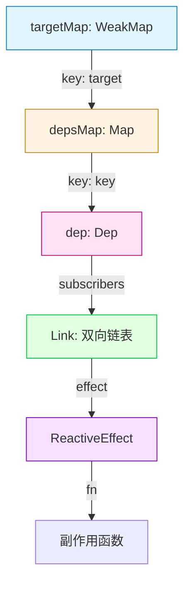

# Vue 3 依赖追踪原理(一)：核心数据结构

> 本文是《Vue 3 依赖追踪原理》系列的第一篇。在深入了解 Vue 3 如何自动追踪依赖并触发更新之前，我们需要先掌握支撑这一机制的核心数据结构。

## 一、概述

Vue 3 的响应式系统相较于 Vue 2 有了质的飞跃，其中最核心的改进之一就是依赖追踪系统的重构。为了实现高效、精确的依赖收集与副作用（Effect）触发，Vue 3 设计了一套基于 `WeakMap`、`Map` 和 `Set`（在源码中通过链表实现优化）的三层数据结构。

理解这些数据结构是阅读源码和理解响应式原理的基石。

## 二、三层映射关系

Vue 3 使用三层映射关系来管理对象、属性与副作用函数之间的关联：



### 1. 第一层：`targetMap`

这是最顶层的容器，用于存储所有被代理的响应式对象（Target）。

- **类型**：`WeakMap<object, KeyToDepMap>`
- **Key**：响应式对象本身（Target）。
- **Value**：`depsMap`，一个存储该对象所有属性依赖的 Map。
- **为什么用 WeakMap？**：当目标对象不再被代码引用时，WeakMap 允许垃圾回收器自动回收该对象及其对应的依赖信息，有效防止内存泄漏。

### 2. 第二层：`depsMap`

每个响应式对象都有一个对应的 `depsMap`。

- **类型**：`Map<any, Dep>`
- **Key**：对象的属性名（如 `'count'`, `'name'`）。
- **Value**：`Dep`，该属性对应的依赖集合。

### 3. 第三层：`Dep`

这是最小的依赖单元，对应某个对象的一个具体属性。

- **作用**：存储所有依赖于该属性的副作用函数（Effect）。
- **实现**：在 Vue 2 中是一个 `Set`，但在 Vue 3 中为了极致的性能，重构为了一个包含双向链表节点的类。

---

## 三、关键类定义

### 1. Link - 双向链表节点

`Link` 是 Vue 3.2+ 版本引入的核心优化，它作为 `Dep` 和 `ReactiveEffect` 之间的桥梁。

```typescript
// packages/reactivity/src/dep.ts
export class Link {
  /**
   * 版本号：用于追踪依赖是否仍被使用
   * - 每次 effect 运行前重置为 -1
   * - 运行时同步到 Dep 的版本
   * - 运行后仍为 -1 的 Link 会被清理
   */
  version: number;

  // 双向链表指针
  nextDep?: Link; // 指向 Effect 的下一个依赖
  prevDep?: Link; // 指向 Effect 的上一个依赖
  nextSub?: Link; // 指向 Dep 的下一个订阅者
  prevSub?: Link; // 指向 Dep 的上一个订阅者

  constructor(
    public sub: Subscriber, // 订阅者（通常是 ReactiveEffect）
    public dep: Dep // 被订阅的依赖集合
  ) {
    this.version = dep.version;
  }
}
```

**设计解读**：
传统的 `Set<Effect>` 结构在移除依赖时需要 O(n) 的查找时间，而通过 `Link` 构成的双向链表，Vue 可以在 O(1) 的时间内移除任何一个依赖关系，这在组件卸载或依赖频繁变动时性能提升巨大。

### 2. Dep - 依赖集合

`Dep` 不再仅仅是一个集合，它还维护了自身的版本号和链表头。

```typescript
// packages/reactivity/src/dep.ts
export class Dep {
  version = 0; // 版本号，每次 trigger (属性更新) 时自增

  // 性能优化：缓存当前正在追踪的 Link，避免重复创建
  activeLink?: Link = undefined;

  // 双向链表：订阅此 dep 的所有 effects
  subs?: Link = undefined; // 链表尾部
  subsHead?: Link = undefined; // 链表头部（主要用于 DEV 模式调试和遍历）

  // 反向引用：方便从 Dep 找到其所属的 Map 和 Key（用于清理）
  map?: KeyToDepMap;
  key?: unknown;

  // 订阅者计数
  sc: number = 0;
}
```

### 3. ReactiveEffect - 副作用封装

我们在 Vue 中使用的 `watch`、`computed` 或 `watchEffect`，底层都会被封装成一个 `ReactiveEffect` 实例。

```typescript
// packages/reactivity/src/effect.ts
export class ReactiveEffect<T = any> implements Subscriber {
  // 双向链表：此 effect 依赖的所有 deps（Link 节点）
  deps?: Link = undefined; // 链表头
  depsTail?: Link = undefined; // 链表尾

  // 状态标志位：标识 Effect 是激活态、正在追踪等
  flags: EffectFlags = EffectFlags.ACTIVE | EffectFlags.TRACKING;

  next?: Subscriber; // 用于调度器的链式调用优化

  constructor(public fn: () => T) {
    // 作用域管理相关逻辑...
  }
}
```

---

## 四、核心全局状态

为了在没有任何参数传递的情况下，让 `getter` 知道当前是谁在读取它，Vue 使用了全局变量来追踪当前的上下文。

### 1. `activeSub` (当前活跃的副作用)

```typescript
export let activeSub: Subscriber | undefined;
```

- 当一个 `effect` 开始执行时，它会将自己赋值给 `activeSub`。
- 在属性被读取（`track`）时，系统会检查 `activeSub` 是否存在。如果存在，就建立该属性（Dep）与当前副作用（activeSub）之间的联系。

### 2. `shouldTrack` (追踪控制开关)

```typescript
export let shouldTrack = true;
```

- 有时我们需要临时暂停依赖收集（例如在 `cleanup` 阶段或某些特殊操作中）。
- Vue 提供了 `pauseTracking()` 和 `resetTracking()` 来切换这个开关。

---

## 五、总结

通过 `WeakMap -> Map -> Dep -> Link -> Effect` 的结构，Vue 3 构建了一个稳固且高效的依赖网。

- **WeakMap** 保证了内存安全。
- **双向链表 (Link)** 保证了依赖添加和移除的高性能 (O(1))。
- **版本号 (Version)** 机制（后续章节详解）提供了快速的脏检查能力。

在下一章中，我们将深入了解**依赖收集**的具体流程，看看这些数据结构是如何动态建立关联的。
