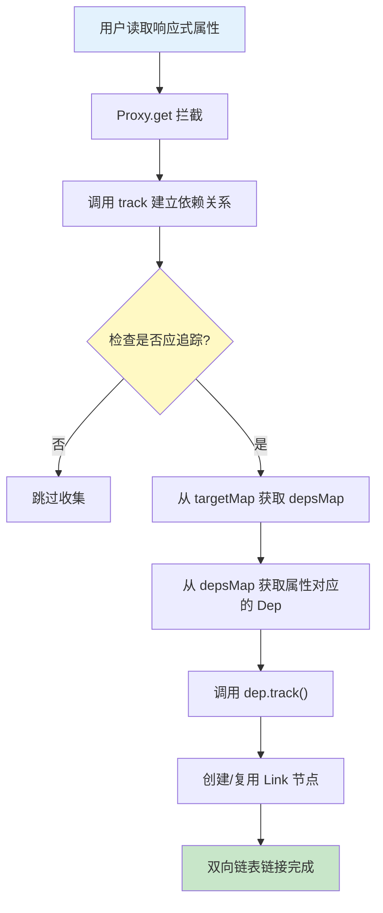

# Vue 3 依赖追踪原理(二)：依赖收集流程

> 本文是《Vue 3 依赖追踪原理》系列的第二篇。在了解了核心数据结构后，本文将详细解析 Vue 是如何在属性被读取时自动“记住”依赖关系的。

## 一、流程概览

依赖收集（Dependency Collection）是响应式系统的“输入”端。当我们在一个副作用函数（如 `computed` 或 `watchEffect`）中读取响应式对象的属性时，Vue 需要记录下“这个副作用依赖了这个属性”。

### 完整流程图



---

## 二、关键步骤详解

### 1. Proxy 拦截读取操作

Vue 3 使用 `Proxy` 来代理对象。当访问属性时，`get` 拦截器会被触发。

```typescript
// packages/reactivity/src/baseHandlers.ts
function get(target: Target, key: string | symbol, receiver: object): any {
  // 1. 获取原始值
  const res = Reflect.get(target, key, receiver);

  // ... (省略部分 Ref 解包和特殊 Key 处理逻辑)

  // 2. 关键：如果不是只读的，且允许追踪，则进行依赖收集
  if (!isReadonly) {
    track(target, TrackOpTypes.GET, key);
  }

  // 3. 如果结果是对象，会进行深层响应式转换（Lazy Reactive）
  if (isObject(res)) {
    return isReadonly ? res : reactive(res);
  }

  return res;
}
```

### 2. `track` 函数：收集入口

`track` 函数负责查找或创建对应的 `Dep` 对象，是连接 Target 和 Dep 的枢纽。

```typescript
// packages/reactivity/src/dep.ts
export function track(target: object, type: TrackOpTypes, key: unknown): void {
  // 核心检查：
  // 1. shouldTrack: 是否允许追踪（可能被暂时暂停）
  // 2. activeSub: 当前是否有正在运行的副作用（如果没有副作用在运行，读取属性不需要收集依赖）
  if (shouldTrack && activeSub) {
    // 步骤 1: 获取该对象的 depsMap
    let depsMap = targetMap.get(target);
    if (!depsMap) {
      targetMap.set(target, (depsMap = new Map()));
    }

    // 步骤 2: 获取该属性的 Dep
    let dep = depsMap.get(key);
    if (!dep) {
      // 如果不存在，创建新的 Dep 并初始化
      depsMap.set(key, (dep = new Dep()));
      dep.map = depsMap; // 反向引用，用于清理
      dep.key = key;
    }

    // 步骤 3: 委托给 Dep 实例进行实质性的链接
    if (__DEV__) {
      dep.track({ target, type, key });
    } else {
      dep.track();
    }
  }
}
```

### 3. `Dep.track()`：建立双向链表

这是最复杂也是最精妙的部分。它不仅要建立连接，还要尽可能复用已有的连接节点（`Link`），以减少内存分配。

```typescript
// packages/reactivity/src/dep.ts
class Dep {
  // ...
  track(debugInfo?: DebuggerEventExtraInfo): Link | undefined {
    // 再次安全检查
    if (!activeSub || !shouldTrack || activeSub === this.computed) {
      return;
    }

    let link = this.activeLink;

    // === 场景 A: 建立新连接 ===
    // 如果 link 不存在，或者 link 属于别的副作用（activeLink 缓存失效）
    if (link === undefined || link.sub !== activeSub) {
      // 1. 创建新的 Link 节点
      link = this.activeLink = new Link(activeSub, this);

      // 2. 将 Link 加入 Effect 的依赖列表（deps链表）的尾部
      if (!activeSub.deps) {
        activeSub.deps = activeSub.depsTail = link;
      } else {
        // 双向链表插入操作
        link.prevDep = activeSub.depsTail;
        activeSub.depsTail!.nextDep = link;
        activeSub.depsTail = link;
      }

      // 3. 将 Link 加入 Dep 的订阅列表（subs链表）
      addSub(link);

      // === 场景 B: 复用已有连接 (优化) ===
    } else if (link.version === -1) {
      // link.version 为 -1 表示该 link 在本轮 Effect 执行中尚未被访问过
      // 现在被访问了，将其标记为"活跃"（同步版本号）
      link.version = this.version;

      // 将 Link 移动到 Effect 依赖链表的尾部
      // 目的：保持依赖列表按照访问顺序排列 (LRU 思想)，这对后续清理至关重要
      if (link.nextDep) {
        const next = link.nextDep;
        next.prevDep = link.prevDep;
        if (link.prevDep) {
          link.prevDep.nextDep = next;
        }

        link.prevDep = activeSub.depsTail;
        link.nextDep = undefined;
        activeSub.depsTail!.nextDep = link;
        activeSub.depsTail = link;

        // 如果移动的是头节点，更新头指针
        if (activeSub.deps === link) {
          activeSub.deps = next;
        }
      }
    }

    return link;
  }
}
```

### 4. `addSub`：注册订阅者

这个辅助函数将 `Link` 节点插入到 `Dep` 的订阅链表中。

```typescript
function addSub(link: Link) {
  const { sub, dep } = link;

  // 头插法：新订阅者总是通过 activeLink 及其优化逻辑处理
  // 这里将 link 插入 dep.subs 链表
  link.prevSub = undefined;
  link.nextSub = dep.subs;
  dep.subs = link;

  // 如果定义了头指针（开发模式用到），也进行更新
  if (!dep.subsHead) {
    dep.subsHead = link;
  }

  // 增加计数
  dep.sc++;

  // 链式调用优化 (与批处理有关，暂不展开)
  // ...
}
```

---

## 三、总结

依赖收集的本质是**在读取属性的那一刻，构建一个数据结构来“长期”保存这种依赖关系**。

1.  用户代码访问 `state.count`。
2.  **Proxy** 捕获访问。
3.  **track** 找到 `count` 对应的 `Dep`。
4.  **Dep.track** 创建或复用 `Link` 节点，将当前的副作用（Effect）挂载到 `Dep` 上。
5.  最终形成：`Dep(count) <--> Link <--> Effect(用户函数)` 的双向连接。

这种连接一旦建立，当 `count` 发生变化时，Dep 就能顺藤摸瓜找到 Effect 并执行它。这正是下一篇《触发更新流程》要讲解的内容。
