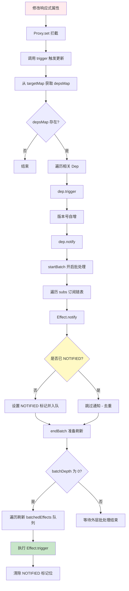

# Vue 3 依赖追踪原理(三)：触发更新流程

> 本文是《Vue 3 依赖追踪原理》系列的第三篇。上一篇我们讲解了如何收集依赖，本文将探讨当数据发生变化时，Vue 如何精确地通知并执行相关的副作用函数。

## 一、流程概览

触发更新（Trigger Update）是响应式系统的“输出”端。当响应式数据的属性被修改（Set）、添加（Add）或删除（Delete）时，系统需要找到所有“关心”这个属性的副作用，并重新运行它们。

### 完整流程图



---

## 二、关键步骤详解

### 1. Proxy 拦截写入操作

与读取被 `get` 拦截类似，写入操作会被 `set` 拦截器捕获。

```typescript
// packages/reactivity/src/baseHandlers.ts
function set(
  target: Record<string | symbol, unknown>,
  key: string | symbol,
  value: unknown,
  receiver: object
): boolean {
  let oldValue = target[key];

  // 检查 Key 是否已存在 (用于区分 ADD 还是 SET)
  const hadKey = hasOwn(target, key);

  // 1. 执行原始的赋值操作
  const result = Reflect.set(target, key, value, receiver);

  // 2. 触发更新
  // 只有当 target 等于 receiver 的原始对象时才触发 (避免原型链上的重复触发)
  if (target === toRaw(receiver)) {
    if (!hadKey) {
      // 场景 A: 新增属性
      trigger(target, TriggerOpTypes.ADD, key, value);
    } else if (hasChanged(value, oldValue)) {
      // 场景 B: 修改已有属性 (且值确实发生了变化)
      trigger(target, TriggerOpTypes.SET, key, value, oldValue);
    }
  }
  return result;
}
```

### 2. `trigger` 函数：派发入口

`trigger` 函数的主要任务是：根据修改的操作类型（Type）和属性名（Key），找出所有需要被通知的依赖集合（Dep）。

```typescript
// packages/reactivity/src/dep.ts
export function trigger(
  target: object,
  type: TriggerOpTypes,
  key?: unknown,
  newValue?: unknown,
  oldValue?: unknown,
  oldTarget?: Map<unknown, unknown> | Set<unknown>
): void {
  // 1. 获取该对象的所有依赖映射
  const depsMap = targetMap.get(target);
  if (!depsMap) {
    // 如果从未被追踪过，直接返回。
    // 但需要递增全局版本号（这对某些计算属性的边缘情况很重要）
    globalVersion++;
    return;
  }

  // 2. 收集需要触发的 Dep
  const deps: (Dep | undefined)[] = [];

  // === 基础情况：触发 Key 对应的 Dep ===
  if (key !== void 0) {
    deps.push(depsMap.get(key));
  }

  // === 特殊情况处理 ===

  // 情况 A: 数组长度变化 / 迭代器依赖
  // 如果是新增属性 (ADD) 或 删除属性 (DELETE)
  if (type === TriggerOpTypes.ADD || type === TriggerOpTypes.DELETE) {
    // 如果不是数组，触发 ITERATE_KEY (对应 Object.keys 等迭代操作的依赖)
    if (!isArray(target)) {
      deps.push(depsMap.get(ITERATE_KEY));
      // 如果是 Map，还需要触发 Map 的迭代 Key
      if (isMap(target)) {
        deps.push(depsMap.get(MAP_KEY_ITERATE_KEY));
      }
    } else if (isIntegerKey(key) && type === TriggerOpTypes.ADD) {
      // 如果是数组且添加了新索引，会影响 length 属性
      deps.push(depsMap.get("length"));
    }
  }

  // 情况 B: 数组修改 length
  if (isArray(target) && key === "length") {
    // 数组 length 变化可能影响所有索引大于新 length 的元素
    // ... (Vue 会找出受影响的索引对应的 Dep)
  }

  // 3. 执行触发
  // 此时我们有了一个 deps 数组，里面包含了所有相关的 Dep 对象
  for (const dep of deps) {
    if (dep) {
      dep.trigger({ target, type, key, newValue, oldValue });
    }
  }
}
```

### 3. `Dep.trigger`：版本递增

找到 Dep 之后，下一步是递增版本号。这是 Vue 3.2+ 性能优化的核心（后续章节细讲）。

```typescript
// packages/reactivity/src/dep.ts
class Dep {
  trigger(debugInfo?: DebuggerEventExtraInfo): void {
    this.version++; // 1. 自身的版本号递增
    globalVersion++; // 2. 全局版本号递增
    this.notify(debugInfo); // 3. 通知订阅者
  }
}
```

### 4. `Dep.notify`：通知所有 Effect

最后一步，遍历订阅链表，通知每个 Effect。

```typescript
// packages/reactivity/src/dep.ts
class Dep {
  notify(debugInfo?: DebuggerEventExtraInfo): void {
    startBatch(); // 开启批处理模式
    try {
      // ... (Dev 模式下的 onTrigger 钩子触发)

      // 遍历订阅链表 (subs)
      // 注意：这里通常会反向遍历或者经过特殊处理，以保证触发顺序符合预期
      for (let link = this.subs; link; link = link.prevSub) {
        // 调用 Effect 的 notify 方法
        if (link.sub.notify()) {
          // 如果 link.sub.notify() 返回 true，说明该 sub 是 ComputedRef
          // ComputedRef 如果变脏了，需要递归触发依赖它的 Effect
          (link.sub as ComputedRefImpl).dep.notify();
        }
      }
    } finally {
      endBatch(); // 结束批处理，统一执行副作用
    }
  }
}
```

---

## 三、进阶：批量更新与去重机制 (Batching & De-duplication)

这是一个极易产生误解的知识点。许多人认为只要在同步代码中修改多个变量，副作用就只会运行一次。**但在 Vue 3 中，这取决于副作用是否使用了“调度器 (Scheduler)”。**

### 1. 为什么需要去重？

考虑以下两种副作用：

#### 场景 A：基础 `effect` (无调度器)

```js
const state = reactive({ a: 1, b: 2 });
effect(() => {
  console.log(state.a + state.b);
});

state.a++; // 触发一次执行
state.b++; // 再次触发一次执行
```

**结果：** 副作用会执行两次。因为每个赋值操作都是一个独立的执行单元。

#### 场景 B：组件渲染 / `watch` (有调度器)

```js
// 伪代码：Vue 组件内部的更新逻辑
const componentEffect = new ReactiveEffect(
  () => {
    render(component);
  },
  () => queueJob(componentEffect)
); // 调度器：将任务推入微任务队列

state.a++; // 标记为脏，入队
state.b++; // 发现已标记，跳过入队
// ... 待同步任务结束，nextTick 后执行一次 render
```

**结果：** 只有这种情况，副作用才会真正合并为一次执行。

### 2. Vue 3.5+ 的 `NOTIFIED` 标识位

既然渲染副作用通过 `queueJob` 去重，那 Vue 3.5 为什么还要在底层引入 `NOTIFIED` 标识位和 `startBatch`？

**`NOTIFIED` 解决的是“单次原子操作”带来的冗余。**
例如：`state.arr.push(1)`。
在底层，`push` 操作不仅会修改索引，还会修改 `length`。如果没有 `NOTIFIED`：

1. `length` 改变 -> 触发依赖此数组的 Effect。
2. 索引 `n` 改变 -> 再次触发该 Effect。

**Vue 3.5 的核心改进：**
所有触发更新的操作（如 `Proxy.set`）现在都被包裹在 `startBatch()` 和 `endBatch()` 之间。

```typescript
// 伪代码：Vue 3.5+ Effect.notify
notify() {
  // 如果当前 Effect 没有被标记为 NOTIFIED
  if (!(this.flags & EffectFlags.NOTIFIED)) {
    // 1. 设置标识位
    this.flags |= EffectFlags.NOTIFIED
    // 2. 将自己挂载到全局 batchedEffect 链表
    this.nextBatchedEffect = batchedEffect
    batchedEffect = this
    return true
  }
  // 如果已经标记，直接忽略本次 notify
  return false
}
```

### 3. 完整的触发链路 (精准版)

1.  **数据变化**：调用 `trigger`。
2.  **开启批处理**：`startBatch()` 增加深度。
3.  **Dep 通知**：调用 `dep.notify()` 遍历所有订阅者。
4.  **Effect 去重**：`Effect.notify()` 检查 `NOTIFIED` 标识。
    - **如果是第一次收到通知**：设置 `NOTIFIED`，加入 `batchedEffects` 队列。
    - **如果是后续冗余通知**：跳过。
5.  **结束批处理**：`endBatch()` 减少深度。当深度回到 0 时，遍历 `batchedEffects`：
    - **如果是基础 Effect**：清理 `NOTIFIED` 标记，立即执行 `run()`。
    - **如果是组件 Effect (带调度器)**：清理 `NOTIFIED` 标记，执行 `scheduler()`（通常是 `queueJob`）。
6.  **异步刷新 (仅限带调度器情况)**：微任务队列在当前 JS 任务结 束后，统一刷新并执行最终的逻辑。

---

## 四、总结

- **`NOTIFIED` 标识位**：位于响应式系统底层。

  它的作用是确保在**同一个批处理周期**内（例如一个 `push` 操作或显式的 `batch()` 调用），同一个 Effect 绝对不会被重复处理。

- **调度器 (Scheduler)**：位于运行时/组件层。

  它的作用是跨越多个同步操作，通过**异步**机制实现最终的去重。关于调度器内部如何通过位掩码标志位实现极致的去重性能，请参考：[Vue 3 调度器去重机制详解](./Vue依赖追踪-03-触发更新流程-调度器去重.md)。
