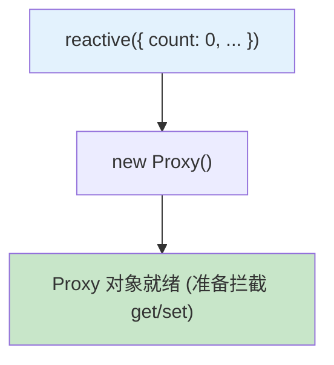

# Vue 3 依赖追踪原理(六)：完整流程演示与总结

> 本文是《Vue 3 依赖追踪原理》系列的终章。我们将通过一个完整的代码示例，串联起前面五篇文章的所有知识点，并对 Vue 3 响应式系统进行最终总结。

## 一、全景演示

为了直观展示整个系统的运作，我们使用一段最简单的代码作为剧本：

```javascript
import { reactive, effect } from "vue";

// 1. 初始化
const state = reactive({
  count: 0,
  name: "vue",
});

// 2. 首次运行
effect(() => {
  console.log(`count: ${state.count}, name: ${state.name}`);
});

// 3. 触发更新
state.count = 1;
```

### 阶段 1：初始化 (Reactive)

当 `reactive(obj)` 被调用时，Proxy 代理对象被创建。此时 `targetMap` 是空的。



### 阶段 2：首次执行 (`effect.run`)

1.  `new ReactiveEffect(fn)` 被创建。
2.  `effect.run()` 开始执行。
3.  `activeSub` 指向当前 effect；`shouldTrack` 设为 `true`。
4.  **执行用户代码**：`console.log(...)`。

**依赖收集细节：**

1.  读取 `state.count` -> 触发 `Proxy.get`。
2.  `track(target, 'count')` -> 发现 `depsMap` 为空，创建之。
3.  `Dep.track()` -> 创建 `Link1`。
    - `Link1` 连接了 `Dep(count)` 和 `Effect`。
4.  读取 `state.name` -> 触发 `Proxy.get`。
5.  `track(target, 'name')`。
6.  `Dep.track()` -> 创建 `Link2` (插入到 Link1 后面)。

**此时的内存结构：**

```
TargetMap -> Map {
  'count': Dep { subs: Link1 },
  'name':  Dep { subs: Link2 }
}

Effect -> depsHead: Link1 -> Link2 -> depsTail
```

### 阶段 3：触发更新 (`state.count = 1`)

1.  赋值操作触发 `Proxy.set`。
2.  `trigger(target, 'count')` 找到对应的 `Dep(count)`。
3.  `Dep.trigger()`：
    - `Dep.version` 从 0 变为 1。
    - `globalVersion` + 1。
4.  `Dep.notify()`：
    - 遍历 `Link1`，找到对应的 `Effect`。
    - 将 `Effect` 加入调度队列（使用批处理机制）。

### 阶段 4：重新运行 (`Re-run`)

1.  调度器执行 `Effect.run()`。
2.  `cleanupEffect` (新版为 `prepareDeps`)：会将 `Link1.version` 和 `Link2.version` 临时置为 -1。
3.  **用户代码再次执行**。
4.  读取 `state.count` -> `track`。
    - 发现已有 `Link1`。
    - **复用 Link1**，并将其 `version` 更新为新的 `Dep.version` (1)。
    - 将 `Link1` 移到链表尾部（保持活跃）。
5.  读取 `state.name` -> `track`。
    - **复用 Link2**，更新 `version`。
6.  `cleanupDeps`：
    - 检查发现 Link1 和 Link2 的 version 都不是 -1。
    - 没有依赖需要被清除。

---

## 二、与 Vue 2 的核心对比

| 特性         | Vue 2 (Object.defineProperty) | Vue 3 (Proxy + Link)        | 优势                                     |
| :----------- | :---------------------------- | :-------------------------- | :--------------------------------------- |
| **拦截机制** | Getter/Setter                 | Proxy                       | 支持新增属性、Map/Set、数组索引修改      |
| **依赖存储** | `Set<Watcher>`                | `Link` 双向链表 + `Dep`     | O(1) 增删，更好的内存管理，顺序可控      |
| **脏检查**   | 遍历对比新旧值                | `version` 整数比较          | 这种 O(1) 检查在组件树庞大时性能优势巨大 |
| **内存/GC**  | 闭包较多，手动清理复杂        | WeakMap 自动回收，Link 复用 | 减少内存碎片，降低 GC 压力               |

---

## 三、系列总结

通过这六篇文章，我们深入解构了 Vue 3 响应式系统的心脏。

1.  **核心数据结构**：确立了 `WeakMap -> Map -> Dep -> Link -> Effect` 的骨架。
2.  **依赖收集**：展示了如何在读取属性时，像织网一样自动建立连接。
3.  **触发更新**：解析了牵一发动全身的通知机制。
4.  **Effect 生命周期**：理解了副作用函数如何自我管理、清理过期依赖。
5.  **批量与优化**：看到了 Vue 团队为了极致性能所做的努力（位操作、版本号）。

掌握这些原理，不仅能让你在面试中游刃有余，更能帮助你在编写 Vue 应用时写出性能更优的代码（例如避免不必要的依赖读取、理解 `ref` 与 `reactive` 的底层差异等）。

希望本系列能成为你通往 Vue 3 源码世界的坚实阶梯。
