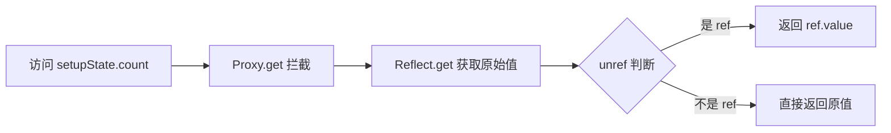
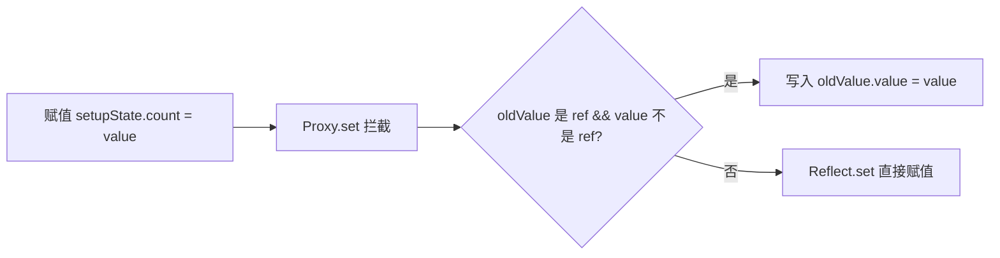

# setup 函数自动浅层解包的实现原理

## 一、核心机制概述

setup 函数返回的 ref 对象会在模板中自动解包，无需手动访问 `.value`。这是通过 **Proxy 代理**实现的，核心工具函数是 `proxyRefs`。

**为什么叫"浅层解包"？**

- 只解包对象**直接属性**中的 ref
- 嵌套对象中的 ref **不会**自动解包

## 二、完整实现流程

### 1. setup 函数返回值处理

当组件初始化时，Vue 会调用 `setupStatefulComponent` 函数：

```typescript
// packages/runtime-core/src/component.ts#L860-L874
const { setup } = Component;
if (setup) {
  // ... 创建 setup 上下文
  const setupResult = callWithErrorHandling(
    setup,
    instance,
    ErrorCodes.SETUP_FUNCTION,
    [__DEV__ ? shallowReadonly(instance.props) : instance.props, setupContext]
  );
  // ... 处理 setup 结果
  handleSetupResult(instance, setupResult, isSSR);
}
```

setup 返回的对象会传递给 `handleSetupResult`：

```typescript
// packages/runtime-core/src/component.ts#L936-L948
export function handleSetupResult(
  instance: ComponentInternalInstance,
  setupResult: unknown,
  isSSR: boolean
): void {
  if (isFunction(setupResult)) {
    // setup 返回了渲染函数
    instance.render = setupResult as InternalRenderFunction;
  } else if (isObject(setupResult)) {
    // setup 返回了对象 - 关键！
    instance.setupState = proxyRefs(setupResult); // ← 这里！
    // ...
  }
  finishComponentSetup(instance, isSSR);
}
```

**关键点**：`instance.setupState = proxyRefs(setupResult)` 这一行是自动解包的入口。

---

### 2. proxyRefs 核心实现

```typescript
// packages/reactivity/src/ref.ts#L276-L282
export function proxyRefs<T extends object>(
  objectWithRefs: T
): ShallowUnwrapRef<T> {
  return isReactive(objectWithRefs)
    ? (objectWithRefs as ShallowUnwrapRef<T>)
    : new Proxy(objectWithRefs, shallowUnwrapHandlers); // ← 创建 Proxy
}
```

如果对象已经是响应式的，直接返回；否则创建一个新的 Proxy 对象。

当 setup 返回一个对象时：

```javascript
setup() {
  const count = ref(0)
  const name = ref('vue')

  return { count, name }  // ← 返回一个对象
}
```

Proxy 包装后的对象结构：

```javascript
setupState = new Proxy(
  // target：原始对象
  {
    count: RefImpl { _value: 0, ... },
    name: RefImpl { _value: 'vue', ... }
  },
  // handler：拦截器
  shallowUnwrapHandlers
)
```

---

### 3. Proxy 拦截器：shallowUnwrapHandlers

这是自动解包的核心逻辑：

```typescript
// packages/reactivity/src/ref.ts#L252-L266
const shallowUnwrapHandlers: ProxyHandler<any> = {
  get: (target, key, receiver) =>
    key === ReactiveFlags.RAW
      ? target
      : unref(Reflect.get(target, key, receiver)), // ← 读取时自动解包

  set: (target, key, value, receiver) => {
    const oldValue = target[key];
    if (isRef(oldValue) && !isRef(value)) {
      // ← 赋值时智能处理
      oldValue.value = value;
      return true;
    } else {
      return Reflect.set(target, key, value);
    }
  },
};
```

#### 读取操作

```typescript
unref(Reflect.get(target, key, receiver));
```

`unref` 函数的实现：

```typescript
// packages/reactivity/src/ref.ts#L228-L230
export function unref<T>(ref: MaybeRef<T> | ComputedRef<T>): T {
  return isRef(ref) ? ref.value : ref;
}
```

**判断 ref 的逻辑**：

```typescript
// packages/reactivity/src/ref.ts#L45-L48
export function isRef(r: any): r is Ref {
  return r ? r[ReactiveFlags.IS_REF] === true : false;
}
```

读取流程：



#### 赋值操作

```typescript
const oldValue = target[key];
if (isRef(oldValue) && !isRef(value)) {
  oldValue.value = value; // ← 写入 ref.value
  return true;
} else {
  return Reflect.set(target, key, value); // ← 直接赋值
}
```

赋值逻辑：



---

### 4. 类型系统支持

TypeScript 类型定义确保了类型安全：

```typescript
// packages/reactivity/src/ref.ts#L516-L520
export type ShallowUnwrapRef<T> = {
  [K in keyof T]: DistributeRef<T[K]>;
};

type DistributeRef<T> = T extends Ref<infer V, unknown> ? V : T;
```

这表示：

- `ShallowUnwrapRef<{ count: Ref<number> }>` 的类型是 `{ count: number }`
- 只解包一层，不会递归解包嵌套类型

对比深度解包类型（响应式系统使用）：

```typescript
// packages/reactivity/src/ref.ts#L522-L545
export type UnwrapRef<T> =
  T extends ShallowRef<infer V, unknown>
    ? V
    : T extends Ref<infer V, unknown>
      ? UnwrapRefSimple<V>  // ← 递归解包
      : UnwrapRefSimple<T>

export type UnwrapRefSimple<T> = T extends
  | Builtin
  | Ref
  | RefUnwrapBailTypes
  ? T
  : T extends Map<infer K, infer V>
    ? Map<K, UnwrapRefSimple<V>>  // ← Map/Set 会递归
    : ...
```

---

### 5. 模板中的访问路径

模板编译后，通过 PublicInstanceProxyHandlers 访问属性：

```typescript
// packages/runtime-core/src/componentPublicInstance.ts#L428-L444
const { ctx, setupState, data, props, accessCache, ... } = instance

if (key[0] !== '$') {
  const n = accessCache![key]
  if (n !== undefined) {
    switch (n) {
      case AccessTypes.SETUP:
        return setupState[key]  // ← 返回 setupState
      // ...
    }
  } else if (hasSetupBinding(setupState, key)) {
    accessCache![key] = AccessTypes.SETUP
    return setupState[key]  // ← 返回 setupState（已被 proxyRefs 包装）
  }
  // ...
}
```

完整访问链：

```
模板中 {{ count }}
    ↓
编译为 _ctx.count
    ↓
PublicInstanceProxyHandlers.get 拦截
    ↓
返回 instance.setupState.count
    ↓
shallowUnwrapHandlers.get 拦截
    ↓
unref(原始值) → 自动返回 count.value
```

---

## 三、示例演示

### 示例 1：基本用法

```javascript
import { ref } from 'vue'

setup() {
  const count = ref(0)
  const name = ref('vue')

  return { count, name }
}
```

模板中直接使用：

```html
<template>
  <div>{{ count }}</div>
  <!-- 自动解包为 0 -->
  <div>{{ name }}</div>
  <!-- 自动解包为 'vue' -->
</template>
```

### 示例 2：浅层解包（嵌套不自动解包）

```javascript
setup() {
  const state = {
    count: ref(0),
    nested: {
      num: ref(1)  // ← 嵌套 ref 不会自动解包
    }
  }

  return { state }
}
```

模板中使用：

```html
<template>
  <div>{{ state.count }}</div>
  <!-- ✓ 自动解包为 0 -->
  <div>{{ state.nested.num }}</div>
  <!-- ✗ 返回 Ref 对象，需要 .value -->
  <div>{{ state.nested.num.value }}</div>
  <!-- ✓ 正确 -->
</template>
```

### 示例 3：赋值行为

```javascript
setup() {
  const count = ref(0)
  const other = 'hello'

  return { count, other }
}
```

JavaScript 中操作：

```javascript
// 通过 this 访问（公共实例代理）
this.count = 10; // 等价于 count.value = 10 ✓
this.other = "world"; // 直接替换为 'world' ✓
```

---

## 四、关键设计决策

### 1. 为什么使用 Proxy 而非 Object.defineProperty？

- **Proxy 可以拦截所有属性**，包括动态添加的属性
- **Proxy 性能更好**，一次代理处理整个对象
- **Proxy 支持删除操作**的拦截

### 2. 为什么只做浅层解包？

- **性能考虑**：深度遍历嵌套对象开销大
- **类型安全**：避免意外的深度解包导致类型混乱
- **灵活性**：用户可以选择使用 `reactive()` 处理嵌套对象

### 3. 与 reactive 的区别

| 特性       | proxyRefs (setup 返回值) | reactive       |
| ---------- | ------------------------ | -------------- |
| 解包层级   | 浅层                     | 深层           |
| 嵌套 ref   | 保留 ref                 | 解包 ref       |
| 适用场景   | setup 返回的绑定对象     | 创建响应式状态 |
| Proxy 对象 | 是                       | 是             |

---

## 五、面试要点总结

1. **核心工具**：`proxyRefs` 函数使用 Proxy 拦截 get/set 操作
2. **get 拦截**：通过 `unref` 自动返回 `ref.value` 或原值
3. **set 拦截**：智能判断，原值是 ref 时写入 `.value`，否则直接赋值
4. **浅层含义**：只解包直接属性，嵌套对象中的 ref 不解包
5. **性能优化**：使用 `accessCache` 缓存属性访问类型
6. **类型安全**：TypeScript 类型 `ShallowUnwrapRef` 确保编译时类型正确
