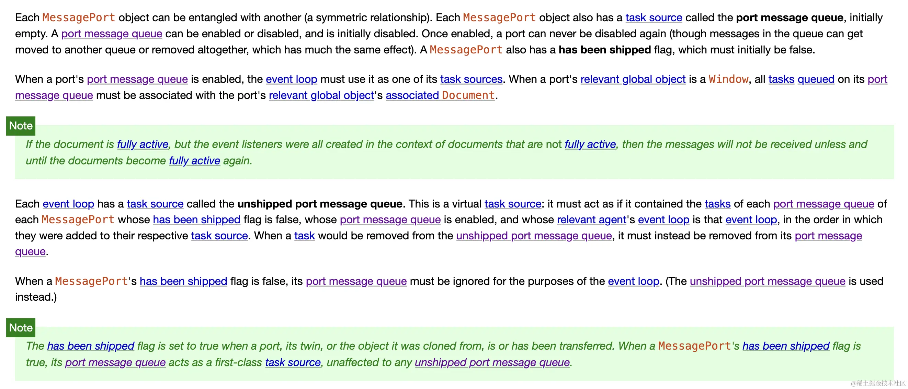

# MessageChannel 的用法详解

## 基本概念

`MessageChannel` 创建了一个新的消息通道，其中包含两个 `MessagePort` 对象，分别是 `port1` 和 `port2`。

这两个端口可以进行双向通信。每个端口可以通过 `postMessage` 方法向对方发送消息，而接收消息的端口可以监听 `message` 事件来接收消息。

## 用法和属性

### `port1` 和 `port2`

- `MessageChannel` 实例包含两个端口 (`port1` 和 `port2`)，它们都是 `MessagePort` 类型。
- 这两个端口可以独立地接收和发送消息，消息通过调用 `port.postMessage()` 来发送。
  port.postMessage(message)

### port.postMessage(message)

- 该方法用于向与之连接的另一端口发送消息。
- `message` 可以是任何可以被复制的对象（基本数据类型、对象、数组等）。

### port.onmessage

- 用于监听从另一端口发送过来的消息。通过设置 `port.onmessage` 事件处理程序来接收消息。

### port.start()

- 默认情况下，`MessagePort` 在创建时处于关闭状态。要使其开始接收消息，必须调用 `port.start()`。
- 通常在创建 `MessageChannel` 后，**`port.start()` 会自动调用**，但如果需要在特定时机启动消息接收，则可以手动调用。

### port.close()

- 关闭端口，表示不再接收任何消息。

```js
const channel = new MessageChannel()

channel.port1.onmessage = (event) => {
  console.log('Received:', event.data)
}

channel.port2.postMessage('Hello, world!')
```

## 核心概念

`MessageChannel` 的“异步任务调度”能力，是指通过它可以将任务分解为小块，按照特定的优先级或时间片调度任务的执行，而不会阻塞主线程。

`MessageChannel` 本质是一个轻量级的消息队列。通过它，可以将任务推送到消息队列中，并异步触发消息处理逻辑。相比传统的异步方法（如 `setTimeout`），`MessageChannel` 的调度更加高效且精准。

### 消息传递是异步的

- `port2.postMessage()` 会将消息发送到消息队列中，而不会阻塞当前执行的代码。
- 消息被接收（通过 `port1.onmessage`）后，**会在下一次事件循环中异步执行**。

```js
const channel = new MessageChannel()

channel.port2.onmessage = ({ data }) => {
  console.log('port2 接受到消息', data)
}

console.log('port1 发送消息')

new Promise((resolve) => {
  resolve()
}).then(() => {
  console.log('then 执行')
})

setTimeout(() => {
  console.log('setTimeout 执行1')
}, 0)

channel.port1.postMessage('Hello1')
channel.port1.postMessage('Hello2')

setTimeout(() => {
  console.log('setTimeout 执行2')
}, 0)

setTimeout(() => {
  console.log('setTimeout 执行3')
}, 0)

// 输出：
// port1 发送消息
// then 执行
// setTimeout 执行1
// port2 接受到消息 Hello1
// setTimeout 执行2
// setTimeout 执行3
// port2 接受到消息 Hello2
```

令人疑惑的是：结果不是 `setTimeout` 全部执行完毕后再执行低优先级的 `MessageChannel`。而是执行了 `MessageChannel` 之后再执行后续的 `setTimeout`。下图是 MessageChannel 的官方资料：



具体原因可以看：

<!-- [MessagePort 详解]('/03-MessageChannel的MessagPort详解.md') -->

### MessagePort 的消息队列

- 每个 `MessagePort` 都有一个 任务源（`task source`），称为 端口消息队列（`port message queue`）。
- 消息队列状态
  - 消息队列可以被启用或禁用，初始状态为禁用
  - 一旦消息队列启用，就不能再禁用
- `MessagePort` 还拥有一个 "`has been shipped`" 标志，初始值为 `false`

### 消息队列与事件循环

- **当端口的消息队列启用时，事件循环会必须将其当作其任务源之一**
- 如果 `MessagePort` 所关联的全局对象（如 Window）处于活动状态（`fully active`），消息队列的任务会被加入事件循环中

### 未发货的端口消息队列

“未发货的端口消息队列”是 事件循环的一个虚拟任务源，专门用于管理以下类型的 `MessagePort`：

- `has been shipped` 标志为 `false` 的 `MessagePort。`
- 消息队列已启用，但还没有被传递给其他端口或对象。

如果 `has been shipped` 标志为 `false`，则 `MessagePort` 的消息队列会被事件循环忽略（实际使用的是未发货队列）

### "has been shipped" 标志

- 当 `MessagePort` 被传递给其他端口或对象时，其`has been shipped` 标志会设为 `true`。
- 一旦标志为 `true`，其消息队列会作为一个正式的任务源使用，不受未发货消息队列的影响

---

总结：这也就是为什么 `MessageChannel` 的消息队列会在 `setTimeout` 之前执行一次的原因，当该队列处于 `enabled` 状态时，`event loop` 必须执行一个 `port message queue` 中的任务。

## 为什么需要异步任务调度

### 主线程阻塞问题：

- 浏览器的主线程（UI 渲染线程）负责处理 `JavaScript` 执行、页面布局、绘制等工作。
- 如果 `JavaScript` 中执行一个大任务，比如计算或 `DOM` 操作，主线程可能会被长时间占用，导致页面卡顿，用户体验变差。

### 解决方案：时间切片

- 将一个大任务切分成多个小任务，每个小任务执行时间尽量短（比如 `5ms` 内）。
- 小任务执行后主动让出主线程，让浏览器可以执行其他操作（如 UI 更新）
- 这种分段执行的机制可以通过 `MessageChannel` 实现，达到类似“时间切片”的效果

## 与订阅发布模式的区别

| 特性           | MessageChannel                 | 传统发布-订阅模式              |
| -------------- | ------------------------------ | ------------------------------ |
| **通信机制**   | 基于两个固定的端口双向通信     | 多个发布者和订阅者通过中间代理 |
| **中间代理**   | 无需中间代理，端口直接通信     | 通常需要一个“事件总线”或中介   |
| **订阅数量**   | 每个端口只能与另一个端口通信   | 可以有多个订阅者订阅同一个事件 |
| **解耦程度**   | 两端直接通信，相对耦合较低     | 发布者和订阅者完全解耦         |
| **实现复杂性** | 提供浏览器级原生实现，使用简单 | 通常需要手动实现发布-订阅模式  |
| **异步特性**   | 基于异步消息传递，性能优越     | 可以同步或异步，依赖实现方式   |
