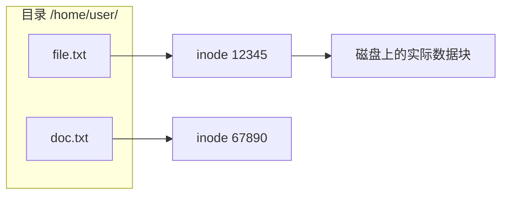
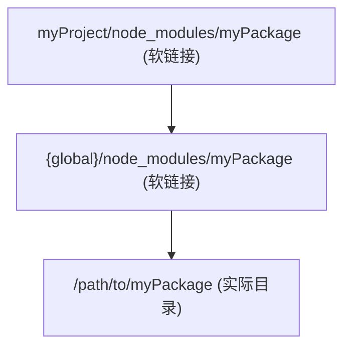
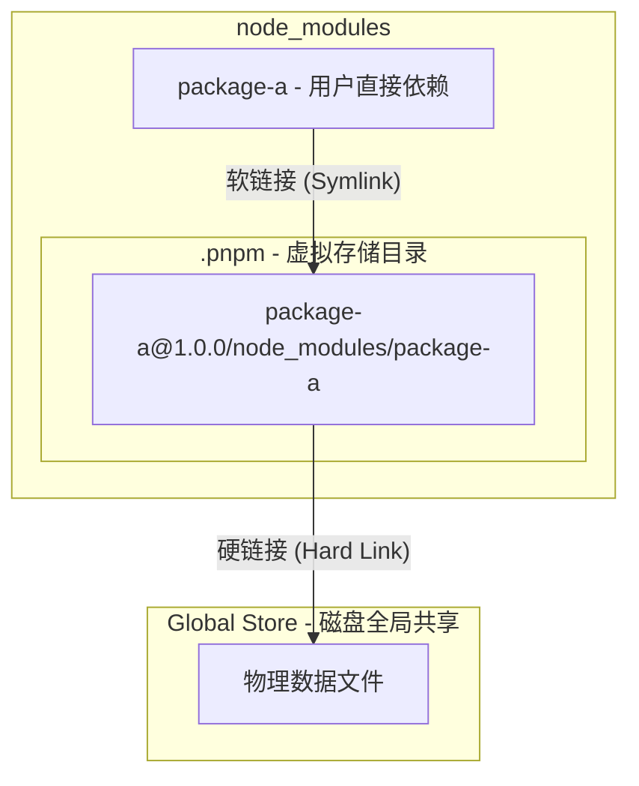
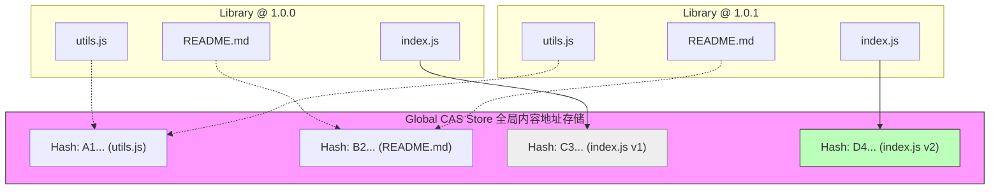

## 文件系统基础概念

在理解链接之前,需要了解文件系统的基本结构：

**1. inode (索引节点)**

- 文件系统中存储文件元数据的数据结构
- 包含：文件大小、权限、时间戳、数据块位置等
- 每个文件/目录都有唯一的 `inode` 编号
- **重点**: `inode` 不包含文件名

**2. 目录项 (directory entry)**

- 目录实际上是一个特殊文件，存储 **"文件名 → inode 编号"** 的映射表
- 我们看到的"文件"其实是目录项中的一条记录

**示例**:



## 硬链接的本质

硬链接就是 **在目录中创建另一个指向同一 `inode` 的条目**：

可以理解为"自动同步的引用"

特点：

- 所有硬链接都是平等的，删除其中一个不影响其他
- 只能链接文件，不能链接目录
- 必须在同一个文件系统内
- 修改任何一个硬链接，其他都会同步变化(因为指向同一数据)
- 文件的引用计数会增加，只有所有硬链接都删除后，数据才真正被删除

```
目录 /home/user/
├── file.txt    → inode 12345  (原始)
└── backup.txt  → inode 12345  (硬链接，指向同一 inode)
```

:::tip

硬链接是指多个文件名指向同一个物理数据块
:::

### 应用场景

- 原子性操作

创建硬链接后再删除原文件，可以实现"安全重命名"：

```bash
# 创建新名字
ln old-name.txt new-name.txt

# 删除旧名字(数据仍在)
rm old-name.txt
```

在这个过程中，文件数据始终可访问，不会出现"空档期"。

- 防止误删除

为重要文件创建硬链接作为"保险"：

```bash
ln important.txt important.backup
# 即使误删 important.txt,数据仍可通过 important.backup 访问
```

## 软链接的本质

软链接是一个 **独立的文件，内容是目标路径的字符串**，类似 windows 的快捷方式：

特点：

- 可以链接文件和目录
- 可以跨文件系统
- 如果删除源文件，软链接会失效(变成悬空链接)
- 软链接本身是一个独立的文件，有自己的 `inode`
- 可以链接到不存在的路径

```
目录 /home/user/
├── file.txt → inode 12345 (普通文件)
└── link.txt → inode 99999 (软链接文件，内容是 "/home/user/file.txt")
```

## npm link

`npm link` 是一个非常实用的 `npm` 命令，主要用于在本地开发环境中测试和调试 `npm` 包，而不需要每次都发布到 `npm` 仓库。

1. 在包项目中创建全局链接

```bash
cd myPackage
npm link
```

`npm` 会在全局 `node_modules` 目录创建一个软链接：

`{global}/node_modules/myPackage -> /path/to/myPackage`

2. 在使用包的项目中链接

```bash
cd myProject
npm link myPackage
```

这会在 `myProject` 的 `node_modules` 中创建一个符号链接，指向全局链接的 `myPackage`。



## pnpm

`pnpm` 的核心机制通过结合硬链和软链来实现极致的磁盘空间节省和严格的依赖管理。

核心机制：三层架构

`pnpm` 采用 **内容寻址存储 (Content-Addressable Storage)** + **链接机制** 来节省磁盘空间。

- 全局存储 (`Global Store`)： 物理文件实际存放的地方。

- 虚拟存储目录（Virtual Store）： 项目内的 `.pnpm` 目录（隐藏目录）。

- 标准模块目录： 项目根目录下的 `node_modules`。



### 为什么要使用软链

- **扁平化结构**：保持 `node_modules` 看起来扁平
- **符合 Node.js 解析规则**
- **依赖隔离**：每个包的依赖都在自己的 `.pnpm` 目录下

解决了 **“幽灵依赖”（Phantom Dependencies）**： 只有你在 `package.json` 里声明过的依赖，才会在根目录的 `node_modules` 里创建软链。你无法访问没有声明的子依赖（因为它们被藏在 `.pnpm` 文件夹深处的嵌套软链里）。

### 硬链接的局限

- 不能跨文件系统（必须在 **同一个文件系统(分区/磁盘)** 内创建。）

  - 如果你的项目在 D 盘，而 `pnpm` 的全局 `store` 在 C 盘，硬链接无法创建。
  - 在这种情况下，`pnpm` 会自动回退到 **复制 (`Copy`)** 模式（即复制文件，不使用硬链，但依然使用软链来管理结构）。

- 不能链接目录（硬链接只能链接文件，不能链接目录。）

  - `pnpm` 需要对每个文件创建硬链接,而不是整个目录
  - 安装大型包(如 `@types/node`)时会创建大量硬链接，稍慢

- **修改会影响所有链接**

所有硬链接指向同一数据块，修改任意一个，所有都会变化。

- **删除行为不直观**
  删除一个硬链接不会删除数据,只有删除所有硬链接,数据才真正删除。

- **无法识别是否为硬链接**
  从外观上，硬链接看起来就像普通文件，无法直观识别。

### 内容寻址存储

**内容寻址存储 (Content-Addressable Storage, CAS)** 是 `pnpm` 的核心设计。

在 CAS 中，检索数据依赖于内容的哈希摘要（Content Hash）。

`pnpm` 的 CAS 实现是 **文件粒度 (`File-level`)** 的，而不是包粒度 (`Package-level`) 的。这是它与其他包管理器缓存机制最大的不同。

#### 传统方式 vs 内容寻址

传统方式：按照"名称+版本"存储：

```bash
node_modules/
├── lodash/           ← 按包名存储
│   └── index.js
└── react/
    └── index.js
```

内容寻址：按照"文件内容的哈希值"存储：

```bash
~/.pnpm-store/v3/files/
├── a1/
│   └── b2c3d4e5f6...abc  ← 文件内容的 hash
├── f7/
│   └── 8e9d0a1b2c...def
└── ...
```

#### 写入流程

- **下载与计算**： 当 `pnpm` 下载一个 tarball（压缩包）后，它会解压并遍历其中的每一个文件（`.js`, `.json`, `.png` 等）。
- **哈希生成**： 对每一个单独的文件内容计算 `SHA-256` 哈希值（或其他算法）。
- **扁平化存储**： 文件被重命名为该哈希值，并存入全局 `Store` 的 `files` 目录下。

#### 映射关系

`pnpm` 维护一个索引，记录"包信息 → 文件哈希"的映射:

```yaml
# ~/.pnpm-store/v3/metadata/
lodash@4.17.21:
  files:
    package.json: a1b2c3d4e5f6...
    index.js: f7g8h9i0j1k2...
    array.js: m3n4o5p6q7r8...
    ...
```

在项目的 `.pnpm` 目录创建硬链接:

```bash
项目/.pnpm/lodash@4.17.21/node_modules/lodash/
  ├── package.json → ~/.pnpm-store/v3/files/a1/b2c3d4e5f6...
  ├── index.js     → ~/.pnpm-store/v3/files/f7/g8h9i0j1k2...
  └── array.js     → ~/.pnpm-store/v3/files/m3/n4o5p6q7r8...
```

#### CAS 的关键技术优势

- 跨版本增量去重
  - 对于那 50 个未变动的文件，计算出的哈希值与旧版本完全一致。CAS 检测到 `Store` 中已存在该哈希，直接复用物理文件。
  - 只有那个被修改的 `index.js` 会生成新的哈希，并作为一个新文件写入磁盘。
  - 结果： 升级依赖时，磁盘增量几乎仅等于 diff 的大小。

假设 `library@1.0.0` 和 `library@1.0.1` 只有 `index.js` 里的最后一行代码不同，但其他的 50 个文件（工具函数、文档、License、图片资源）完全没变。



- **数据完整性校验**

  - 在读取文件时，`pnpm` 可以重新计算内容的哈希。
  - 如果计算结果与文件名（或索引中的记录）不符，说明文件已损坏或被恶意篡改。

#### 实际存储示例

真实的 `pnpm store` 结构：

```bash
~/.pnpm-store/
├── v3/
│   ├── files/                    # 所有文件内容
│   │   ├── 00/
│   │   │   ├── 1a2b3c4d5e...    # 某个文件的内容
│   │   │   └── 9f8e7d6c5b...
│   │   ├── 01/
│   │   │   └── ...
│   │   ├── ...
│   │   └── ff/
│   │       └── ...
│   ├── metadata/                 # 包的元数据
│   │   └── registry.npmjs.org/
│   │       ├── lodash/
│   │       │   └── 4.17.21.json  # 记录这个版本包含哪些文件
│   │       └── react/
│   │           └── 18.2.0.json
│   └── tmp/                      # 临时文件
└── v2/                           # 旧版本格式(向后兼容)
```

#### 它是如何被引用的？

当你执行 `pnpm install` 时：

1. `pnpm` 解析依赖树。
2. 查找全局 `Store` 的索引，找到该版本所有文件对应的哈希值。
3. 在你的项目 `node_modules/.pnpm/...` 中，将对应的文件通过 **硬链接** 直接指向上述的物理存储路径。

**一句话总结**： `pnpm` 的 CAS 是一个以文件内容哈希为键值的全局键值对数据库，它实现了文件级别的物理去重，使得不同版本的包可以共享相同的物理文件块。

## yalc

`yalc` 是一个用于在本地开发和测试 `npm` 包的工具。

简单来说，它是一个运行在本地磁盘上的轻量级 **npm 注册表 (Registry) 模拟器**。它的核心目的是解决 `npm link` 或 `yarn link` 在开发调试本地库时带来的各种 **“软链地狱”** 问题。
