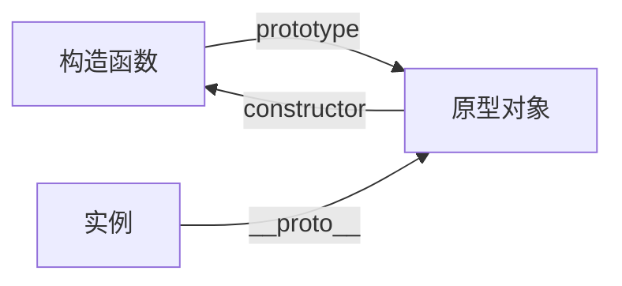

# 原型和原型链

## 核心概念

- 构造函数 (Constructor): 用来生成对象的函数（比如 `function Person() {}`）。

- 原型对象 (Prototype Object): 这是一个“公共仓库”，里面存放着所有实例共享的属性和方法。

- 实例 (Instance): 通过构造函数 new 出来的对象。

两个重要的属性：

- `prototype`：只有函数（构造函数）才有。 它指向由于该函数创建的实例的原型对象。

- `__proto__`（读作 dunder proto）：所有对象（包括函数）都有。 它是实例指向原型的“链条/指针”。（注：标准写法是 Object.getPrototypeOf()，但为了理解方便，通常用 **proto** 解释）。



```javascript
// 1. 定义构造函数
function Person(name) {
  this.name = name;
}

// 2. 在原型上添加方法
Person.prototype.sayHello = function () {
  console.log("你好，我是 " + this.name);
};

// 3. 创建实例
const p1 = new Person("张三");
const p2 = new Person("李四");

// 测试
p1.sayHello(); // 输出：你好，我是 张三
// 解释：p1 自己没有 sayHello，顺着 __proto__ 找到了 Person.prototype 里的 sayHello
```

它们之间的三角关系：

我们可以用一个简单的逻辑公式来表示这种关系：

1. `p1.constructor === Person `

2. `Person.prototype.constructor === Person`

3. 最关键的一行： `p1.__proto__ === Person.prototype `

## 原型链

### 显示原型

显示原型就是利用 `prototype` 属性查找原型，只是这个是函数类型数据的属性。

### 隐式原型

隐式原型是利用 `__proto__` 属性查找原型，这个属性指向当前实例的构造函数的原型对象。原型对象也是一个对象，那么它的`__proto__`属性指向哪里呢？

对象的构造函数就是 `Object()`，所以对象的原型对象，就是 `Object.prototype`。

所以，原型对象它的 `__proto__` 属性指向 `Object.prototype`。`Object.prototype`存放着 `toString`, `valueOf`等基础方法。

### 图解原型链

根据上述逻辑，我们可以总结出如下的完整流程图（蓝色线条表示 `__proto__` 构成的原型链）：

```mermaid
flowchart TD
    %% 节点形状定义
    PersonC(["Person()"])
    PersonP["Person.prototype"]
    per1(["per1"])
    ObjectC(["Object()"])
    ObjectP["Object.prototype"]
    Null(["null"])

    %% 构造函数与原型关系
    PersonC -- ".prototype" --> PersonP
    PersonP -- ".constructor" --> PersonC
    ObjectC -- ".prototype" --> ObjectP
    ObjectP -- ".constructor" --> ObjectC

    %% 实例化
    PersonC -. "new" .-> per1

    %% 核心原型链 (蓝色线条)
    per1 -- ".__proto__" --> PersonP
    PersonP -- ".__proto__" --> ObjectP
    ObjectP -- ".__proto__" --> Null

    %% 布局对齐辅助 (不可见线)
    PersonC ~~~ per1
    per1 ~~~ ObjectC
    PersonP ~~~ ObjectP

    %% 样式美化
    linkStyle 5,6,7 stroke:#2b99ff,stroke-width:2px;
    style Null fill:none,stroke:none
```

## Object.create()

Object.create() 的作用非常直接：

它创建一个新对象，并把这个新对象的 `__proto__` 直接指向你传入的参数 `proto`。

```javascript
const obj1 = {
  name: "xiaoming",
};

const obj2 = Object.create(obj1);

console.log(obj2); // 输出为 {}
console.log(Object.getPrototypeOf(obj2)); // Object.getPrototypeOf(obj2) 等同于 obj2.__proto__，输出为 obj1
console.log(obj2.name); // 输出为 "xiaoming"
```
