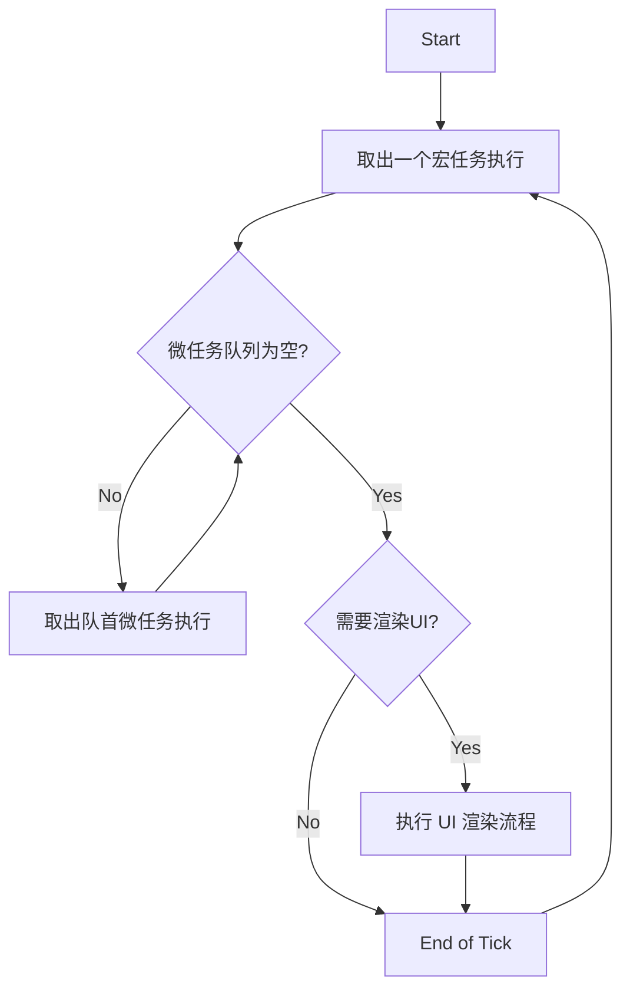

# 深度解析：浏览器与 Node.js 事件循环

> **核心摘要**：事件循环（Event Loop）是 JavaScript 实现异步非阻塞 I/O 的核心机制。作为资深前端开发，不仅要掌握宏任务与微任务的区别，更要深入理解浏览器渲染时机、Node.js 各阶段的差异以及在性能优化中的实际应用。

## 核心概念：为什么需要事件循环？

JavaScript 的一大特点是**单线程**（Single Threaded）。这意味着如果不加以管理，一个耗时的任务（如网络请求、图片处理）就会阻塞整个主线程，导致页面卡死（UIThread Block）。

为了解决这个问题，JavaScript 采用了 **"单线程 + 事件循环"** 的架构：

- **调用栈 (Call Stack)**：负责执行同步代码，遵循 LIFO (Last In, First Out) 原则。
- **任务队列 (Task Queue)**：负责存放异步任务的回调。
- **事件循环 (Event Loop)**：一个持续运行的进程，它负责监控调用栈。**一旦调用栈为空**，它就会从任务队列中取出任务推入栈中执行。

---

## 浏览器的事件循环机制

浏览器中，异步任务被分为两类：**宏任务 (Macrotask)** 和 **微任务 (Microtask)**。这两者的执行时机完全不同，是面试中的"必考题"。

### 宏任务 (Macrotask)

宏任务代表一个个独立的、离散的工作单元。有些文档也直接称为 "Task"。

- **常见源**：
  - `<script>` (整体代码脚本)
  - `setTimeout` / `setInterval`
  - `setImmediate` (仅 IE/Node)
  - `requestAnimationFrame` (注：通常归类为渲染步骤，但在循环中类似宏任务位置)
  - `I/O 操作` (网络请求回调、UI 事件如 click/scroll)
  - `MessageChannel`

### 微任务 (Microtask)

微任务是为了在当前宏任务结束后、下一个宏任务开始前，尽快执行的任务。**微任务拥有插队特权**。

- **常见源**：
  - `Promise.then` / `.catch` / `.finally`
  - `MutationObserver`
  - `queueMicrotask()`
  - `process.nextTick` (Node.js 独有，优先级最高)

### 完整的循环流程 (The Tick)

一个标准的 Event Loop "Tick" (循环) 流程如下：

1.  **执行栈选择**：从宏任务队列中取出一个（最老的一个）执行。如果是首次启动，则是脚本整体代码。
2.  **执行宏任务**：执行过程中可能会产生新的宏任务或微任务。
3.  **清空微任务队列**：当当前宏任务执行完毕，**立即检查微任务队列**。
    - 如果不为空，依次取出执行，直到队列为空。
    - **关键点**：如果在执行微任务的过程中，又产生了新的微任务，**会继续添加到队尾并在本次周期内执行完**。这意味着微任务长循环会导致阻塞（无限循环）。
4.  **UI 渲染** (Update the Rendering)：
    - 浏览器此时会判断是否需要更新 UI。通常浏览器的刷新率是 60Hz（16.6ms 一次），如果两次 Loop 间隔很短，浏览器可能会跳过渲染。
    - 如果有 `requestAnimationFrame`，通常会在渲染前执行。
5.  **下一轮**：回到步骤 1。



---

## 渲染时机与 requestAnimationFrame

很多开发者误以为 `setTimeout(fn, 0)` 就能立即执行，其实不然。

### 渲染管线

浏览器的重绘（Repaint）和重排（Reflow）通常发生在事件循环的 **Update the Rendering** 阶段。

- **Javascript** -> **Style** -> **Layout** -> **Paint** -> **Composite**

### requestAnimationFrame (rAF)

- `rAF` 是专门为动画设计的 API。
- 它保证回调函数在**每一次浏览器重绘之前**执行。
- **它是宏任务还是微任务？**
  - 严格来说，它不属于这两者。它是在 "Rendering" 步骤中被调用的独立队列。
  - 执行顺序通常为：同步代码 -> 微任务 -> **rAF** -> 渲染 -> 宏任务(下一次)。

### 为什么 setTimeout 甚至 setInterval 做动画会卡顿？

1.  **时间不准**：`setTimeout` 依赖事件循环，如果主线程阻塞，延时会大大增加。
2.  **掉帧**：如果屏幕刷新率是 60Hz（16.6ms），而定时器设为 10ms，可能在一次刷新间隔内执行两次，或者跨过刷新点，导致动画抖动。
3.  **不节能**：后台标签页中，`setTimeout` 仍会运行（虽然现代浏览器限制为 1s+），但 `rAF` 会自动暂停。

---

## Node.js 事件循环的特殊性

Node.js 的 Event Loop 基于 **libuv**，与浏览器环境有显著差异。Node 的循环分为 6 个阶段，按照顺序循环往复。

### 六个阶段 (Six Phases)

主要关注以下三个：

1.  **Timers**：执行 `setTimeout` 和 `setInterval` 的回调。
2.  **Poll**：获取新的 I/O 事件（网络、文件读写等），执行 I/O 回调。这是最为复杂的阶段。
3.  **Check**：执行 `setImmediate` 的回调。

### Node 11 之前 vs 之后

这是一个非常重要的面试考点。

- **Node 10 及以前**：
  - 微任务（`process.nextTick` 和 Promise）只在**每个阶段切换时**才执行。
  - 如果 Timers 阶段有 3 个回调，会先把这 3 个全都执行完，再回头去清空微任务队列。
- **Node 11 及以后**：
  - **行为向浏览器看齐**。
  - 如果 Timers 阶段有 3 个回调，执行完第 1 个后，**立即**检查并清空微任务，然后再执行第 2 个。

### process.nextTick vs setImmediate

- **process.nextTick**：
  - **不是**事件循环的一部分。它有一个独立的队列（nextTickQueue）。
  - **优先级极高**：在当前操作完成后，无论处于哪个阶段，都会**立即**处理 nextTickQueue，然后才处理 Promise 队列。
  - **风险**：递归调用 `nextTick` 会导致 I/O 饥饿（Starvation），阻塞事件循环。
- **setImmediate**：
  - 用于在 Poll 阶段结束后（即 Check 阶段）立即执行脚本。
  - 它和 `setTimeout(fn, 0)` 的顺序是不确定的（取决于启动时的性能偏差），但在 I/O 回调中，`setImmediate` 总是优先于 `setTimeout`。

---

## 面试避坑指南 (FAQ)

### Q1: 页面卡顿是因为宏任务太多还是微任务太多？

**答**：通常是因为**同步代码执行过久**（Long Task）或者**微任务队列死循环**。

- 如果是宏任务多，浏览器有机会在两个任务之间进行渲染，页面可能响应慢，但不至于完全“卡死”。
- 如果是微任务队列无限添加（例如递归 Promise），由于微任务必须在当前 Tick 清空，事件循环永远无法进入渲染阶段，导致页面彻底卡死。

### Q2: 如何实现一个 sleep 函数？

JS 是单线程，无法真正的 "sleep"（阻塞线程）。我们指的通常是异步等待。

```javascript
// 现代写法
const sleep = (ms) => new Promise((resolve) => setTimeout(resolve, ms));
await sleep(1000);
```

不要使用 `while(Date.now() - start < 1000)` 这种“忙等待”写法，它会阻塞主线程，导致这段时间内无法响应任何交互。

### Q3: 为什么 Vue.$nextTick 优先使用 Promise？

**核心原因**：为了在**同一个事件循环 Tick 内、DOM 更新后、浏览器渲染前**执行回调。

**执行流程**：

1. **数据变化** → Vue 将 DOM 更新操作放入微任务队列（微任务 A）
2. **调用 `$nextTick(callback)`** → 将回调放入微任务队列（微任务 B，排在 A 后面）
3. **执行微任务 A** → DOM 已更新（虚拟 DOM diff + 真实 DOM 操作完成）
4. **执行微任务 B** → `$nextTick` 的回调执行，此时**能拿到更新后的 DOM**
5. **UI 渲染** → 浏览器将更新后的 DOM 绘制到屏幕

**关键细节**：

- **DOM 更新** ≠ **UI 渲染**
  - DOM 更新：修改 DOM 树结构/属性（在微任务中完成）
  - UI 渲染：浏览器将 DOM 绘制到屏幕（在微任务清空后）
- 微任务中可以完成 DOM 更新，`$nextTick` 回调能读取到更新后的 DOM 节点
- 但此时屏幕上还没有视觉变化，要等微任务清空后才会触发渲染

**为什么不用 `setTimeout`**：

- 如果用 `setTimeout`（宏任务），回调会在下一个宏任务执行
- 中间可能已经渲染过一次，时机不够精确
- 用微任务可以保证在**同一个 Tick 内**，时机更可控，减少不必要的重绘

## 总结

| 特性                 | 浏览器                     | Node.js (v11+)         |
| :------------------- | :------------------------- | :--------------------- |
| **微任务执行时机**   | 每个宏任务执行完后立即执行 | 同浏览器               |
| **process.nextTick** | 无                         | 微任务队列中最优先执行 |
| **setImmediate**     | 无 (IE 独有非标准)         | Check 阶段执行         |
| **Timer 优先级**     | 宏任务                     | Timers 阶段执行        |

掌握事件循环，本质上是掌握**JavaScript 引擎的时间管理艺术**。在性能优化、复杂逻辑排错中，这些知识也是必不可少的。

---

## 经典面试题：执行顺序大乱斗

这是区分初级和高级开发者的分水岭。请务必掌握 Promise、Async/Await 和 Timer 的混合执行顺序。

### 基础题：Promise vs Timeout

```javascript
console.log("1");

setTimeout(() => {
  console.log("2");
}, 0);

Promise.resolve()
  .then(() => {
    console.log("3");
  })
  .then(() => {
    console.log("4");
  });

console.log("5");
```

**解析**：

1. `log('1')` 同步执行。
2. `setTimeout` 注册宏任务。
3. `Promise.then` 注册微任务 1。
4. `log('5')` 同步执行。
5. **同步结束，检查微任务**：执行微任务 1 -> `log('3')`。产生的 `then` 注册新微任务 2。
6. 继续执行微任务 2 -> `log('4')`。
7. 微任务清空，UI 渲染（略），执行宏任务 -> `log('2')`。
   **结果**：1 -> 5 -> 3 -> 4 -> 2

### 进阶题：Async/Await 的本质

`async/await` 只是 Promise 的语法糖。

- `await` 之前的代码是同步的。
- `await` 之后的代码可以理解为放在了 `Promise.then` 中，即**微任务**。

```javascript
async function async1() {
  console.log("async1 start");
  await async2();
  console.log("async1 end"); // 关键点：这行相当于在 .then() 里
}

async function async2() {
  console.log("async2");
}

console.log("script start");

setTimeout(function () {
  console.log("setTimeout");
}, 0);

async1();

new Promise(function (resolve) {
  console.log("promise1"); // Promise 构造函数是同步的
  resolve();
}).then(function () {
  console.log("promise2");
});

console.log("script end");
```

**深度解析**：

1. `script start`
2. `setTimeout` -> 宏任务列表
3. `async1()` 调用 -> `async1 start`
4. 调用 `async2()` -> `async2`
5. **关键**：遇到 `await`。`async2` 执行完，`async1` 暂停，剩下的 `console.log('async1 end')` 被放入微任务队列（记为 Micro1）。
6. `new Promise` -> `promise1`
7. `resolve` -> `.then` 被放入微任务队列（记为 Micro2）。
8. `script end`
9. **清空微任务**：
   - Micro1: `async1 end`
   - Micro2: `promise2`
10. **执行宏任务**：`setTimeout`
    **结果**：script start -> async1 start -> async2 -> promise1 -> script end -> async1 end -> promise2 -> setTimeout

> **注意**：在旧版 Chrome（V8 < 7.3）中，`await` 的处理机制稍有不同，可能导致微任务顺序变慢，但现代浏览器和 Node 12+ 均遵循上述标准（ECMAScript spec）。
