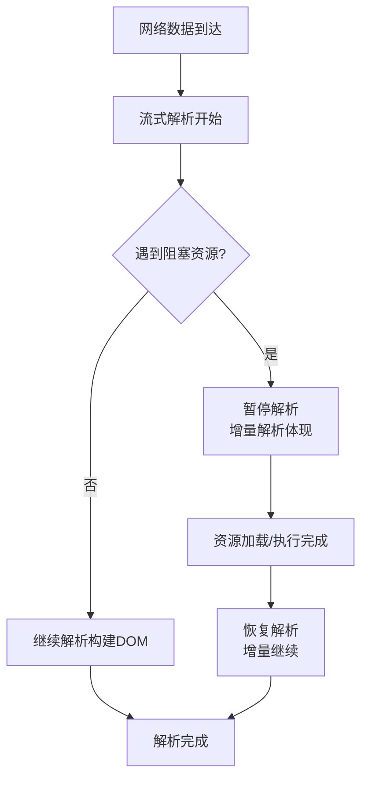
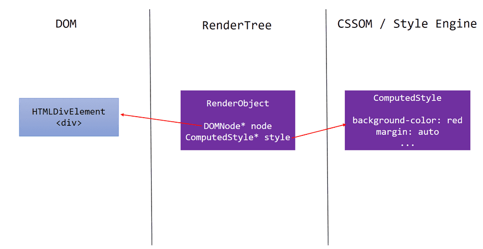
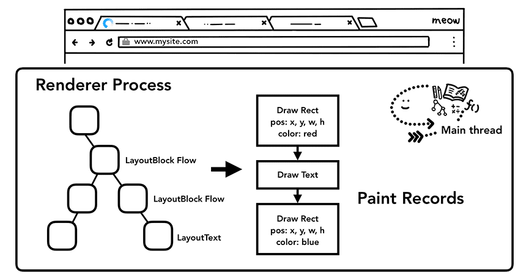

# 浏览器渲染原理完全指南

## 1. 浏览器架构

### 1.1 多进程架构

现代浏览器(Chrome, Edge)采用多进程架构:

```shell
Browser Process (浏览器进程)
├── UI Thread (UI线程) - 地址栏、书签、前进后退按钮
├── Network Thread (网络线程) - 处理网络请求
├── Storage Thread (存储线程) - 访问文件系统
└── ...

Renderer Process (渲染进程) - 每个标签页一个
├── Main Thread (主线程) - 运行JS、解析HTML/CSS、布局、绘制
├── Compositor Thread (合成线程) - 合成图层.
├── Raster Thread (光栅化线程) - 光栅化图层
└── Worker Threads (工作线程) - Web Worker, Service Worker

GPU Process (GPU进程)
└── 处理GPU任务,绘制到屏幕

Plugin Process (插件进程)
└── 运行插件代码
```

### 1.2 为什么使用多进程？

- **稳定性**: 一个标签页崩溃不影响其他标签页
- **安全性**: 沙箱隔离，限制恶意代码
- **性能**: 并行处理，充分利用多核 CPU

### 1.3 渲染进程内部线程

1.  **Main Thread (主线程)**：最忙碌的线程。负责 JS 执行、HTML/CSS 解析、DOM 构建、样式计算、布局、绘制指令生成。**JS 单线程**指的就是它。
2.  **Compositor Thread (合成线程)**：负责接收主线程生成的图层，进行分块、合成、页面滚动处理。**它不被 JS 阻塞**（这是流畅滚动的关键）。
3.  **Raster Worker Threads (光栅化线程池)**：负责将图块转换成位图。
4.  **IO Thread**：负责进程间通信 (IPC)。

---

## 2. 导航流程

### 2.1 URL 输入到页面显示

```
1. URL解析
   ├── 协议识别 (http/https/file)
   ├── 域名解析 (DNS查询)
   └── 端口确定

2. 建立连接
   ├── TCP三次握手
   └── TLS握手 (HTTPS)

3. 发送HTTP请求
   └── Browser Process → Network Thread

4. 接收响应
   ├── 检查响应头
   │   ├── Content-Type
   │   ├── Content-Encoding
   │   └── 状态码处理
   └── 决定如何处理
       ├── HTML → 渲染进程
       ├── 下载文件 → 下载管理器
       └── 其他类型

5. 准备渲染进程
   └── 如果是新站点,创建新的渲染进程

6. 提交导航
   └── Browser Process → Renderer Process
```

### 2.2 DNS 解析优化

```html
<!-- DNS预解析 -->
<link rel="dns-prefetch" href="//example.com" />

<!-- 预连接 -->
<link rel="preconnect" href="//example.com" />
```

---

## 3. 渲染流程核心步骤

### 3.1 HTML 解析 → DOM Tree

- **流式解析**：浏览器使用**流式增量解析**，浏览器不需要等待网络请求结束，收到一部分字节就开始解析

  

- **预加载扫描器 (Preload Scanner)**：在主线程构建 DOM 时，后台有一个轻量级扫描器会提前扫描 HTML，发现 `<link>`, ``, `<script>` 等资源，并通知网络进程提前下载。这能显著减少网络延迟带来的阻塞。



### 3.2 CSS 解析 → CSSOM Tree

主线程解析所有 CSS（内联与外部），根据选择器和规则构建 CSSOM。

**特点**:

- CSS 是**阻塞渲染**的资源 (render-blocking)，在 CSSOM 构建完成前，浏览器不会渲染任何内容
- 但不阻塞 HTML 解析
- CSS 阻塞 JS 执行

```css
/* CSSOM 树结构 */
body { font-size: 16px; }
div { font-size: 20px; }
.container { color: red; }

/* CSSOM继承特性 */
body (font-size: 16px)
└── div (font-size: 20px, 继承body其他属性)
    └── .container (color: red, 继承div的font-size)
```

  

### 3.3 构建渲染树（Render Tree）

浏览器将 DOM 树和 CSSOM 树合并成渲染树。渲染树只包含需要渲染的节点（可见的 DOM 元素），每个节点携带其计算好的样式和内容。

- `display: none` 的节点不在渲染树中。
- `::before`, `::after` 伪元素在渲染树中



### 3.4 布局 (Layout / Reflow)

布局阶段根据渲染树计算每个节点的几何尺寸和位置，浏览器从渲染树根节点开始，结合视口大小和盒模型属性，依次计算出每个可见元素在屏幕上的绝对位置和大小。

```javascript
// 盒模型计算
Element Box = Content + Padding + Border + Margin

// 布局流程
1. 从根节点开始递归
2. 父元素先布局
3. 计算子元素
4. 回溯更新父元素(如子元素影响父高度)

// 布局类型
- Normal Flow (正常流)
- Float (浮动)
- Positioning (定位: relative, absolute, fixed, sticky)
- Flexbox
- Grid
```

**性能关键点**:

- Layout 是**递归**的,成本高
- 触发一个元素的 Layout 可能导致整个文档 Layout
- 尽量避免**强制同步布局**

```javascript
// ❌ 强制同步布局 (Forced Synchronous Layout)
div.style.width = "100px";
console.log(div.offsetWidth); // 强制Layout
div.style.height = "100px";
console.log(div.offsetHeight); // 再次强制Layout

// ✅ 批量读取,批量写入
const width = div.offsetWidth;
const height = div.offsetHeight;
div.style.width = "100px";
div.style.height = "100px";
```

  

### 3.5 分层 (Layer)

浏览器会将某些元素提升为**独立的合成层** (Compositing Layer):

**提升条件**：

1. 3D transforms: `transform: translateZ(0)` / `translate3d(0,0,0)`
2. video, canvas, iframe 元素
3. CSS filters, masks
4. `will-change` 属性
5. `position: fixed`
6. 元素有 transform 动画或 opacity 动画
7. 有合成层后代的元素

```css
/* 创建合成层 */
.layer {
  will-change: transform;
  /* 或 */
  transform: translateZ(0);
}
```

  


**优点**:

- 独立绘制,不影响其他层
- GPU 加速
- transform 和 opacity 动画只影响合成,不触发 Layout/Paint

**缺点**:

- 内存占用增加
- 层爆炸问题 (Layer Explosion)

### 3.6 绘制 (Paint)

将元素转换为**屏幕像素**的过程:

```
Layout Tree → Paint Records (绘制指令列表)
```

**绘制顺序** (Stacking Context):

```
1. 背景色
2. 背景图
3. 边框
4. 子元素
5. 轮廓 (outline)
```

**Paint 触发**:

- 颜色变化
- 背景变化
- 阴影变化
- 文本变化
- ...

**优化**:

```css
/* 只触发 Composite,不触发 Paint */
.fast {
  transform: translateX(100px); /* ✅ */
  opacity: 0.5; /* ✅ */
}

/* 触发 Paint */
.slow {
  left: 100px; /* ❌ */
  background: red; /* ❌ */
}
```

  


**查看绘制区域**: Chrome DevTools → Rendering → Paint flashing

### 3.6 光栅化 (Raster)

将绘制指令转换为**位图** (bitmap):

```
Paint Records → Raster Thread → Bitmap (Tiles)
```

**分块光栅化**:

- 页面分成多个 **Tiles** (通常 256x256 或 512x512)
- 优先光栅化**视口内**的 Tiles
- 使用多个 Raster Thread 并行处理

```
Viewport (视口)
┌─────────────────┐
│ Tile1 │ Tile2  │ ← 优先光栅化
├─────────────────┤
│ Tile3 │ Tile4  │
└─────────────────┘
  (下方未显示区域的Tiles稍后光栅化)
```

  


### 3.7 合成与显示 (Composite)

Compositor Thread 将各层位图合成:

```
Bitmaps → GPU → Display
```

**合成优势**:

- 在 Compositor Thread 执行，不阻塞主线程
- GPU 加速
- 滚动流畅 (滚动只需重新合成，不需要 Layout/Paint)

```javascript
// 这些操作只在合成线程进行
- 滚动 (scroll)
- transform 动画
- opacity 动画
```

---

## 4. 关键渲染路径

**Critical Rendering Path** - 浏览器首次渲染页面的最少必需步骤:

```
1. 构建 DOM Tree
2. 构建 CSSOM Tree
3. 构建 Render Tree (DOM + CSSOM)
4. 执行 Layout
5. 执行 Paint
```

### 4.1 阻塞渲染的资源

**CSS**: 阻塞渲染

```html
<!-- 阻塞 -->
<link rel="stylesheet" href="style.css" />

<!-- 有条件阻塞 -->
<link rel="stylesheet" href="mobile.css" media="(max-width: 600px)" />
```

**JavaScript**: 阻塞解析和渲染

```html
<!-- 阻塞解析 -->
<script src="app.js"></script>

<!-- 不阻塞，并行下载 -->
<script async src="app.js"></script>
<script defer src="app.js"></script>

<!-- 不阻塞，延迟加载 -->
<script type="module" src="app.js"></script>
```

### 4.2 优化关键渲染路径

**目标**: 减少关键资源数量和大小

```html
<!DOCTYPE html>
<html>
  <head>
    <!-- 1. 内联关键CSS -->
    <style>
      /* 首屏关键样式 */
      .hero {
        ...;
      }
    </style>

    <!-- 2. 异步加载非关键CSS -->
    <link
      rel="preload"
      href="non-critical.css"
      as="style"
      onload="this.rel='stylesheet'"
    />

    <!-- 3. 预加载关键资源 -->
    <link rel="preload" href="font.woff2" as="font" crossorigin />
  </head>
  <body>
    <!-- 内容 -->

    <!-- 4. 脚本放底部或使用defer -->
    <script defer src="app.js"></script>
  </body>
</html>
```

**指标**:

- **CRP 资源数**: 越少越好
- **CRP 字节数**: 越小越好
- **CRP 长度**: 往返次数越少越好

**参考**: [Optimize the Critical Rendering Path](https://web.dev/articles/critical-rendering-path)

---

## 5. 重排与重绘

### 5.1 重排 (Reflow / Layout)

**定义**: 重新计算元素的几何属性

**触发条件**:

```javascript
// 几何属性变化
element.style.width = "100px";
element.style.padding = "10px";

// 获取几何属性(可能触发)
element.offsetWidth;
element.getBoundingClientRect();
window.getComputedStyle(element).width;

// DOM操作
parent.appendChild(child);
element.remove();

// 页面初始化
window.onload;

// 窗口调整
window.resize;
```

**会触发重排的属性**:

```javascript
// 盒模型
width, height, padding, margin, border;

// 定位
top, right, bottom, left, position;

// 布局
display, float, clear, overflow;

// 字体
font - size, font - family, font - weight, line - height;

// 其他
text - align, vertical - align, white - space;
```

### 5.2 重绘 (Repaint)

**定义**: 元素样式变化但不影响布局

**触发条件**:

```javascript
element.style.color = "red";
element.style.backgroundColor = "blue";
element.style.visibility = "hidden";
```

**只触发重绘的属性**:

```javascript
color,
background,
background - image,
background - position,
background - repeat,
background - size,
border - color,
border - style,
box - shadow,
outline,
visibility;
```

### 5.3 性能影响

```
重排 > 重绘 > 合成

重排: Layout → Paint → Composite (最慢)
重绘: Paint → Composite (较慢)
合成: Composite only (最快)
```

### 5.4 优化技巧

#### 1. 批量修改样式

```javascript
// ❌ 触发3次重排
element.style.width = "100px";
element.style.height = "100px";
element.style.margin = "10px";

// ✅ 触发1次重排
element.style.cssText = "width:100px;height:100px;margin:10px;";

// ✅ 使用class
element.className = "new-style";
```

#### 2. 离线操作 DOM

```javascript
// ❌ 每次appendChild触发重排
for (let i = 0; i < 1000; i++) {
  const div = document.createElement("div");
  document.body.appendChild(div);
}

// ✅ 使用DocumentFragment
const fragment = document.createDocumentFragment();
for (let i = 0; i < 1000; i++) {
  const div = document.createElement("div");
  fragment.appendChild(div);
}
document.body.appendChild(fragment); // 只触发1次
```

#### 3. 避免频繁读取布局属性

```javascript
// ❌ 布局抖动 (Layout Thrashing)
for (let i = 0; i < elements.length; i++) {
  const width = elements[i].offsetWidth; // 读
  elements[i].style.width = width + 10 + "px"; // 写
}

// ✅ 读写分离
const widths = elements.map((el) => el.offsetWidth); // 批量读
elements.forEach((el, i) => {
  el.style.width = widths[i] + 10 + "px"; // 批量写
});
```

#### 4. 使用 transform 替代 top/left

```css
/* ❌ 触发重排 */
.move {
  left: 100px;
}

/* ✅ 只触发合成 */
.move {
  transform: translateX(100px);
}
```

#### 5. 使用 requestAnimationFrame

```javascript
// ✅ 在浏览器下次重绘前执行
function update() {
  element.style.transform = `translateX(${x}px)`;
  requestAnimationFrame(update);
}
requestAnimationFrame(update);
```

**参考**: [Minimize Reflow](https://developers.google.com/speed/docs/insights/browser-reflow)

---

## 6. 合成层与硬件加速

### 6.1 合成层 (Compositing Layer)

**普通元素 vs 合成层**:

```
普通元素: 在主线程绘制，影响性能
合成层: GPU加速，独立绘制
```

**创建合成层**:

```css
/* 方法1: 3D transform */
.layer {
  transform: translateZ(0);
  transform: translate3d(0, 0, 0);
}

/* 方法2: will-change */
.layer {
  will-change: transform, opacity;
}

/* 方法3: video/canvas */
<video></video>
<canvas></canvas>

/* 方法4: CSS filters */
.layer {
  filter: blur(10px);
}
```

### 6.2 will-change

提前告知浏览器哪些属性会变化:

```css
/* ✅ 合理使用 */
.animation {
  will-change: transform;
}

.animation:hover {
  transform: scale(1.2);
}

/* ❌ 过度使用 */
* {
  will-change: transform, opacity; /* 导致内存问题 */
}

/* ✅ 动态添加和移除 */
element.style.willChange = 'transform';
element.addEventListener('animationend', () => {
  element.style.willChange = 'auto';
});
```

**最佳实践**:

- 只在需要时使用
- 动画结束后移除
- 不要应用到太多元素

### 6.3 层压缩 (Layer Squashing)

浏览器会尝试合并层以节省内存:

```html
<div class="layer1" style="will-change: transform;"></div>
<div class="layer2" style="will-change: transform;"></div>
<!-- 如果两层不重叠，可能被压缩为一层 -->
```

### 6.4 层爆炸 (Layer Explosion)

**问题**:

```css
/* ❌ 创建1000个合成层 */
.item {
  will-change: transform;
}

/* 如果有1000个.item元素，内存爆炸 */
```

**解决**:

- 仅对需要动画的元素使用
- 使用 `transform` 和 `opacity` 动画
- 检查 Layers 面板

**查看工具**:

```
Chrome DevTools → More tools → Layers
或 Rendering → Layer borders
```

**参考**: [Compositor thread architecture](https://developer.chrome.com/blog/inside-browser-part3/)

---

## 7. JavaScript 执行与渲染

### 7.1 JavaScript 阻塞渲染

```html
<head>
  <!-- ❌ 阻塞HTML解析 -->
  <script src="large.js"></script>
</head>
<body>
  <!-- 内容要等上面的JS下载并执行完才能显示 -->
</body>
```

### 7.2 脚本加载策略

```html
<!-- 1. 正常: 阻塞解析 -->
<script src="app.js"></script>

<!-- 2. async: 下载时不阻塞，下载完立即执行 -->
<script async src="analytics.js"></script>
<!-- 适合:独立脚本，如统计 -->

<!-- 3. defer: 下载时不阻塞，DOMContentLoaded前执行 -->
<script defer src="app.js"></script>
<!-- 适合:依赖DOM的脚本 -->

<!-- 4. module: 默认defer行为 -->
<script type="module" src="app.js"></script>

<!-- 5. 动态导入: 按需加载 -->
<script>
  button.onclick = async () => {
    const module = await import("./heavy.js");
    module.doSomething();
  };
</script>
```

**执行顺序**:

```
<script>立即执行</script>
<script defer>DOMContentLoaded前,按顺序执行</script>
<script async>下载完立即执行,顺序不定</script>
```

### 7.3 事件循环与渲染时机

```javascript
// 事件循环
while (true) {
  // 1. 执行宏任务
  task = taskQueue.shift();
  execute(task);

  // 2. 执行所有微任务
  while (microtaskQueue.length) {
    microtask = microtaskQueue.shift();
    execute(microtask);
  }

  // 3. 渲染(可能)
  if (shouldRender()) {
    render();
  }
}
```

**渲染时机**:

- 不是每次事件循环都渲染
- 通常 60Hz → 每 16.67ms 渲染一次
- requestAnimationFrame 在渲染前调用

```javascript
// 宏任务
setTimeout(() => console.log("timeout"), 0);

// 微任务
Promise.resolve().then(() => console.log("promise"));

// 渲染前
requestAnimationFrame(() => console.log("raf"));

// 输出顺序: promise → timeout → raf → [渲染]
```

### 7.4 长任务阻塞渲染

```javascript
// ❌ 长任务阻塞渲染(超过50ms)
function heavyTask() {
  for (let i = 0; i < 1000000000; i++) {
    // ...
  }
}
heavyTask(); // 阻塞主线程,页面卡顿

// ✅ 分片执行
function* heavyTaskGenerator() {
  for (let i = 0; i < 1000000000; i++) {
    if (i % 1000000 === 0) yield;
    // ...
  }
}

function runWithYield(generator) {
  const gen = generator();
  function step() {
    const { done } = gen.next();
    if (!done) {
      requestIdleCallback(step); // 空闲时继续
    }
  }
  step();
}

runWithYield(heavyTaskGenerator);
```

**参考**: [Optimize long tasks](https://web.dev/articles/optimize-long-tasks)

---

## 8. 渲染优化策略

### 8.1 资源优先级

```html
<!-- 预加载关键资源 -->
<link rel="preload" href="critical.css" as="style" />
<link rel="preload" href="hero.jpg" as="image" />

<!-- 预连接 -->
<link rel="preconnect" href="https://cdn.example.com" />

<!-- 预获取未来可能需要的资源 -->
<link rel="prefetch" href="next-page.js" />

<!-- 预渲染下一页 -->
<link rel="prerender" href="/next-page" />
```

### 8.2 代码分割 (Code Splitting)

```javascript
// 路由级分割
const Home = lazy(() => import("./Home"));
const About = lazy(() => import("./About"));

// 组件级分割
button.onclick = async () => {
  const { default: HeavyComponent } = await import("./Heavy");
  render(<HeavyComponent />);
};
```

### 8.3 虚拟滚动 (Virtual Scrolling)

```javascript
// 只渲染可见区域的元素
function VirtualList({ items, itemHeight }) {
  const [scrollTop, setScrollTop] = useState(0);
  const visibleStart = Math.floor(scrollTop / itemHeight);
  const visibleEnd = visibleStart + Math.ceil(height / itemHeight);

  return (
    <div onScroll={(e) => setScrollTop(e.target.scrollTop)}>
      <div style={{ height: items.length * itemHeight }}>
        {items.slice(visibleStart, visibleEnd).map((item) => (
          <Item
            key={item.id}
            style={{
              transform: `translateY(${visibleStart * itemHeight}px)`,
            }}
          />
        ))}
      </div>
    </div>
  );
}
```

### 8.4 IntersectionObserver 懒加载

```javascript
// 图片懒加载
const observer = new IntersectionObserver((entries) => {
  entries.forEach((entry) => {
    if (entry.isIntersecting) {
      const img = entry.target;
      img.src = img.dataset.src;
      observer.unobserve(img);
    }
  });
});

document.querySelectorAll("img[data-src]").forEach((img) => {
  observer.observe(img);
});
```

### 8.5 Content Visibility

```css
/* 跳过屏幕外内容的渲染 */
.section {
  content-visibility: auto;
  contain-intrinsic-size: 0 500px; /* 占位高度 */
}
```

### 8.6 CSS Containment

```css
/* 限制布局/样式/绘制的影响范围 */
.card {
  contain: layout style paint;
}

/* 或单独指定 */
.card {
  contain: layout; /* 布局隔离 */
}
```

---

## 9. 常见面试问题

### Q1: 为什么操作 DOM 慢？

**答**:

1.  **跨线程通信**: JS 引擎和渲染引擎是两个独立的模块，通过接口通信，有开销。
2.  **重排重绘**: 修改 DOM 往往导致渲染树重新计算（Layout）和重新绘制（Paint），这是昂贵的操作。

### Q2: `display: none` vs `visibility: hidden` vs `opacity: 0`

| 属性                 | 渲染树 (Render Tree) | 占据空间 | 继承性 | 事件响应 | 重排/重绘                 |
| :------------------- | :------------------- | :------- | :----- | :------- | :------------------------ |
| `display: none`      | **移除**             | 否       | 否     | 否       | **重排** + 重绘           |
| `visibility: hidden` | 存在                 | **是**   | 是     | 否       | 仅重绘                    |
| `opacity: 0`         | 存在                 | **是**   | 否     | **是**   | 仅合成 (如果提升为合成层) |

### Q3: 如何减少重排 (Reflow)？

**答**:

1.  **集中修改样式**: 使用 `class` 或 `cssText`。
2.  **读写分离**: 避免在循环中交替读写布局属性（防止强制同步布局）。
3.  **DOM 离线处理**: 使用 `DocumentFragment` 或 `display: none` 后修改。
4.  **使用绝对定位**: 将频繁动画的元素脱离文档流 (`position: absolute/fixed`)。
5.  **优化动画**: 使用 `transform` 和 `opacity`，开启 GPU 加速。

### Q4: 什么是关键渲染路径 (CRP)？如何优化？

**答**:
CRP 是浏览器将 HTML/CSS/JS 转换为屏幕像素的步骤。
**优化**:

1.  **关键 CSS 内联**: 减少关键 CSS 请求。
2.  **推迟非关键资源**: `defer` / `async` 脚本，`preload` / `lazyload`。
3.  **压缩资源**: Minify, Gzip/Brotli。
4.  **减少 HTTP 请求**: 合并文件（HTTP/1.1），使用 HTTP/2。

### Q5: `requestAnimationFrame` vs `setTimeout`

**答**:

- `setTimeout(fn, 0)`: 尽可能快执行，但受限于宏任务队列，且不考虑渲染时机，可能导致丢帧或无效绘制。
- `requestAnimationFrame(fn)`: **与屏幕刷新率同步** (通常 60Hz)，在每次渲染前执行，保证每一帧只执行一次，最适合动画。

### Q6: 浏览器是如何解析 CSS 选择器的？

**答**:
**从右向左**解析。
例如 `div .box span`:

1.  先找到所有 `span`。
2.  检查父元素是否是 `.box`。
3.  检查祖先是否是 `div`。
    **原因**: 能够更快地排除不匹配的元素（因为子元素数量通常远大于祖先元素数量，从右向左可以快速过滤掉大部分不符合条件的叶子节点）。

---

## 总结

理解浏览器渲染原理是前端性能优化的基石。从**多进程架构**到**渲染流水线**，再到**合成层**与**硬件加速**，每一个环节都蕴含着优化的机会。

**核心优化原则**:

1.  **减少**关键路径上的资源。
2.  **避免**强制同步布局。
3.  **利用**合成线程和 GPU 加速。
4.  **关注**每一帧的 16ms 预算。
