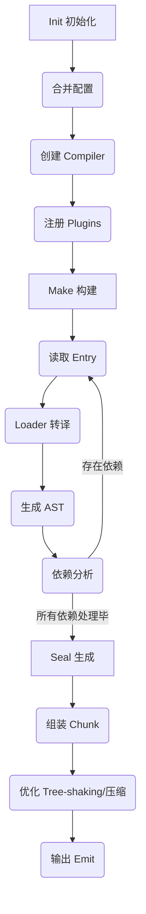

## Webpack 构建流程详解

Webpack 的构建流程主要分为三个阶段：**Init 初始化阶段**、**Make 构建阶段** 和 **Seal 生成阶段**。

### 1. Init 初始化阶段

这一阶段的主要任务是读取配置、初始化 compiler 对象并挂载插件。

1.  **初始化参数**：从配置文件 (`webpack.config.js`) 和 Shell 语句中读取与合并参数，得出最终的参数。
2.  **创建编译器对象**：用上一步得到的参数初始化 `Compiler` 对象。
3.  **挂载插件**：遍历配置中的 `plugins`，调用插件的 `apply` 方法，让插件监听 Webpack 生命周期中的事件节点。
4.  **注册内部插件**：调用 `new WebpackOptionsApply().process` 方法，根据配置内容动态注入 Webpack 内部插件：
    - 调用 `EntryOptionPlugin` 插件，根据 `entry` 配置注入 `DynamicEntryPlugin` 或 `EntryPlugin`。
    - 根据 `devtool` 配置注入 Sourcemap 相关插件 (`SourceMapDevToolPlugin` 等)。
    - 注入 `RuntimePlugin`，用于动态注入 webpack 运行时代码。
5.  **开始编译**：执行 `compiler.compile` 方法，开始执行构建。

### 2. Make 构建阶段

这一阶段的主要任务是从入口文件开始，递归解析模块依赖，构建出模块依赖图 (ModuleGraph)。

1. **读取文件**：从入口文件开始读取文件内容。
2. **Loader 转译**：调用匹配的 `Loader` 将非 JS 模块（如 css, less, png）转译为标准的 JS 内容。
3. **生成 AST**：调用 `acorn` 将 JS 代码解析为抽象语法树 (AST)。
4. **依赖分析**：遍历 AST，收集模块依赖（如 `import`, `require` 语句）。
5. **递归编译**：对解析出的依赖模块递归执行上述流程（读取 -> Loader -> AST -> 依赖分析），直到所有模块处理完毕，生成完整的 **ModuleGraph** (模块依赖图)。

### 3. Seal 生成阶段

这一阶段的主要任务是组装 Chunk，优化代码，并输出到文件系统。

1. **代码转译**：遍历 ModuleGraph，将 ESModule 的 `import` 转换为 Webpack 的 `__webpack_require__` 调用等。
2. **运行时分析**：分析并生成 Webpack 运行时代码 (Runtime Code)。
3. **组装 Chunk**：根据入口和代码分割配置，将多个 Module 合并成一个或多个 **Chunk**。
4. **优化 (Optimization)**：执行产物优化操作，包括：
   - **Tree-shaking**：剔除未使用的代码。
   - **Minification**：压缩代码。
   - **Code Split**：代码分割。
5. **生成 Assets**：将 Chunk 转换为最终的输出资源 (Assets)。
6. **输出文件 (Emit)**：根据配置确定输出的路径和文件名，将文件内容写入到文件系统 (`dist` 目录)。

### 总结图解

