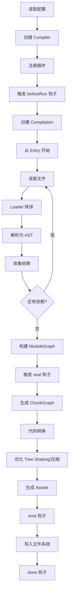

## 核心三阶段

Webpack 的构建流程可以概括为三个阶段：

1. **Init（初始化）**：准备工作，创建 Compiler，注册插件
2. **Make（构建）**：从入口开始，递归解析模块，构建依赖图
3. **Seal（生成）**：优化代码，生成 Chunk，输出文件

---

## 1. Init 初始化阶段

**目标**：读取配置、创建 Compiler 对象、注册插件。

### 详细步骤

1. **合并配置参数**

   - 读取 `webpack.config.js` 文件
   - 合并命令行参数（如 `--mode production`）
   - 得到最终的配置对象

2. **创建 Compiler 对象**

   - Compiler 是 Webpack 的核心对象，贯穿整个构建生命周期
   - 它继承自 Tapable，提供了事件钩子机制

3. **挂载用户插件**

   - 遍历配置中的 `plugins` 数组
   - 调用每个插件的 `apply(compiler)` 方法
   - 插件通过 `compiler.hooks.xxx.tap()` 监听生命周期事件

4. **注册内部插件**

   - 调用 `WebpackOptionsApply.process()` 方法
   - 根据配置动态注入内部插件：
     - **EntryPlugin**：处理入口配置
     - **SourceMapDevToolPlugin**：根据 `devtool` 配置生成 sourcemap
     - **RuntimePlugin**：注入运行时代码

5. **触发 `environment` 和 `afterEnvironment` 钩子**

   - 插件可以在这些钩子中做环境准备工作

6. **开始编译**
   - 调用 `compiler.run()` 或 `compiler.watch()`
   - 触发 `beforeRun` → `run` 钩子
   - 执行 `compiler.compile()` 进入 Make 阶段

### 面试考点

**Q: Compiler 和 Compilation 的区别是什么？**

- **Compiler**：代表整个 Webpack 构建过程，全局唯一，包含配置、插件等信息。
- **Compilation**：代表一次构建（一次编译），每次文件变化都会创建新的 Compilation 对象。

**关系**：一个 Compiler 可以创建多个 Compilation（watch 模式下）。

---

## 2. Make 构建阶段

**目标**：从入口文件开始，递归解析所有模块，构建出完整的模块依赖图（ModuleGraph）。

### 详细步骤

1. **创建 Compilation 对象**

   - 触发 `beforeCompile` → `compile` → `make` 钩子
   - 创建新的 Compilation 实例

2. **从入口开始构建**

   - 根据 `entry` 配置找到入口文件
   - 调用 `compilation.addEntry()` 添加入口模块

3. **模块构建流程**（递归执行）

   **a. 读取模块内容**

   - 使用 `fs.readFile` 读取文件内容

   **b. Loader 转译**

   - 根据 `module.rules` 匹配对应的 Loader
   - **从右到左**、**从下到上**执行 Loader 链
   - 将非 JS 资源（CSS、图片等）转换为 JS 模块

   **c. 解析为 AST**

   - 使用 `acorn` 将 JS 代码解析为抽象语法树（AST）

   **d. 依赖收集**

   - 遍历 AST，找到所有的依赖语句：
     - `import` / `export`
     - `require()` / `module.exports`
     - 动态 `import()`
   - 将依赖路径解析为绝对路径（使用 `enhanced-resolve`）

   **e. 递归处理依赖**

   - 对每个依赖模块重复上述流程（读取 → Loader → AST → 依赖收集）
   - 直到所有模块都被处理完毕

4. **构建 ModuleGraph**
   - 记录模块之间的依赖关系
   - 每个模块都有唯一的 `moduleId`

### 面试考点

**Q: Loader 的执行顺序是什么？**

**从右到左，从下到上**。

```javascript
module.exports = {
  module: {
    rules: [
      {
        test: /\.css$/,
        use: ["style-loader", "css-loader", "postcss-loader"],
        // 执行顺序：postcss-loader → css-loader → style-loader
      },
    ],
  },
};
```

**Q: Webpack 如何处理循环依赖？**

Webpack 会检测循环依赖并打印警告，但不会报错。在运行时，循环依赖的模块可能会得到 `undefined`，因为模块还未完全加载。

---

## 3. Seal 生成阶段

**目标**：根据 ModuleGraph 生成 Chunk，优化代码，输出最终文件。

### 详细步骤

1. **触发 `seal` 钩子**

   - 标志着模块构建完成，开始生成产物

2. **生成 ChunkGraph**

   - 根据入口和代码分割规则，将模块分组为 Chunk
   - 每个入口对应一个 Chunk
   - 动态 `import()` 会生成新的 Chunk

3. **代码转换**

   - 将 ESM 的 `import` 转换为 `__webpack_require__`
   - 将 `export` 转换为 `__webpack_exports__`

4. **生成运行时代码**

   - 注入 Webpack Runtime（模块加载器）
   - 包括 `__webpack_require__`、`__webpack_modules__` 等

5. **优化（Optimization）**

   **a. Tree Shaking**

   - 标记未使用的导出（`usedExports`）
   - 在压缩阶段删除死代码

   **b. Scope Hoisting**

   - 将多个模块合并到一个函数作用域中
   - 减少函数调用开销

   **c. Code Splitting**

   - 根据 `splitChunks` 配置提取公共模块
   - 生成 vendor chunk

   **d. Minification**

   - 使用 Terser 压缩代码
   - 删除注释、空格，缩短变量名

6. **生成 Assets**

   - 将 Chunk 转换为最终的文件内容
   - 触发 `optimizeChunkAssets` 钩子

7. **输出文件（Emit）**
   - 触发 `emit` 钩子（最后修改文件的机会）
   - 根据 `output.path` 和 `output.filename` 配置
   - 将文件写入文件系统（`dist` 目录）
   - 触发 `done` 钩子，构建完成

### 面试考点

**Q: `__webpack_require__` 是什么？**

这是 Webpack 运行时注入的模块加载函数，用于在浏览器中实现 CommonJS 的 `require` 功能。

**Q: Tree Shaking 的原理是什么？**

基于 ES Module 的静态结构特性：

1. 在构建时标记未使用的导出（`usedExports: true`）
2. 在压缩时删除这些未使用的代码（`minimize: true`）

**前提条件**：

- 必须使用 ES Module（`import/export`）
- 不能使用 CommonJS（`require/module.exports`）

---

## 4. 完整流程图



---

## 5. 关键生命周期钩子

| 阶段     | 钩子名           | 触发时机     | 常见用途        |
| :------- | :--------------- | :----------- | :-------------- |
| **Init** | `environment`    | 准备编译环境 | 初始化插件      |
| **Init** | `afterPlugins`   | 插件注册完成 | 访问所有插件    |
| **Make** | `beforeCompile`  | 编译前       | 修改编译参数    |
| **Make** | `make`           | 开始构建     | 添加额外入口    |
| **Make** | `buildModule`    | 构建模块前   | 修改模块内容    |
| **Seal** | `seal`           | 开始封装     | 优化模块图      |
| **Seal** | `optimizeChunks` | 优化 Chunk   | 合并/拆分 Chunk |
| **Seal** | `emit`           | 输出文件前   | 修改输出内容    |
| **Seal** | `done`           | 构建完成     | 统计信息、通知  |

---

## 6. 面试高频问题汇总

### Q1: Webpack 的构建流程分为哪几个阶段？

**Init（初始化）** → **Make（构建）** → **Seal（生成）**

### Q2: 什么是 ModuleGraph 和 ChunkGraph？

- **ModuleGraph**：模块依赖图，记录所有模块及其依赖关系
- **ChunkGraph**：Chunk 依赖图，记录 Chunk 和 Module 的关系

### Q3: Webpack 插件是如何工作的？

插件通过 Tapable 提供的钩子系统，在构建的不同阶段插入自定义逻辑：

```javascript
class MyPlugin {
  apply(compiler) {
    compiler.hooks.emit.tap("MyPlugin", (compilation) => {
      // 在输出文件前执行
      console.log("即将输出文件");
    });
  }
}
```

### Q4: 如何优化 Webpack 构建速度？

**Make 阶段优化**：

- 缩小 Loader 作用范围（`include/exclude`）
- 使用 `cache-loader` 或 Webpack 5 的持久化缓存
- 多进程构建（`thread-loader`）

**Seal 阶段优化**：

- 减少压缩范围（`exclude: /node_modules/`）
- 使用 `esbuild-loader` 替代 Terser

### Q5: 为什么 Webpack 需要运行时代码？

因为浏览器不支持 CommonJS 的 `require`，Webpack 需要注入 `__webpack_require__` 等运行时函数来实现模块加载。
