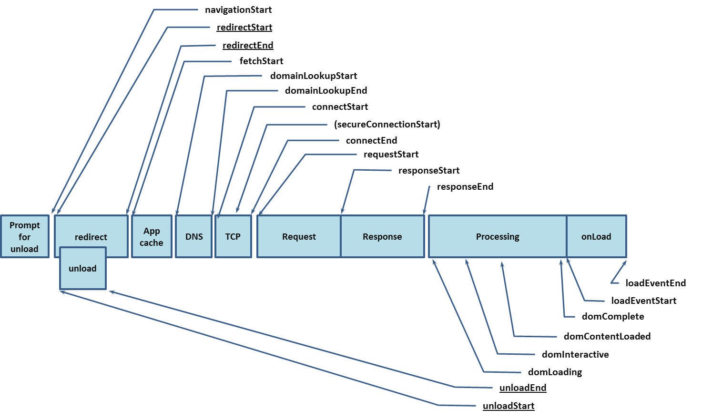
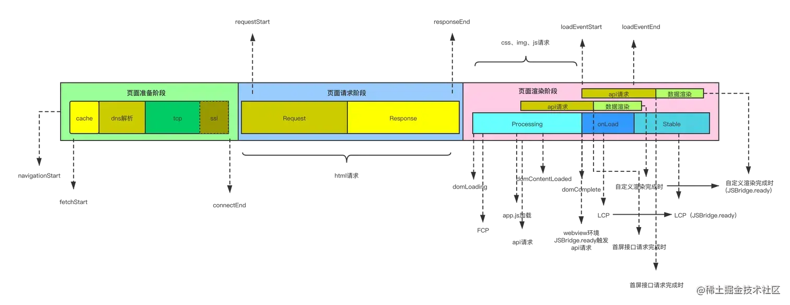

下图展示了 W3C 定义的所有导航时间事件在时间轴上的情况。



以 SPA 页面来说，页面的加载过程大致是这样的：



## W3C 定义的指标：

- `Request Start`：

  等于 W3C 定义的 `requestStart`，这是一个时间戳，表示浏览器在完成 DNS 查找和 TCP 连接后开始向 Web 服务器请求资源的时间。

- `Time to first byte`（首次字节时间 TTFB）：

  等于 W3C 定义的 `navigationStart` 和 `responseStart` 之间的时间差。简而言之，这是浏览器发送第一个请求到服务器，以及接收到响应的第一个字节之间的时间（这包括任何重定向和 SSL/TCP 连接）。

- `DOM interactive`：

  等于 W3C 定义的 `domInteractive`，它是一个时间戳，表示文档准备状态设置为“interactive”，表明浏览器已经停止解析页面，用户可以开始与页面进行交互。脚本、图片、样式表或框架等资源可能仍在加载中。

- `DOM completed`

  等于 W3C 定义的 domComplete ，它是一个时间戳，表示主文档已被解析，DOM 已完全加载，页面准备状态设置为“complete”。

- `Load Event`

  等于 W3C 定义的 loadEventEnd ，它是一个时间戳，表示当前文档的 load 事件已完成，包括所有依赖的资源，如样式表和图片。

## 各项指标的含义

Google 提出了 **Core Web Vitals (核心 Web 指标)** 来评估页面的加载速度、交互性和视觉稳定性。

### 核心结论

| 指标                               | Good (优秀) | Needs Improvement (需改进) | Poor (较差) |
| :--------------------------------- | :---------- | :------------------------- | :---------- |
| **FP** (First Paint)               | **≤ 1.0s**  | 1.0s – 2.0s                | > 2.0s      |
| **FCP** (First Contentful Paint)   | **≤ 1.8s**  | 1.8s – 3.0s                | > 3.0s      |
| **LCP** (Largest Contentful Paint) | **≤ 2.5s**  | 2.5s – 4.0s                | > 4.0s      |

### 1. FP & FCP（视觉反馈）

- **FP (First Paint)**：**首次绘制**。

记录浏览器从开始导航到第一次在屏幕上渲染像素点的时间。即使只是一个背景颜色，也算 FP。

- **标准**：理想时间应在 **1.0 秒** 或更短。

- **FCP (First Contentful Paint)**：**首次内容绘制**。

记录浏览器渲染出第一个文档内容（DOM 元素，如文本、图像、`<canvas>` 等）的时间。

- **意义**：FCP 让用户知道页面正在加载，减少焦虑。
- **标准**：理想时间应在 **1.8 秒** 或更短。

### 2. LCP (Largest Contentful Paint) - 加载体验

- **定义**：**最大内容绘制**。记录可视区域内最大的内容元素（通常是图片、视频封面或大文本块）渲染完成的时间。
- **意义**：反映了页面的主要内容加载速度，是衡量用户感知加载速度最重要的指标。
- **标准**：理想时间应在 **2.5 秒** 以内。

### 3. CLS (Cumulative Layout Shift) - 视觉稳定性

- **定义**：**累计布局偏移**。衡量页面在生命周期内发生的意外布局移动。例如：图片加载后突然把下方的文字顶下去。
- **计算**：偏移分数 = 影响范围频率 \* 移动距离频率。
- **意义**：CLS 高会导致用户误点击，造成糟糕的体验。
- **标准**：理想分数应小于 **0.1**。

### 4. FID (First Input Delay) - 交互及时性

- **定义**：**首次输入延迟**。记录用户第一次与页面进行交互（例如点击按钮、点击链接）到浏览器实际能够开始处理处理该交互的时间。
- **局限**：它只衡量“第一次”交互。从 2024 年起，Google 已将其在 Core Web Vitals 中替换为 INP。
- **标准**：理想时间在 **100 毫秒** 以内。

### 5. INP (Interaction to Next Paint) - 运行流畅度

- **定义**：**交互到下次绘制的延迟**。衡量页面在用户访问期间，所有交互响应的整体流畅度。它会观察用户点击、触摸或按键交互，并记录从触发到屏幕更新的这段时间。
- **意义**：比 FID 更全面，反映了页面的长期响应能力。从 2024 年 3 月起正式取代 FID 成为核心指标。
- **标准**：理想时间应在 **200 毫秒** 以内。

### 6. TBT (Total Blocking Time) - 主线程压力

- **定义**：**总阻塞时间**。测量 FCP 和 TTI（可交互时间）之间，主线程被长任务（执行时间超过 50ms）阻塞的总时长。
- **计算**：每个长任务中超过 50ms 的部分相加。
- **意义**：反映了页面的主线程负担，TBT 越高，页面越容易卡顿。
- **标准**：建议保持在 **200 毫秒** 以内（移动端可适当放宽至 300ms）。

## 性能指标的计算

### web-vitals

通过 web-vitals 库可以很方便的获取 LCP、CLS、FID 等指标。

```js
import { onLCP, onFID, onCLS } from "web-vitals";

onCLS(console.log);
onFID(console.log);
onLCP(console.log);
```

### performance api

在浏览器中，可以通过 `performance.getEntriesByType('navigation')[0]` 获取导航相关的详细时间戳（注：旧的 `performance.timing` 已被废弃）。

#### 1. 基础加载指标计算

```js
function getNavigationTiming() {
  const timing = performance.getEntriesByType("navigation")[0];
  if (!timing) return {};

  return {
    // DNS 查询耗时
    dns: timing.domainLookupEnd - timing.domainLookupStart,
    // TCP 连接耗时
    tcp: timing.connectEnd - timing.connectStart,
    // SSL 安全连接耗时（仅 HTTPS）
    ssl: timing.connectEnd - timing.secureConnectionStart,
    // 网络请求耗时 (TTFB)
    ttfb: timing.responseStart - timing.requestStart,
    // 数据传输耗时
    response: timing.responseEnd - timing.responseStart,
    // DOM 解析耗时
    domParse: timing.domInteractive - timing.responseEnd,
    // 资源加载耗时（Load 事件耗时）
    load: timing.loadEventEnd - timing.loadEventStart,
    // 首屏白屏时间 (从开始加载到 responseStart)
    whiteScreen: timing.responseStart - timing.startTime,
  };
}
```

#### 2. FP 和 FCP 计算

这两个指标属于 Paint Timing API。

```js
function getPaintTiming() {
  const entries = performance.getEntriesByType("paint");
  const result = {};

  entries.forEach((entry) => {
    if (entry.name === "first-paint") {
      result.fp = entry.startTime;
    } else if (entry.name === "first-contentful-paint") {
      result.fcp = entry.startTime;
    }
  });

  return result;
}
```

#### 3. LCP 计算

LCP 需要通过 `PerformanceObserver` 持续观察，因为最大的内容块可能会随着页面加载而变化。

```js
let lcpValue = 0;

const lcpObserver = new PerformanceObserver((entryList) => {
  const entries = entryList.getEntries();
  const lastEntry = entries[entries.length - 1];
  lcpValue = lastEntry.startTime;
});

lcpObserver.observe({ type: "largest-contentful-paint", buffered: true });

// 在页面卸载或上报时获取 lcpValue
```

#### 4. CLS 计算

同样需要观察布局偏移。

```js
let clsValue = 0;

const clsObserver = new PerformanceObserver((entryList) => {
  for (const entry of entryList.getEntries()) {
    if (!entry.hadRecentInput) {
      clsValue += entry.value;
    }
  }
});

clsObserver.observe({ type: "layout-shift", buffered: true });
```

#### 5. 资源加载监控 (Resource Timing)

除了页面整体加载，监控具体资源（JS、CSS、图片）的加载情况能更精准地定位瓶颈。

```js
function getResourceTiming() {
  const resources = performance.getEntriesByType("resource");
  return resources.map((item) => ({
    name: item.name, // 资源 URL
    type: item.initiatorType, // 资源类型: script, img, link...
    protocol: item.nextHopProtocol, // 请求协议: http/1.1, h2
    duration: item.duration.toFixed(2), // 总耗时
    // 关键点：跨域资源需后端设置 Timing-Allow-Origin 响应头才能获取细分耗时
    decodedBodySize: item.decodedBodySize, // 解压后大小
    encodedBodySize: item.encodedBodySize, // 压缩后大小（衡量 Gzip 效果）
    hitCache: item.transferSize === 0, // 是否命中缓存
  }));
}
```

#### 6. 长任务监控 (Long Tasks)

长任务是指执行时间超过 **50ms** 的任务，它会阻塞主线程，导致用户操作卡顿。

```js
const longTaskObserver = new PerformanceObserver((entryList) => {
  for (const entry of entryList.getEntries()) {
    console.warn("检测到长任务:", {
      duration: entry.duration,
      startTime: entry.startTime,
      // 甚至可以获取到导致长任务的容器（如某个 iframe）
      attribution: entry.attribution,
    });
    // 上报卡顿信息
  }
});

longTaskObserver.observe({ type: "longtask", buffered: true });
```

#### 7. SPA 路由跳转耗时

原生 `performance` 只能捕获首页加载。对于单页应用（SPA）的内部跳转，需要手动打点。

```js
// 以 Vue Router 为例
let routeStartTime = 0;

router.beforeEach((to, from, next) => {
  routeStartTime = performance.now();
  next();
});

router.afterEach(() => {
  const duration = performance.now() - routeStartTime;
  console.log(`页面跳转 [${to.path}] 耗时: ${duration}ms`);
  // 上报 SPA 性能数据
});
```

#### 8. 用户自定义打点 (User Timing)

用于测量特定业务逻辑的耗时（如：从点击搜索到第一条结果渲染）。

```js
// 开始打点
performance.mark("search-start");

// ... 业务逻辑执行 (如接口请求、大列表渲染) ...

// 结束打点
performance.mark("search-end");

// 计算测量值
performance.measure("search-duration", "search-start", "search-end");

// 获取测量结果
const measure = performance.getEntriesByName("search-duration")[0];
console.log(`搜索功能耗时: ${measure.duration}ms`);

// 记得清理
performance.clearMarks();
performance.clearMeasures();
```

#### 9. 内存监控 (Memory)

仅适用 Chrome 浏览器，用于发现内存泄漏导致的卡顿。

```js
function getMemoryInfo() {
  if (performance.memory) {
    const { usedJSHeapSize, totalJSHeapSize, jsHeapSizeLimit } =
      performance.memory;
    return {
      used: (usedJSHeapSize / 1024 / 1024).toFixed(2) + "MB", // 已使用 JS 堆内存
      total: (totalJSHeapSize / 1024 / 1024).toFixed(2) + "MB", // 总分配内存
      limit: (jsHeapSizeLimit / 1024 / 1024).toFixed(2) + "MB", // 内存上限
      usage: ((usedJSHeapSize / jsHeapSizeLimit) * 100).toFixed(2) + "%", // 内存使用率
    };
  }
}
```

#### 10. FPS & 掉帧监控

用于评估页面滑动或动画的流畅度。

```js
function getFPS() {
  let frameCount = 0;
  let lastTime = performance.now();
  let fps = 0;

  function calculate() {
    frameCount++;
    const now = performance.now();

    if (now >= lastTime + 1000) {
      fps = frameCount; // 过去一秒内的帧数
      frameCount = 0;
      lastTime = now;
      console.log("当前 FPS:", fps);

      // 如果 FPS < 20，可以判定为严重卡顿，进行数据上报
      if (fps < 20) {
        reportStall();
      }
    }
    requestAnimationFrame(calculate);
  }

  requestAnimationFrame(calculate);
}
```

---

## 环境上下文采集

为了让性能数据具有分析价值，必须记录采集时的**外部环境**：

### 1. 网络状态 (Network Information API)

```js
const connection =
  navigator.connection || navigator.mozConnection || navigator.webkitConnection;

const networkInfo = {
  effectiveType: connection?.effectiveType, // 4g, 3g, 2g
  rtt: connection?.rtt, // 往返时延
  downlink: connection?.downlink, // 下行带宽 (Mb/s)
};
```

### 2. 设备信息

```js
const deviceInfo = {
  // 设备内存（GB）
  memory: navigator.deviceMemory,
  // CPU 核心数
  cpuCore: navigator.hardwareConcurrency,
  // 浏览器与操作系统
  userAgent: navigator.userAgent,
};
```

---

## 性能采集全景总结

| 采集维度           | 采集手段                        | 解决什么问题                                   |
| :----------------- | :------------------------------ | :--------------------------------------------- |
| **页面整体加载**   | Navigation Timing API           | 宏观判断页面快慢，区分网络/解析阶段耗时        |
| **核心交互指标**   | Core Web Vitals (LCP, CLS, INP) | 衡量用户真实的视觉与交互质量（谷歌 SEO 标准）  |
| **静态资源详细**   | Resource Timing API             | 定位是哪个图片或 JS 文件拖慢了速度             |
| **运行运行时卡顿** | Long Tasks API                  | 发现导致页面操作响应不及时的长 JS 任务         |
| **单页应用跳转**   | 路由钩子 + `performance.now()`  | 弥补原生 API 无法观察 SPA 路由切换的缺陷       |
| **自定义业务逻辑** | User Timing (`mark`, `measure`) | 满足特定业务场景（如首屏骨架屏消失）的耗时统计 |
| **环境上下文**     | Network/Device Info API         | 排除设备性能差或网络差导致的异常数据           |

### 数据上报最佳实践

1.  **数据抽样**：对于千万级流量的页面，全量采集性能数据成本极高，通常设置 1%~10% 的抽样率。
2.  **避免副作用**：使用 `requestIdleCallback` 或在页面 `unload` 时利用 `navigator.sendBeacon` 发送数据，不占用主线程资源。
3.  **分批上报**：将多次打点结果合并，在空闲时段或页面切换时一次性上报，减少 HTTP 请求开销。
