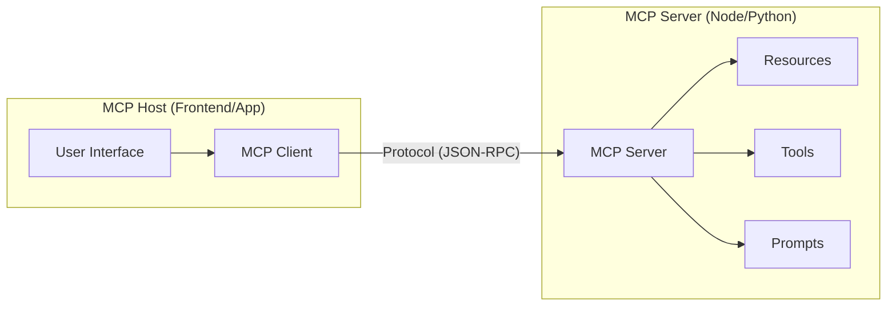
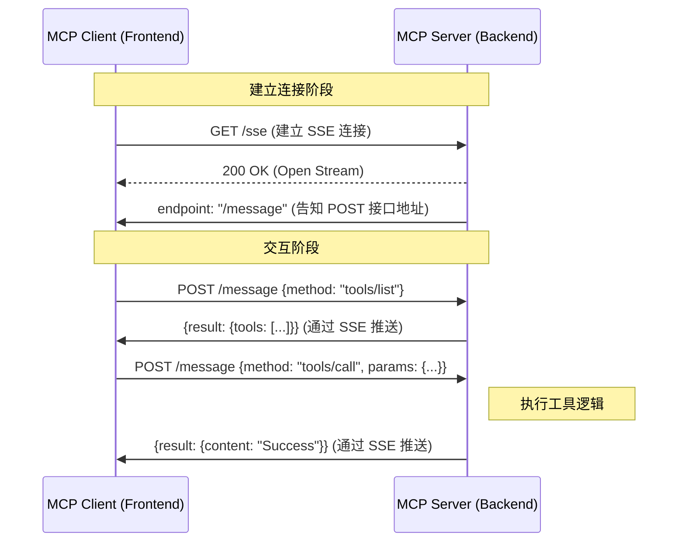

# MCP 架构解析

## 一、什么是 MCP？

**Model Context Protocol (MCP)** 是一个用于标准化 AI 模型与外部系统交互的开放协议。

它定义了 **Host (宿主应用)** 与 **Server (服务节点)** 之间的通信标准，使得 AI 应用能够以统一的方式访问本地或远程的数据与工具，无需为每个数据源编写特定的适配代码。

---

## 二、架构核心组件

MCP 采用典型的客户端-服务端架构。

### 1. MCP Host (宿主应用)

- **定义**：发起请求的应用程序（如 Claude Desktop, IDE, 或 Web 应用）。
- **前端职责**：负责初始化 MCP Client，管理连接生命周期，并将用户意图转化为对 MCP Server 的调用。

### 2. MCP Client (客户端)

- **定义**：Host 内部的协议实现层，通常使用官方 SDK (`@modelcontextprotocol/sdk`)。
- **功能**：负责建立连接、发送 JSON-RPC 请求、处理服务端推送。

### 3. MCP Server (服务端)

- **定义**：提供数据和能力的独立服务。
- **核心能力**：
  - **Resources**：被动读取的数据（如文件、数据库记录）。
  - **Tools**：可执行的函数（如 API 调用、脚本执行），这是 Agent 能够产生副作用的关键。
  - **Prompts**：预置的 Prompt 模板。

---

## 三、通信机制 (Transports)

MCP 建立在 **JSON-RPC 2.0** 之上，支持多种传输层。前端开发主要关注 **SSE (Server-Sent Events)**。

### 1. SSE over HTTP (Web 标准模式)

在 Web 环境下，MCP 使用 SSE 进行双向通信的模拟：

- **Server -> Client**：通过 SSE 长连接推送 JSON-RPC 响应或通知。
- **Client -> Server**：通过标准 HTTP POST 请求发送 JSON-RPC 请求。

### 2. Stdio (标准输入输出)

- **场景**：Electron 应用或本地 CLI 工具。
- **原理**：Host 启动 Server 作为子进程，通过标准输入/输出流通信。优点是零网络开销，适合本地文件操作。

---

## 四、前端视角的应用价值

### 1. 统一的数据访问层

传统开发中，对接不同的 API 需要编写不同的胶水代码。在 MCP 架构下，前端只需维护一个通用的 MCP Client，即可对接任意符合标准的 MCP Server。

### 2. TypeScript 全栈支持

官方提供了完善的 TypeScript SDK。前端工程师可以使用 Node.js 快速构建 MCP Server，将现有的后端 API 或数据库封装为标准服务，供 AI Agent 调用。

### 3. 调试与抓包

由于基于 JSON-RPC 和 HTTP/SSE，前端开发者可以使用浏览器 DevTools 网络面板直接观察通信过程，便于调试 AI Agent 的行为。
