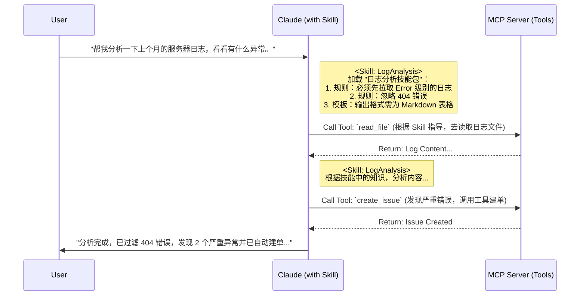

# AI Skill 概念与应用

## 一、什么是 Skill？(Claude 定义)

在最新的 AI Agent 架构（特别是 Anthropic Claude 生态）中，**Skill (技能)** 不再单纯等同于 API 工具，而是指 **“模块化的知识与工作流包”**。

- **本质**：它是一套**Prompt (指令)**、**Templates (模板)** 和 **Best Practices (最佳实践)** 的集合。
- **作用**：它教 AI **“如何”** 去做某件事，而不是提供 **“去做”** 的能力。
- **物理形态**：通常是一个包含 `SKILL.md` (定义指令) 和相关示例文件的文件夹。

> **通俗理解**：
>
> - **Tool** 是你的 **“手”**（可以拿东西，按按钮）。
> - **Skill** 是脑子里的 **“菜谱”**（教你如何用手切菜、炒菜）。

---

## 二、Skill vs Tool (MCP)：核心差异

这是面试中极容易混淆的点。在旧的框架（如 Semantic Kernel 早期）中，Skill 和 Tool 往往混用。但在 MCP (Model Context Protocol) 时代，它们被清晰区分：

| 维度           | Claude Skill (技能)                                           | MCP Tool (工具)                            |
| :------------- | :------------------------------------------------------------ | :----------------------------------------- |
| **定位**       | **程序性知识 (Procedural Knowledge)**                         | **执行能力 (Execution Capability)**        |
| **回答的问题** | _"我该怎么使用这些工具来完成任务？"_                          | _"我能调用什么外部功能？"_                 |
| **核心构成**   | Prompt Context, Instructions, Examples                        | JSON Schema, API Implementation            |
| **副作用**     | 无 (主要是思维链路的指导)                                     | 有 (读写数据库, 发送请求, 操作文件)        |
| **复用性**     | 跨模型复用 (只要模型听得懂 Prompt)                            | 跨应用复用 (任何支持 MCP 的 Client 都可用) |
| **例子**       | **"财务报表分析专家"** (教 AI 先读数据，再算比率，最后写总结) | **`query_database`** (执行 SQL 语句的能力) |

---

## 三、协作流程：Skill 指挥 Tool

在实际的 Agent 运行中，Skill 往往充当 **“大脑皮层”** 的角色，指挥作为 **“手脚”** 的 Tool 去工作。



---

## 四、Skill 的构成要素 (Claude Desktop 标准)

一个标准的 Claude Skill 通常包含以下文件：

### 1. `SKILL.md` (核心指令)

这是 Skill 的灵魂。它包含了 System Prompt 的片段，告诉 AI 在处理特定任务时应遵循的步骤、语气和规则。

```markdown
# Data Analysis Skill

## Goal

当用户请求分析数据时，遵循以下标准流程。

## Workflow

1. **Inspection**: 首先调用 `tools/list` 确认有哪些数据工具可用。
2. **Implementation**: 编写 Python 代码进行分析（使用 `python_repl` 工具）。
3. **Validation**: 检查代码输出是否为空。

## Constraints

- 永远不要假设列名，必须先看数据架构。
- 所有的图表必须有标题。
```

### 2. `examples/` (Few-Shot 样本)

包含“用户输入”和“理想输出”的对子，让 AI 能够模仿（In-context Learning）。

### 3. `prompts/` (预制提示词)

用户可以直接调用快捷指令，例如 `/analyze`，底层就是发送一段预写好的 Prompt。

---

## 五、总结

在面试中，如果你能区分出 **“能力 (Tool)”** 和 **“指导能力的知识 (Skill)”**，会显得非常专业。

- **MCP** 解决了 **Tool** 的标准化连接问题。
- **Skill** 解决了 **AI 使用 Tool 的质量和规范性** 问题。

> **一句话总结**：**MCP Tools 给了 AI 强壮的肌肉，而 Skills 给了 AI 专业运动员的技巧。**
