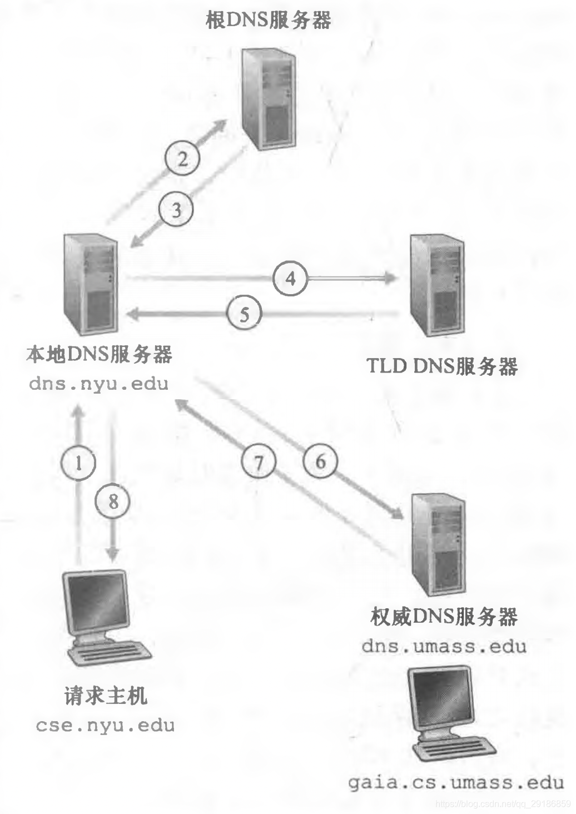
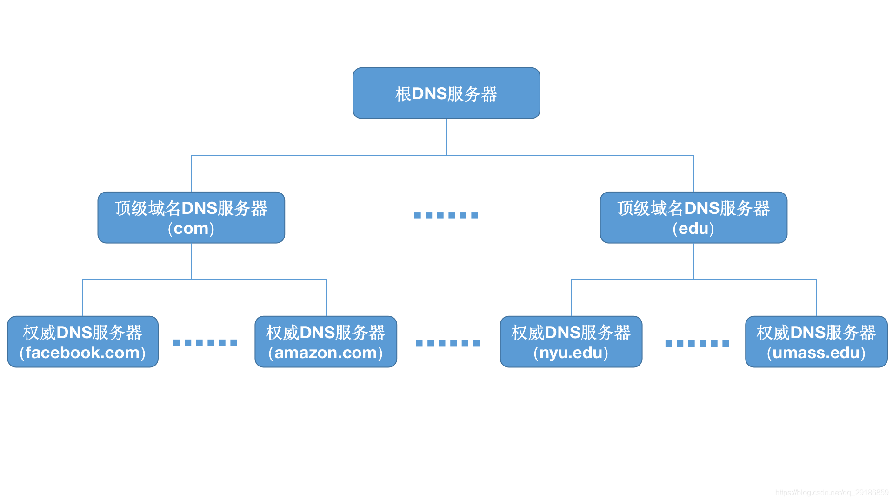

## 什么是 DNS

`DNS` 即 Domain Name System，即域名系统，是进行域名和与之相对应的 IP 地址进行转换的服务器。

DNS 是因特网上作为域名和 IP 地址相互映射的一个分布式数据库，能够使用户信息更方便的去访问互联网而不是去记住能够被机器直接读取的 IP 地址。

- DNS 是一个由分层的 DNS 服务器（DNS Server）实现的分布式数据库。DNS 服务器通常是运行 BIND（Berkeley Internet Name Domain）软件的 UNIX 机器。
- DNS 是一个使得主机能够查询分布式数据库的应用层协议。
  通过域名，最终得到该域名对应的 IP 地址的过程是域名解析的过程。

**DNS 主要使用 UDP，在特殊情况下，也会使用 TCP，端口号都是 53**。

一般情况下，DNS 报文都比较小，只需要一个包就能承载所有信息。既然只有一个包，就无需考虑哪个包未送达，直接重发一个包即可，因此无需使用 TCP 那样复杂的协议，直接使用 UDP 协议，DNS 协议自己处理超时和重传问题，以提供可靠性服务。

### DNS 查询方式

DNS 查询的方式有两种：

- **递归查询**

  在递归查询中，客户端将域名解析的任务完全委托给 DNS 服务器。DNS 服务器必须返回最终的查询结果（IP 地址或查询失败的信息），而不能返回其他 DNS 服务器的引用。

- **迭代查询**

  在迭代查询中，DNS 服务器不会代替客户端完成全部查询，而是返回它所知道的最佳答案或下一步应该查询的 DNS 服务器地址，由客户端自己继续查询。

### DNS 缓存

DNS 缓存是提高解析效率、减少网络流量的关键机制。

DNS 缓存分为多个层级,从上到下依次是：

- 浏览器缓存
- 操作系统缓存
- 路由器缓存
- ISP DNS 服务器缓存
- 公共 DNS 服务器缓存

## DNS 服务器的层级结构

为了处理 DNS 拓展性问题，DNS 使用了大量的 DNS 服务器，他们以层次方式组织，并且分布在世界各地。没有一台 DNS 服务器拥有因特网上所有主机的映射。

大致来说，有 3 种类型的 DNS 服务器：

- 根 DNS 服务器：有 400 多个根名字服务器遍布全球。根 DNS 服务器提供顶级域名服务器的 IP 地址。
- 顶级域名服务器：顶级域名服务器提供了权威 DNS 服务器的 IP 地址。
- 权威 DNS 服务器：权威 DNS 服务器提供该组织的可访问域名的 IP 地址。

结构如图所示：

除了这 3 种 DNS 服务器，还有另一类重要的 DNS 服务器，称为**本地 DNS 服务器**。本地 DNS 服务器虽然不属于该服务器的层级结构，但它对 DNS 层次结构是至关重要的。

## 浏览器输入网址后，DNS 解析的流程

当我们在浏览器输入 `https://www.baidu.com` 后，DNS 解析过程会经历以下步骤：

1.  浏览器 DNS 缓存查询

    浏览器首先检查自己的 DNS 缓存（缓存中维护一张域名与 IP 地址的对应表），看是否之前访问过这个域名并缓存了对应的 IP 地址。如果缓存命中且未过期，直接使用缓存的 IP 地址，DNS 解析结束。

2.  操作系统 DNS 缓存查询

    如果浏览器缓存未命中，请求会传递给操作系统。操作系统会检查自己的 DNS 缓存(hosts 文件和系统 DNS 缓存)。如果找到对应记录，返回 IP 地址。

3.  本地 DNS 服务器查询（`递归查询`）

    如果操作系统缓存也没有，请求会发送到本地 DNS 服务器（通常是 ISP 提供的 DNS 服务器，或你配置的公共 DNS 如 8.8.8.8）。这是一个`递归查询`，本地 DNS 服务器会负责完成后续所有查询工作。

4.  根 DNS 服务器查询（`迭代查询开始`）

    本地 DNS 服务器如果没有缓存，会向根 DNS 服务器查询。根服务器不会直接返回 IP 地址，而是告诉本地 DNS 服务器"你应该去查询.com 顶级域名服务器"，并返回.com 域名服务器的地址。

5.  顶级域名服务器查询

    本地 DNS 服务器接着向.com 顶级域名服务器查询。顶级域名服务器会返回 baidu.com 权威域名服务器的地址。

6.  权威域名服务器查询

    本地 DNS 服务器最后向 baidu.com 的权威 DNS 服务器查询 `www.baidu.com` 的 IP 地址。权威服务器返回最终的 IP 地址(可能是多个 IP 地址)。

7.  返回结果并缓存

    本地 DNS 服务器将获得的 IP 地址返回给操作系统，操作系统返回给浏览器。整个链路上的各级服务器都会根据 TTL(Time To Live)值缓存这个结果，以加速后续查询。
    整个 DNS 解析过程通常只需要几十毫秒，但如果没有任何缓存，完整的查询链路可能需要 100-200 毫秒。
