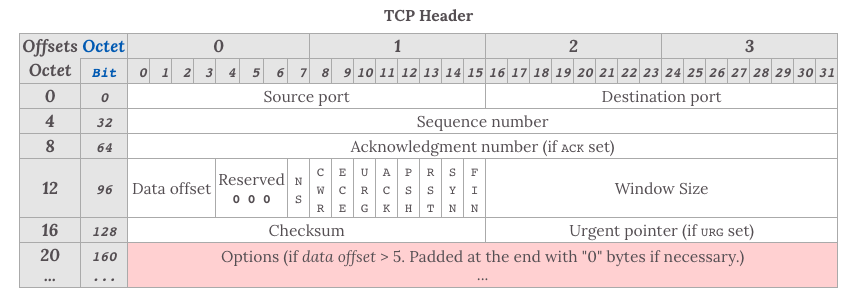
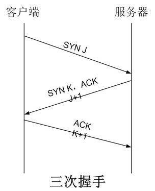

## 什么是 TCP 协议

TCP 是一个面向连接、可靠的、基于字节流的传输层协议。它有几个关键特性：

- 可靠性：TCP 通过序列号、确认应答、超时重传等机制确保数据完整无误地送达。每个数据包都有序列号，接收方收到后会发送 ACK 确认，如果发送方在规定时间内没收到确认，就会重传。
- 有序性：即使数据包在网络中乱序到达，TCP 也能通过序列号将它们重新排序，保证应用层接收到的数据顺序正确。
- 流量控制：通过滑动窗口机制，接收方可以告诉发送方自己的接收能力，避免发送方发送过快导致接收方缓冲区溢出。
- 拥塞控制：TCP 会根据网络状况动态调整发送速率，包括慢启动、拥塞避免、快速重传、快速恢复等算法，防止网络过载。

在基于 TCP 进行通信时，通信双方需要先建立一个 TCP 连接，建立连接需要经过三次握手，断开连接的时候需要经过四次挥手。

### TCP 头部

对于 TCP 头部来说，以下几个字段是很重要的:

- **序列号**（Sequence number），这个序号保证了 TCP 传输的报文都是有序的，对端可以通过序号顺序的拼接报文

- **确认号**（Acknowledgement Number），这个序号表示数据接收端期望接收的下一个字节的编号是多少，同时也表示上一个序号的数据已经收到

- **窗口大小**（Window Size），表示还能接收多少字节的数据，用于流量控制

- **标识符**

  - **ACK=1**：该字段表示确认号字段有效。此外，TCP 还规定在连接建立后传送的所有报文段都必须把 ACK 置为一。
  - **SYN=1**：当 SYN=1，ACK=0 时，表示当前报文段是一个连接请求报文。当 SYN=1，ACK=1 时，表示当前报文段是一个同意建立连接的应答报文。
  - **FIN=1**：该字段表示此报文段是一个释放连接的请求报文。
  - **URG=1**：该字段表示本数据报的数据部分包含紧急信息，是一个高优先级数据报文，此时紧急指针有效。紧急数据一定位于当前数据包数据部分的最前面，紧急指针标明了紧急数据的尾部。
  - **PSH=1**：该字段表示接收端应该立即将数据 push 给应用层，而不是等到缓冲区满后再提交。
  - **RST=1**：该字段表示当前 TCP 连接出现严重问题，可能需要重新建立 TCP 连接，也可以用于拒绝非法的报文段和拒绝连接请求。

## 三次握手

在 TCP/IP 协议中，TCP 协议提供可靠的连接服务，采用三次握手建立一个连接。

- 第一次握手

  - SYN = 1, seq(client) = x
  - 客户端向服务端发送连接请求报文段。该报文段中包含自身的数据通讯初始序号。请求发送后，客户端便进入 SYN-SENT 状态。

- 第二次握手

  - SYN = 1, ACK = 1, 确认序号 = x + 1, seq(server) = y
  - 服务端收到连接请求报文段后，如果同意连接，则会发送一个应答，该应答中也会包含自身的数据通讯初始序号，发送完成后便进入 SYN-RECEIVED 状态

- 第三次握手

  - ACK = 1, 确认序号 = y + 1, seq(client) = x + 1
  - 客户端收到连接同意的应答后，还要向服务端发送一个确认报文。客户端发完这个报文段后便进入 ESTABLISHED 状态，服务端收到这个应答后也进入 ESTABLISHED 状态，此时连接建立成功。

## 四次挥手

TCP 是全双工的，在断开连接时两端都需要发送 FIN 和 ACK。

- 第一次挥手

  - 若客户端 A 认为数据发送完成，则它需要向服务端 B 发送连接释放请求。

- 第二次挥手

  - B 收到连接释放请求后，会告诉应用层要释放 TCP 链接。然后会发送 `ACK` 包，并进入 `CLOSE_WAIT` 状态，表示 A 到 B 的连接已经释放，不接收 A 发的数据了。但是因为 TCP 连接时双向的，所以 B 仍旧可以发送数据给 A。

- 第三次挥手

  - B 如果此时还有没发完的数据会继续发送，完毕后会向 A 发送连接释放请求，然后 B 便进入 `LAST-ACK` 状态。

- 第四次挥手

  - A 收到释放请求后，向 B 发送确认应答，此时 A 进入 `TIME-WAIT` 状态。该状态会持续 2MSL（最大段生存期，指报文段在网络中生存的时间，超时会被抛弃） 时间，若该时间段内没有 B 的重发请求的话，就进入 `CLOSED` 状态。当 B 收到确认应答后，也便进入 `CLOSED` 状态。

## 面试常见问题

### 为什么建立连接是三次握手，四次不可以吗

第一次握手：

> Client 什么都不能确认
>
> Server 确认了对方发送正常

第二次握手：

> Client 确认：自己发送/接收正常，对方发送/接收正常
>
> Server 确认：自己接收正常 ，对方发送正常

第三次握手：

> Client 确认：自己发送/接收正常， 对方发送/接收正常
>
> Server 确认：自己发送/接收正常，对方发送/接收正常

所以通过三次握手确认双方收发功能都正常，四次也可以但是显得比较多余

### 为什么 A 要进入 TIME-WAIT 状态，等待 2MSL 时间后才进入 CLOSED 状态？

MSL 是报文最大生存时间，等待 2MSL 是为了：

- 确保最后的 ACK 能被对方收到（如果丢失，对方会重发 FIN，客户端还能再次回复 ACK）
- 确保当前连接的所有报文都从网络中消失，避免影响新连接

### 为什么建立连接是三次握手，关闭连接确是四次挥手呢？

1. 建立连接的时候， 服务器在 LISTEN 状态下，收到建立连接请求的 SYN 报文后，把 ACK 和 SYN 放在一个报文里发送给客户端。

2. 而关闭连接时，服务器收到对方的 FIN 报文时，仅仅表示对方不再发送数据了但是还能接收数据，而自己也未必全部数据都发送给对方了
