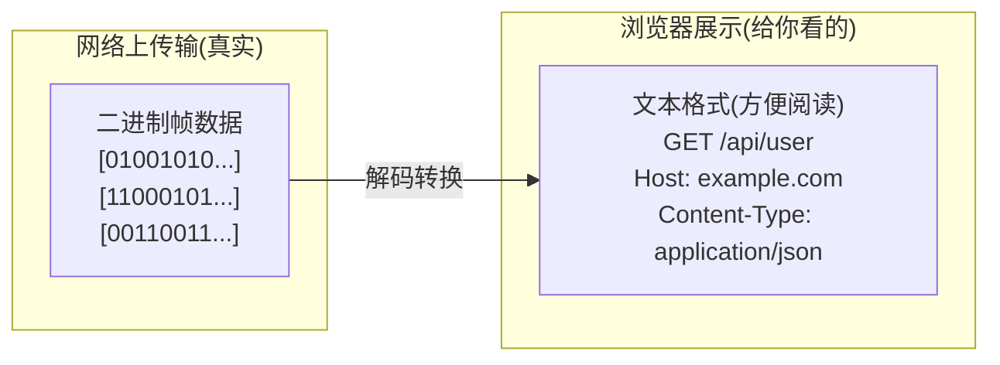
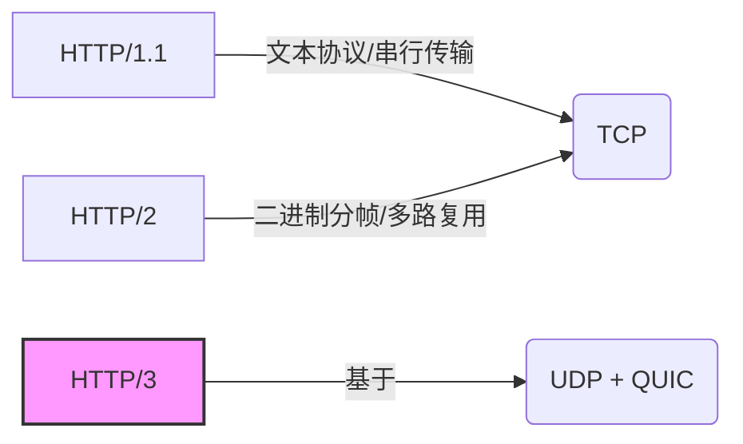

HTTP 版本演进

| 版本    | 发布时间 | 核心特性                                           | 解决的问题                  |
| :------ | :------- | :------------------------------------------------- | :-------------------------- |
| **0.9** | 1991     | 仅支持 GET，只能传输 HTML                          | 实现基础的文档传输          |
| **1.0** | 1996     | 增加 POST/HEAD，支持多种数据格式，非持久连接       | 支持多媒体内容              |
| **1.1** | 1997     | 持久连接 (Keep-Alive)，管道化，断点续传，Host 头   | 减少 TCP 连接开销           |
| **2.0** | 2015     | 多路复用，头部压缩 (HPACK)，二进制分帧，服务端推送 | 解决 HTTP/1.1 队头阻塞      |
| **3.0** | 2022     | 基于 QUIC (UDP)，0-RTT 握手，连接迁移              | 解决 TCP 队头阻塞、提高性能 |

## HTTP/1.1 存在的问题

- 队头阻塞

  - 一个 TCP 连接同时只能处理一个请求
  - 前面的请求未完成，后面的请求必须等待
  - 即使后面的资源很小，也得排队

- 连接数限制

  - 浏览器对同一域名的并发连接数有限制（通常是 6 个）
  - 导致大量资源需要排队加载

- 头部冗余

  - 每次请求都要携带完整的 HTTP 头部
  - 大量重复的 header 信息（Cookie、User-Agent 等）

- 无法设置请求优先级
  - 所有资源平等对待
  - 关键资源可能被阻塞

## HTTP/2

HTTP/2 是 HTTP 协议的第二个主要版本，于 2015 年发布，是对 HTTP/1.1 的重大改进。它主要解决了 HTTP/1.1 的性能瓶颈问题。

### 二进制分帧（Binary Framing）

HTTP/1.1 是基于文本的协议，HTTP/2 采用二进制格式传输。

- 将所有传输的信息分割为更小的消息和帧
- 采用二进制编码，解析更高效
- 帧类型包括：`HEADERS 帧`、`DATA 帧`、`PRIORITY 帧`等

```
// HTTP1.1
GET /index.html HTTP/1.1
Host: example.com
User-Agent: Mozilla/5.0
```

HTTP/2 在浏览器开发者工具上看起来也是 HTTP/1.1 格式的文本，但这并不是 HTTP/2 在网络上传输的真实格式。



### 多路复用

HTTP/1.1 的做法：

```
连接1: 请求A → 等待响应A
连接2: 请求B → 等待响应B
连接3: 请求C → 等待响应C
```

HTTP/2 的做法：

```
单个TCP连接:
  流1: 请求A → 响应A（交错传输）
  流2: 请求B → 响应B（交错传输）
  流3: 请求C → 响应C（交错传输）
```

核心概念：

- 流（Stream）：一个虚拟通道，承载双向消息交换
- 消息（Message）：一个完整的请求或响应，由多个帧组成
- 帧（Frame）：HTTP/2 通信的最小单位

优势：

- 同一个 TCP 连接可以并发处理多个请求/响应
- 彻底解决了 HTTP/1.1 的队头阻塞问题
- 不需要建立多个 TCP 连接，减少了 TCP 握手开销
- 资源可以交错传输，不会互相阻塞

### 头部压缩

HTTP/1.1 每次请求都发送完整的头部：

```
Cookie: session_id=abc123; user_token=xyz789...
User-Agent: Mozilla/5.0 (Windows NT 10.0; Win64; x64)...
Accept: text/html,application/xhtml+xml...
Accept-Language: zh-CN,zh;q=0.9,en;q=0.8
```

如果发送 100 个请求，这些头部会重复传输 100 次

HTTP/2 的解决方案 - HPACK 算法：

- 静态字典：常见的头部字段有预定义的索引

  - `:method: GET` → 索引 2
  - `:path: /` → 索引 4

- 动态字典：为本次连接建立的头部字段表

  - 第一次发送完整头部，后续只发送索引

- 哈夫曼编码：进一步压缩头部值

```
第一次请求：
:method: GET
:path: /api/users
cookie: session_id=abc123

第二次请求（相同头部）：
[索引2] [索引4变更为/api/posts] [索引引用cookie]
```

### 服务器推送（Server Push）

现在已经被弃用，可以使用 `link preload` 替代

```html
<!DOCTYPE html>
<html>
  <head>
    <!-- 告诉浏览器预加载关键资源 -->
    <link rel="preload" href="/critical.css" as="style" />
    <link rel="preload" href="/critical.js" as="script" />
    <link rel="preload" href="/hero.jpg" as="image" />

    <!-- 预连接到第三方域名 -->
    <link rel="preconnect" href="https://cdn.example.com" />
  </head>
</html>
```

## HTTP/3

HTTP/3 是 HTTP 协议的第三个主要版本，最大的变化是放弃了 TCP，改用基于 UDP 的 QUIC 协议。



HTTP/3 的核心特性：

### 基于 QUIC 协议

### 真正解决队头阻塞

QUIC 在传输层就实现了多路复用，每个流独立：

```
HTTP/2 + TCP:
┌─────────────────┐
│  Stream 1, 2, 3 │ ← HTTP层多路复用
└─────────────────┘
        ↓
┌─────────────────┐
│   单个TCP连接    │ ← 一个包丢失，全部阻塞
└─────────────────┘

HTTP/3 + QUIC:
┌─────────────────┐
│  Stream 1, 2, 3 │ ← 每个流独立
└─────────────────┘
        ↓
┌─────────────────┐
│   QUIC多路复用   │   ← 一个流丢包，不影响其他流
└─────────────────┘
        ↓
        UDP
```

### 0-RTT 连接建立

RTT = Round-Trip Time（往返时间）

指数据包从发送端发出，到接收端收到后发回确认，再到发送端收到确认的总时间。

HTTP/2 + TLS 1.3 的连接建立：

```
客户端                     服务器
  |                          |
  |---- ClientHello -------->|  RTT 1
  |<--- ServerHello ---------|
  |                          |
  |---- HTTP Request ------->|  RTT 2
  |<--- HTTP Response -------|

总计：2-RTT 才能开始传输数据
```

### 连接迁移

网络切换不会中断连接

```
QUIC 不用 IP 和端口标识连接，而是用 Connection ID

Wi-Fi 网络:
Connection ID: abc123
IP: 192.168.1.100

切换到4G:
Connection ID: abc123  ← 还是同一个连接！
IP: 10.20.30.40        ← IP变了但连接不断

服务器识别 Connection ID，继续传输数据
```

## 面试常见问题

### HTTP/2 的多路复用是如何实现的？

HTTP/2 通过引入"流"的概念实现多路复用。每个请求/响应对应一个流，流有唯一的 ID。

在同一个 TCP 连接上，不同流的帧可以交错发送，接收方根据帧头的流 ID 将它们重新组装成完整的消息，这样就可以在一个连接上并发处理多个请求，而不会相互阻塞。

### HTTP/2 解决了队头阻塞问题吗？

部分解决。HTTP/2 解决了 HTTP 层面的队头阻塞（一个请求不会阻塞其他请求），但 TCP 层面的队头阻塞依然存在。

如果 TCP 层某个数据包丢失，整个连接的所有数据都会被阻塞，直到重传成功。这也是 HTTP/3 选择使用 QUIC（基于 UDP）协议的主要原因。

### HTTP/2 对前端性能优化有什么影响？

通过多路复用解决了 HTTP/1.1 的队头阻塞问题，并通过头部压缩减少了传输开销。

不再需要**域名分片**、**资源合并**、**雪碧图**等优化手段。

### 为什么 HTTP/2 要用二进制而不是文本？

- 解析效率：二进制格式更容易解析，不需要处理各种文本格式的边界情况
- 传输效率：更紧凑，占用空间更小
- 扩展性：更容易添加新的帧类型
- 错误处理：二进制格式的错误更容易检测

### 所有网站都应该升级到 HTTP/3 吗？

不一定，要根据具体情况：

**适合升级的场景**：

- 移动用户占比高的应用
- 实时性要求高的应用（直播、游戏）
- 全球用户，网络环境多样
- 视频、大文件下载等场景
