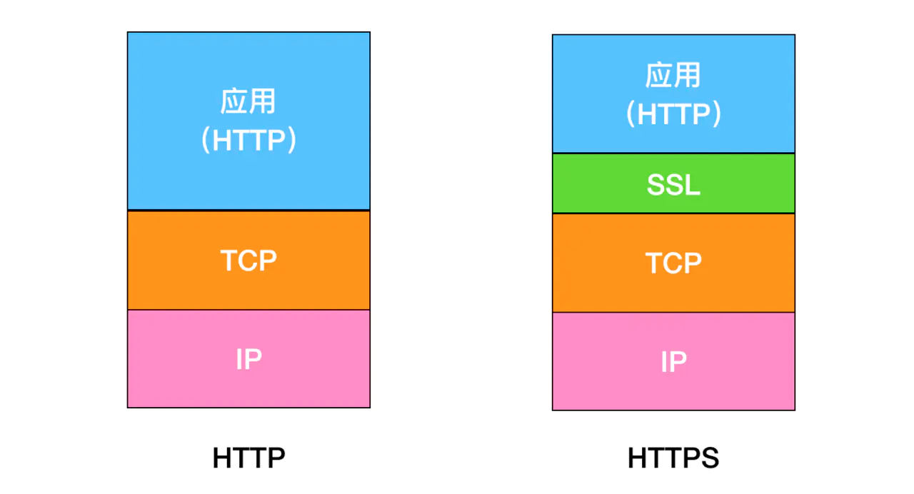
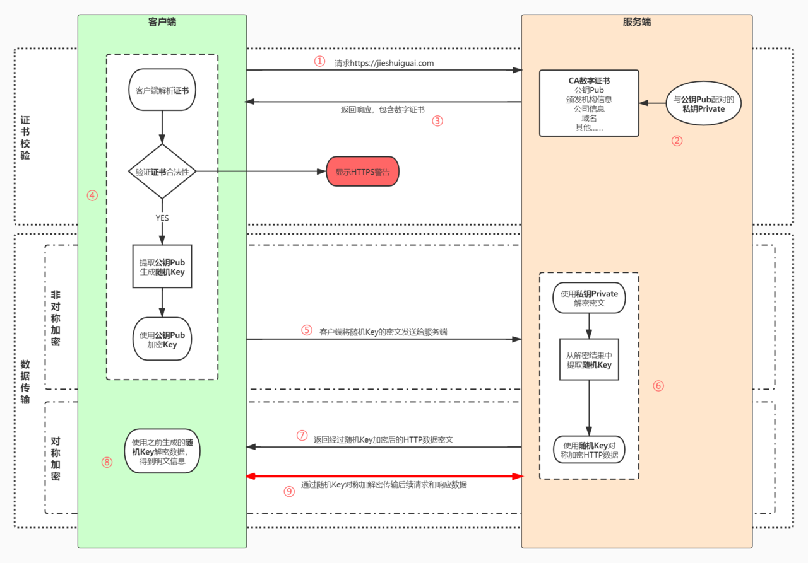

## 什么是 HTTPS

HTTP（Hypertext Transfer Protocol）超文本传输协议，是一种用于分布式、协作式和超媒体信息系统的应用层协议。

但是 HTTP 有一个致命缺陷，就是内容是明文传输的，没有经过任何加密，而这些明文数据会经过 WIFI、路由器、运营商、机房等物理节点，如果在这中间任意一个节点被监听，传输的内容就会完全暴露，这一攻击手法叫做 MITM （Man in The Middle）中间人攻击。

为了解决 HTTP 明文传输数据可能导致的安全问题，1994 年网景公司提出了 HTTPS 超文本传输安全协议，数据通信仍然是 HTTP，但是利用了 SSL/TSL 加密数据包。

HTTPS 的内核是 HTTP，也就是说 HTTPS 就是加了 TSL/SSL 协议的 HTTP。

HTTPS 协议提供了 3 个关键的指标

1. **加密**（Encryption），HTTPS 通过对数据加密来使免受窃听者对数据的监听，这就意味着当用户在浏览网站时，没有人能够监听他喝网站之间的信息交换，从而窃取用户的信息
2. **数据一致性**（Data interity），数据在传输的过程中不会被窃听者所修改，用户发送的数据会完整的传输到服务端，保证用户发的是什么，服务器接收的就是什么
3. **身份认证**（Authentication），是指确认对方的真实身份，可以防止中间人攻击并建立用户信任。

## HTTPS 加解密过程

1. 用户在浏览器发起 HTTPS 请求（如 `juejin.im/`），默认使用服务端的 443 端口进行连接
2. HTTPS 需要使用一套 CA 数字证书，证书内会附带一个公钥 Pub，而与之对应的私钥 Private 保留在服务端不公开
3. 服务端收到请求，返回配置好的包含公钥 Pub 的证书给客户端
4. 客户端收到证书，校验合法性，主要包括是否在有效期内、证书的域名与请求的域名是否匹配，上一级证书是否有效（递归判断，直到判断到系统内置或浏览器配置好的根证书），如果不通过，则显示 HTTPS 警告信息，如果通过则继续
5. 客户端生成一个用于对称加密的随机 Key，并用证书内的公钥 Pub 进行加密，发送给服务端
6. 服务端收到随机 Key 的密文，使用与公钥 Pub 配对的私钥 Private 进行解密，得到客户端真正想发送的随机 Key
7. 服务端使用客户端发送过来的随机 Key 对要传输的 HTTP 数据进行对称加密，将密文返回客户端
8. 客户端使用随机 Key 对称解密密文，得到 HTTP 数据明文
9. 后续 HTTPS 请求使用之前交换好的随机 Key 进行对称加解密

## 加密算法相关

### 对称算法

### 非对称算法

### 混合算法

### 哈希算法
