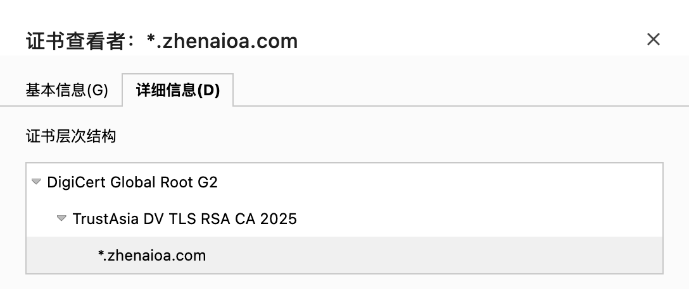
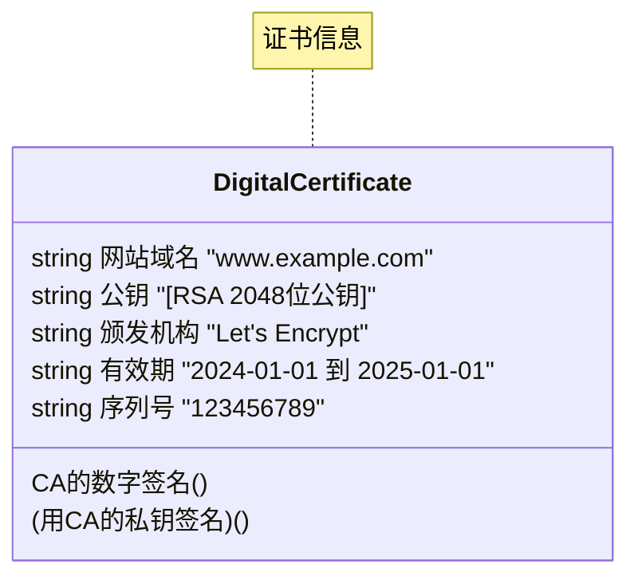

## 什么是 HTTPS

HTTPS = HTTP + TLS/SSL，是 HTTP 协议的安全版本。它在 HTTP 和 TCP 之间加了一层加密层（TLS/SSL），确保数据传输的安全性。

```
SSL (Secure Sockets Layer)
├─ SSL 1.0 (1994) - 从未公开
├─ SSL 2.0 (1995) - 已废弃
├─ SSL 3.0 (1996) - 已废弃
└─ 被TLS取代

TLS (Transport Layer Security)
├─ TLS 1.0 (1999) - 逐步淘汰
├─ TLS 1.1 (2006) - 逐步淘汰
├─ TLS 1.2 (2008) - 广泛使用 ⭐
└─ TLS 1.3 (2018) - 最新标准 ⭐⭐

```

现在说的 SSL 实际上指的是 TLS

HTTPS 协议提供了 3 个关键的指标

1. **加密**（Encryption），HTTPS 通过对数据加密来使免受窃听者对数据的监听，这就意味着当用户在浏览网站时，没有人能够监听他喝网站之间的信息交换，从而窃取用户的信息
2. **数据一致性**（Data interity），数据在传输的过程中不会被窃听者所修改，用户发送的数据会完整的传输到服务端，保证用户发的是什么，服务器接收的就是什么
3. **身份认证**（Authentication），是指确认对方的真实身份，可以防止中间人攻击并建立用户信任。


## 加密算法相关

### 对称算法

对称算法使用同一个密钥进行加密和解密。就像一把钥匙既能锁门也能开门。

常见算法：

- AES (Advanced Encryption Standard)： 目前最流行的标准，广泛用于 WiFi 安全、HTTPS 数据传输等。
- DES / 3DES： 较老的标准，现在认为已不够安全，逐渐被淘汰。

### 非对称算法

非对称算法使用一对密钥：公钥（public key）和私钥（private key）。公钥加密的内容只能用私钥解密，反之亦然。

常见算法：

- RSA： 最流行的非对称算法，广泛用于数字签名、数据加密等。
- ECC (Elliptic Curve Cryptography)： 椭圆曲线密码学，用更短的密钥实现同等安全性，现代移动设备常用。

应用场景： 数字签名、身份认证、密钥交换、SSL/TLS 握手等

### 混合算法

混合加密结合了对称算法和非对称算法的优点，是现代加密通信的标准做法。

工作原理：

1. 发送方生成一个随机的对称密钥（会话密钥）
2. 用接收方的公钥加密这个对称密钥
3. 用对称密钥加密实际的数据内容
4. 将加密后的对称密钥和加密数据一起发送
5. 接收方用私钥解密得到对称密钥，再用它解密数据

### 哈希算法

哈希算法是一种单向函数，将任意长度的数据转换为固定长度的"指纹"或"摘要"。

**哈希不是加密**，加密是为了解密，而哈希是为了“验证”。

常见算法：

- MD5：最经典，但因为安全性已不够（可以被暴力破解），现在主要用于校验文件是否损坏，不再用于存密码。
- SHA-256：最流行的哈希算法，广泛用于数据完整性校验、数字签名等。

应用场景： 数据完整性校验、数字签名、密码存储等

---

## HTTPS 工作流程

### 数字证书

HTTPS 证书（即 SSL/TLS 证书）的校验核心机制是 **信任链**。简单来说，浏览器不直接信任网站，而是信任给网站发证的那个“权威机构”（CA）。

浏览器并不知道 `google.com` 是真是假，但它内置了一份 **受信任的根证书列表**

- 根证书 (Root CA)：操作系统或浏览器自带，绝对权威，无条件信任。
- 中间证书 (Intermediate CA)：由根证书授权（签名）的机构
- 服务器证书 (Server Certificate)：由中间证书签发

以 `zhenaioa.com` 为例，下图展示了证书信任链路径



校验过程就是“顺藤摸瓜”： 浏览器拿到网站证书 -> 看是谁签发的（中间证书） -> 再看中间证书是谁签发的（根证书） -> 检查根证书是否在我系统自带的“信任列表”里。如果能在列表里找到，那这条链就是通的，证书有效。



验证过程：

1. 浏览器收到证书
2. 用 CA 的公钥验证签名
3. 确认证书未被篡改
4. 确认域名匹配
5. 确认证书未过期

### HTTPS 加解密流程


1. 用户在浏览器发起 HTTPS 请求（如 `https://juejin.im/`），默认使用服务端的 443 端口进行连接
2. HTTPS 需要使用一套 CA 数字证书，证书内会附带一个公钥 Pub，而与之对应的私钥 Private 保留在服务端不公开
3. 服务端收到请求，返回配置好的包含公钥 Pub 的证书给客户端
4. 客户端收到证书，校验合法性，主要包括是否在有效期内、证书的域名与请求的域名是否匹配，上一级证书是否有效（递归判断，直到判断到系统内置或浏览器配置好的根证书），如果不通过，则显示 HTTPS 警告信息，如果通过则继续
5. 客户端生成一个用于对称加密的随机 Key，并用证书内的公钥 Pub 进行加密，发送给服务端
6. 服务端收到随机 Key 的密文，使用与公钥 Pub 配对的私钥 Private 进行解密，得到客户端真正想发送的随机 Key
7. 服务端使用客户端发送过来的随机 Key 对要传输的 HTTP 数据进行对称加密，将密文返回客户端
8. 客户端使用随机 Key 对称解密密文，得到 HTTP 数据明文
9. 后续 HTTPS 请求使用之前交换好的随机 Key 进行对称加解密
