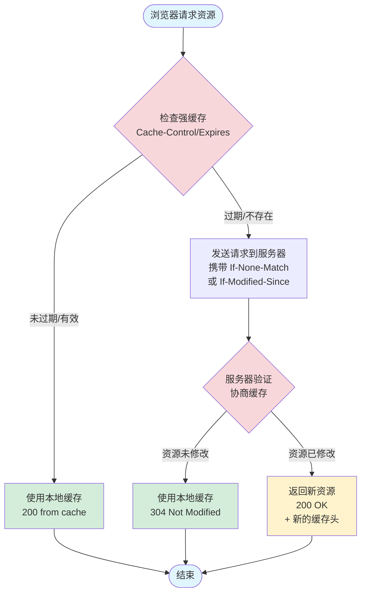

## 核心流程

浏览器缓存主要分为两类：`强缓存` 和 `协商缓存`。

当浏览器发起请求时，检查顺序如下：

1. **先查强缓存**：如果命中了强缓存，直接使用本地副本，**不发送请求到服务器**。

状态码：`200(from memory/disk cache)`

2. **再查协商缓存**：如果强缓存失效（或未设置），浏览器发送请求给服务器，询问文件是否更新。如果服务器告诉依然可用，则使用本地副本。

状态码：`304 Not Modified`

3. **获取新资源**：如果以上都没命中，服务器返回新的文件。（状态码：200 OK）

在现代开发中，我们通常结合使用：HTML 文件设置为 `no-cache`（始终协商），而 JS/CSS/图片等静态资源设置为超长 `max-age` 并配合**文件 hash**文件名，从而实现内容更新时的精准缓存失效。

## 强缓存

### Cache-Control（HTTP/1.1 优先级高）

Cache-Control 常用指令：

- `public`：任何缓存都可存储
- `private`：仅客户端缓存，代理服务器不能缓存
- `no-cache`：**这是一个陷阱**。它不代表“不缓存”，而是代表“不使用强缓存”，必须去向服务器发起协商缓存验证。
- `no-store`：完全不缓存
- `max-age=秒`：资源有效期
- `s-maxage=秒`：代理服务器缓存时间
- `must-revalidate`：过期后必须验证

### Expires（HTTP/1.0 优先级低）

使用绝对时间（如 `Expires: Wed, 21 Oct 2025 07:28:00 GMT`）。

缺点： 依赖客户端时间，如果用户修改了本地时间，缓存可能失效。

## 协商缓存

触发条件： 强缓存失效（过期）或设置了 `no-cache`，如果两者共存，服务器优先校验 ETag。

`ETag` 的优先级大于 `Last-Modified`，服务器返回 304 则使用缓存

| 方案       | 响应头 (Server) | 请求头 (Client)     | 描述                                                                   | 优缺点                                                                          |
| :--------- | :-------------- | :------------------ | :--------------------------------------------------------------------- | :------------------------------------------------------------------------------ |
| (基于时间) | `Last-Modified` | `If-Modified-Since` | 服务器返回文件最后修改时间。下次请求时，浏览器带上这个时间问是否过期。 | 缺点： 1. 精度只到秒。2. 如果文件重新生成但内容没变，时间也会变，导致缓存失效。 |
| (基于内容) | `ETag`          | `If-None-Match`     | 服务器根据文件内容生成唯一的 Hash 值（指纹）。                         | 优点： 精度高，只要内容没变，ETag 就不变。缺点： 计算 Hash 需要消耗服务端性能。 |

## 缓存位置

浏览器会在哪里找缓存？（按优先级排序）

1. `Service Worker`： 运行在后台的脚本，可由开发者完全控制缓存逻辑（PWA 的核心）。
2. `Memory Cache`（内存缓存）： 存取极快，主要包含当前页面中已经抓取到的资源（如图片、脚本）。关闭 Tab 页即清空。
3. `Disk Cache`（磁盘缓存）： 存取较慢，但持久存储。主要存放非当前 Session 的大文件。

## 用户行为对缓存的影响

| 用户操作                  | 触发机制                                                                                                           |
| :------------------------ | :----------------------------------------------------------------------------------------------------------------- |
| **地址栏回车 / 点击链接** | 最正常模式。先检查强缓存，若有效则直接用；无效则进行协商缓存。                                                     |
| **F5 (普通刷新)**         | 跳过强缓存。浏览器会把 `Cache-Control` 设为 `max-age=0`，强制向服务器发起协商缓存验证（检查 ETag/Last-Modified）。 |
| **Ctrl + F5 (强制刷新)**  | 跳过所有缓存。浏览器发送 `Cache-Control: no-cache` 且不带任何缓存校验字段，服务器直接返回最新资源（200 OK）。      |

## 缓存流程图

